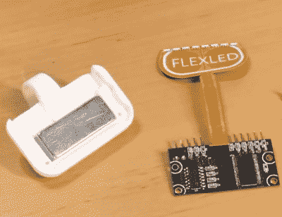

# 最新的 FlexLED 里程碑改进了视点显示

> 原文：<https://hackaday.com/2020/02/28/latest-flexled-milestone-refines-the-pov-display/>

通过他的 FlexLED 项目，[【Carl bug eja】正试图完善一种简单而廉价的视觉暂留(POV)显示器](https://hackaday.io/project/164585-flexled)，能够在半空中生成“全息”字符。传统上，POV 系统快速旋转 led 以创造所需的幻觉，但这意味着电机、滑环和噪声。顾名思义，这个项目的目标是消除这一切，代之以一个自我激励的柔性 PCB。

 该设备能够快速、安静、高效地来回移动 led，这要归功于集成在柔性 PCB 中的永久磁铁和磁性线圈。由于没有电机或齿轮，整个装置比其他 POV 显示器更小，也更简单。额外的好处是，如果好奇的用户将手指伸进去，操作者或设备都不会有危险。

我们最后一次看这个项目时， [[Carl]已经将一个早期的单 LED 版本加入了 2019 年 Hackaday 奖](https://hackaday.com/2019/07/09/flexled-is-a-unique-take-on-persistence-of-vision/)。去年竞争非常激烈，不幸的是 FlexLED 没有入选决赛。但是我们仍然非常有兴趣看到项目的发展，我们想你也是如此。

最近完成的第二版显示器采用了改进的线圈设计，八个 RGB LEDs 和一个集成磁体的 3D 打印底座。随着更多的 led 板载，单个显示器能够显示多个角色，甚至是基本的动画。这些扑翼元素的大阵列有望成为一大景观。

但是在你太兴奋之前，[卡尔]确实有些坏消息。首先，小批量构建它们的成本很高，这对于试图迭代设计的单个黑客来说总是很难。更糟糕的是，一些 led 似乎已经死在这个原型上了。他说，这可能与快速来回弯曲的压力有关，这显然有点麻烦。他希望从社区获得一些反馈，并希望在下一版本中解决这些问题。

为了有趣地了解他的柔性 PCB 致动器项目，[请查看[Carl]在 2018 Hackaday Superconference](https://hackaday.com/2019/11/05/superconference-interview-carl-bugeja/) 上对我们的采访。

 [https://www.youtube.com/embed/wM_Byrv9iBI?version=3&rel=1&showsearch=0&showinfo=1&iv_load_policy=1&fs=1&hl=en-US&autohide=2&wmode=transparent](https://www.youtube.com/embed/wM_Byrv9iBI?version=3&rel=1&showsearch=0&showinfo=1&iv_load_policy=1&fs=1&hl=en-US&autohide=2&wmode=transparent)

