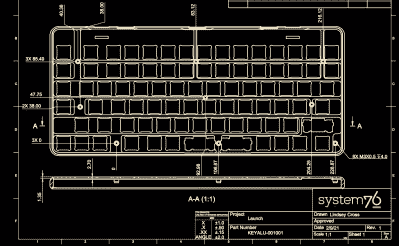

# 启动开源键盘；System76 发布了他们的设计文件

> 原文：<https://hackaday.com/2021/02/20/launching-an-open-source-keyboard-system76-has-published-their-design-files/>

以销售运行 Linux 的机器而闻名的计算机制造商 System76 最近公布了他们即将推出的机械键盘的完整源代码。由熟悉的工具制造，大规模生产，并由一家稳定的公司支持，它看起来将是机械键盘世界的一个引人注目的进入者。

 回到 2020 年 3 月 System76 [发表了一篇博文](https://blog.system76.com/post/612874398967513088/making-a-keyboard-the-system76-approach)关于他们正在着手的一个新项目；布局不同寻常的机械键盘。当时，除了 2021 年夏天的目标之外，几乎没有什么信息可用，直到上周他们开放了对发射库的访问，才听到一些消息。如果你以前看过定制机械键盘的来源，一切都应该是可识别的，这是引起我们注意的地方。电源是用 KiCad 编写的，应该很容易调整或制作。和机械部件是在带有机械图纸的 STEP 文件中提供的，大概是因为他们打算实际制造这些部件。

一个设计良好的键盘的所有特征都在这里。此次发布使用 hostswap 插座，便于安装常见的 Cherry MX 兼容开关选项，并包括 SK6805 LEDs 提供的每键 RGB 背光。ATmega32U4 运行流行且极其强大的 QMK 固件，而不是定制的东西，因此应该很容易根据用户的需求进行定制。

System76 吹捧一种不寻常的[键布局](http://www.keyboard-layout-editor.com/#/gists/8ec5e9026d616ebad6b2c7e9d943e7c0)，但如果你以前见过 75%键盘，它应该不会太有威胁性(尽管我们确实对那种缩小的右移感到奇怪)。最不寻常的特点是，它具有一个 USB 集线器，能够在两个 USB-C 和两个 USB-A 端口上支持全速 10 千兆位 USB 3.1 Gen 2。值得检查一下原理图，以了解集线器的设计比键盘的其他部分复杂多少，相比之下，键盘的其他部分实际上已经退化了。

剩下的未知是如何推出与流行相结合！_OS，System76 笨拙地命名为 Ubuntu 的混音版。他们承诺深度、引人注目的集成，我们很高兴看到这一点是如何体现的。