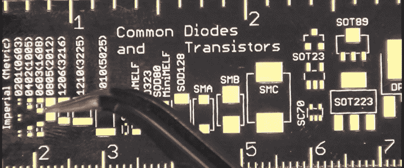
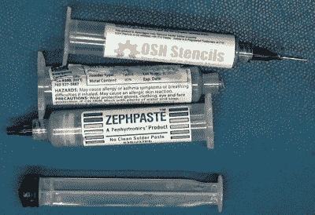
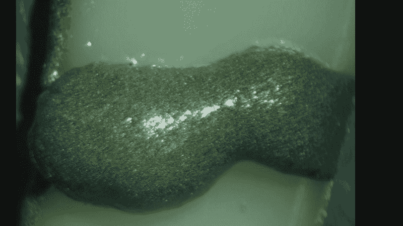
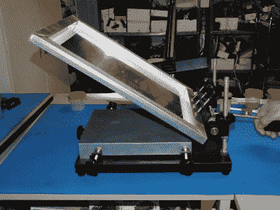
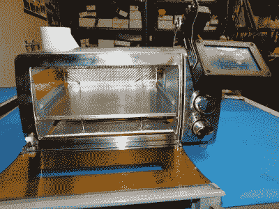
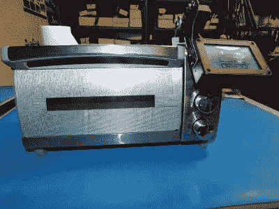
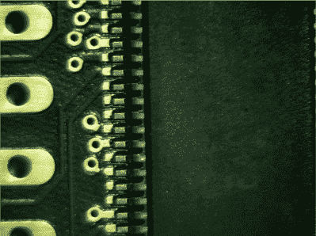

# 了解 Bil Herd 的 DIY 表面贴装组装流程

> 原文：<https://hackaday.com/2021/02/02/learn-bil-herds-diy-surface-mount-assembly-process/>

你可以用少量的工具和一些耐心来完成你自己的基于表面贴装技术的 PCB 组装。我的 SMT 流程的核心是停下来检查各个步骤，同时努力保持流程的整洁。

表面贴装技术(SMT)是组装印刷电路板(PCB)的现代方式，也是打开一件现代技术产品时常见的方式。它比旧的通孔(TH)技术小得多，在旧的通孔技术中，元件引线插入 PCB 的孔中，我们称之为“填充”，因为我们必须将元件塞入孔中。

一些专门的工具使这变得容易得多，但足智多谋的黑客将能够将焊膏模板夹具、真空镊子和带有控制器的改进型烤面包机组装在一起，该控制器可以跟踪焊膏的回流曲线。你不应该吝啬锡膏本身的质量、年龄和储存。

休息之后，请观看我的视频，了解我在工作间使用的流程，以及我的 SMT 组装流程的每一步细节。

 [https://www.youtube.com/embed/HmPYuOIMDJs?version=3&rel=1&showsearch=0&showinfo=1&iv_load_policy=1&fs=1&hl=en-US&autohide=2&wmode=transparent](https://www.youtube.com/embed/HmPYuOIMDJs?version=3&rel=1&showsearch=0&showinfo=1&iv_load_policy=1&fs=1&hl=en-US&autohide=2&wmode=transparent)

## 组件大小很重要

表面贴装封装名称可能会有点混乱。在视频中，我谈到了引脚间距为 0.5 *毫米*的 pat，但当谈到电阻时，我们使用 0603 和 0402 这样的数字，它们的尺寸为 0.06×0.03 *英寸*。最好有一些例子可以参考，以确保你使用的是正确尺寸的包装。

Adafruit Ruler Showing 0603 Size

看着我值得信赖的 Adafruit 尺子上显示的元件尺寸，我会说，我通常定期测量 0603 尺寸的元件，但我也测量过 0402 尺寸的 RF 元件，较小的尺寸意味着随着频率的提高，电感等不利因素会减少。我不使用较小的 0201 组件，因为我害怕吸入它们，它们太小了。

你看到的几乎所有 SOIC 器件都可以使用我在视频中展示的方法来完成，我通常会将引脚间距降至 0.5 mm，不过在视频中，我焊接了一些引脚间距为 0.4 mm 的芯片，这是我在自己的实验室中最小的引脚间距。

## 锡膏的护理

如今，我们将元件“放置”在 PCB 上，而不需要元件引线孔，我们使用由助焊剂和焊料组成的焊膏，而不是在熔化后使用焊料。锡膏可以有多种包装方式，但我买的锡膏是装在注射器里的，我把它们放在一个小冰箱里，只能保存有限的时间，因为锡膏的保质期取决于它的种类和购买地点。

焊锡膏是由它所基于的助焊剂来表示的，我用了“不清洗”这个词，意思和它说的差不多，最终结果是不清洗 PCB 也是可行的。如果我把板子交给其他人，我通常会在视频中清理干净。

Solder paste shown magnified X10

焊料是悬浮在焊剂中的小焊料珠的混合物，可能是 DIY 焊接中最棘手的事情，因为焊料有明确的保质期，根据制造商的不同，保质期可以是几周甚至几天。简单地说，如果你不记得你什么时候购买的焊料，扔掉它。我买了一种保质期更长的焊料，名为 Zeph paste，它比生产混合剂保存的时间更长，我把它储存在一个专用的小冰箱(想想六瓶装的冷却器)中，并垂直储存在注射器中，针头朝下。

焊料也有多种类型，从含铅和无铅开始，然后根据所含助焊剂的种类而有所不同。我使用“免清洗”版本，它没有需要清洗的“T1”，或者可以用酒精清洗，而不用更强的助焊剂。

## 应用焊料

Solder Paste Stencil without Frame

Solder Paste Stencil with Frame in a Stencil Holder

有几种方法可以将锡膏涂在 PCB 上；可以使用注射器和传统的挤压方式手动施加焊料，将焊料沉积在 PCB 的连接器焊盘上。我还有一个气压自动售货机，我并不怎么用。

我最常用的方法是使用一个粘贴模板，将粘贴物涂刷到 PCB 上，如视频所示。有一个技巧来挤压膏，不要压得太紧，同时迫使膏通过膏屏蔽网。粘贴掩模模板可以从我购买 PCB 的同一来源以几美元买到，对于更大的运行，我会看看像 [OSH Stencil](https://www.oshstencils.com/) 这样的公司。

## 检查你的粘贴，然后放置组件

我总是在将元件放在电路板上之前检查 PCB，在这一步我使用了一个立体 X10 显微镜。我正在寻找的是任何会造成焊接短路的东西，也就是说，如果它现在短路，它很可能会在以后短路。

Manual Pickup Tool

诀窍是将元件放置在电路板上，实际上是紧贴在焊膏中，不要涂抹焊膏或弯曲元件引线。镊子适用于电阻和电容等较小的元件，但通常用于集成电路(IC)时，必须小心将封装放平。我有各种各样的方法来使用吸力，包括带挤压球的小吸盘，用于完全手动的方法，或者当我做很多事情时，我可能会受到启发，点燃我的小吸力动力零件拾取器-用旧水族箱泵制成的上部。

## 最后，烤箱

我尝试了各种各样的回流炉，包括 T-962 ( [根据 Hackaday 关于这个主题的文章，完成了 mods](https://hackaday.com/2014/11/27/improving-the-t-962-reflow-oven/) ),但总是发现它有所欠缺，特别是对于高大、黑暗的组件，因为炉内的辐射模式有些不均匀。

为了做一个更好的小型烤箱，我从一个百得对流烤箱开始，买了一个带辅助加热元件的烤箱控制器。在使用了大量的反光胶带和高温 RTV 后，烤箱被密封起来以防止尽可能多的热量损失。烤箱控制器需要一个小时来学习烤箱的特性，但是一旦学会了，我得到了非常好的可重复的结果。

Home Reflow Oven

一个重要的考虑因素是焊料曲线，它是热量与时间的关系图。这与将电路板放在热烤箱中直到焊料熔化正好相反，这几乎可以保证只烘烤掉焊剂，留下少量焊料块，而不是我们想要实现的平滑回流。除了实际的回流焊阶段之外，焊料配置文件还考虑了预热和快速冷却等各个阶段。

我在我的烤箱上安装了一个额外的加热元件。Controleo3 可根据烤箱进行自我校准，甚至校准烤箱所装物品的大小。如果使用空白板制作大型 PCB，我会重新调整烤箱。

## 最后检查

出于我的本性，我最后一次将最终焊接好的产品放在显微镜下，仔细观察每一根引线，注意过程中的任何焊接桥或空洞。我还希望焊料完全熔化，不要看起来像“葡萄状”,或者焊料聚成小块，而不是经过适当打磨的焊点。

.4mm Leads Soldered in Home Lab Magnified X10

我喜欢用我的超声波清洗器检查电路板，这是我专门为多氯联苯准备的。虽然通常没有必要，但它使电路板看起来很专业，并使检查更容易。

## 结论

希望人们可以看到，DIY SMT 组装当然是可能的，甚至可以进行小规模生产。在我的情况下，我可以焊接 0.4 毫米引线间距的元件，只要我做充分的检查，这是非常小的。保持清洁，保持锡膏新鲜，并在每一步进行检查，你会在你自己的车间里得到很好的结果。