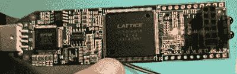

# 通过 Hackaday 的 FPGA 训练营快速学习 FPGA

> 原文：<https://hackaday.com/2018/08/06/learn-fpga-fast-with-hackadays-fpga-boot-camp/>

FPGAs 已经从预算大的人的利基产品变成了每个电子实验者工具箱中应该有的东西。我总是对我遇到的许多人感到惊讶，他们告诉我他们对使用 FPGAs 感兴趣，但他们还没有开始。如果你一直在寻找一种简单的方法来开始使用 FPGA， [Hackaday 的 FPGA 训练营](https://hackaday.io/list/160076-fpga-tutorials)就是为你准备的。小组中甚至有专门针对 FPGA talk 的 Hackaday.io 聊天，用于提问和一般性讨论！

虽然 FPGAs 并不是万能的，但是当你需要它们的时候，你真的需要它们。使用 FPGAs，您可以构建逻辑电路——不是软件模拟，而是真实的电路——并获得比 CPU 更大的性能优势。对于数字信号处理、神经网络或计算机视觉应用来说，能够并行处理所有事情是一大优势。有时你只需要几个逻辑门的原始速度，而不是一个有条不紊地通过代码的 CPU。我们希望看到更多的 FPGA 活动，因为 Arduino 已经在游戏中了。

这些训练营收集了你以前在许多文章中看到的一些材料，加上新的材料来充实它。它是为你设计的，让你更像一个培训班，而不仅仅是阅读一些文本。有大量的截图甚至动画来帮助你了解你应该做什么。你将能够通过模拟来了解我们所说的电路是如何工作的，做出改变，并看到结果。我们将专注于 Verilog——至少目前是这样——因为它接近 C 语言，对懂 C 语言的人来说更容易掌握。还不服气？让我们浏览一下新兵训练营系列的要点。

## 模拟和硬件

需要什么硬件？那得看情况。现在我们有四个训练营可用，你只需要最后一个真正的硬件。廉价的格子冰棍演示板非常适合你的第一次冒险。

它很便宜(不到 30 美元)，有你需要的一切，包括 USB 编程接口，还有开源工具。因此，选择其中一个是有意义的，即使您以后想继续使用不同的 FPGA。此外，一旦你不再需要它，你可以随时[将它重新用作逻辑分析仪](https://hackaday.com/2016/12/13/compiling-a-22-analyzer/)。然而，您可以在没有硬件的情况下完成前三项，并且您仍然可以遵循第四项，即使您没有硬件来完成实际工作。

### 你会在每个新兵训练营发现什么

如果你对数字逻辑一无所知，你可能想从 [Boot Camp 0](https://hackaday.io/project/159720-fpga-bootcamp-0) 开始。当你完成这些后，你应该理解基本的逻辑门、组合逻辑、触发器和时序逻辑。这里没有真正的 FPGA 内容，如果您知道 D 和 JK 触发器之间的区别、建立和保持时间以及如何创建简单的状态机，您可能可以跳过这一步。

 [新兵训练营 1](https://hackaday.io/project/159191-fpga-bootcamp-1) 和[新兵训练营 2](https://hackaday.io/project/159216-fpga-bootcamp-2) 不直接使用 FPGA 硬件。但它们会带你在 Verilog 中构建组合电路和时序电路。您可以在 web 浏览器中或使用离线 Verilog 模拟器来模拟您的设计。

在 [Boot Camp 3](https://hackaday.io/project/159692-fpga-bootcamp-3) 中，你实际上将把 Verilog 移动到 FPGA 配置中。你需要硬件来充分利用它。在那之后，这里有一些关于 Hackaday.com 的文章，这些文章讲述了使用相同硬件的其他项目，可以带你走得更远。好的一面是，在你进入第四个训练营之前，你所学到的东西几乎可以应用于任何 FPGA。

## 让我们知道这些教程是如何为你工作的！

让 Hackaday 和 Hackaday.io 与众不同的一点是，我们是一个非常互动的社区。因此，除了我们肯定会收到的评论之外，我们还希望您在其他一些方面给予我们帮助。如果你完成了这些教程，记录下你花了多少时间，让我们知道。我们最终会标记时间，以帮助其他人规划未来。此外，请告诉我们您还想看什么。您希望看到面向其他 FPGAs 的 bootcamp 3 新版本吗？您想了解更多关于状态机、VHDL 或时序优化设计的细节吗？请在 boot camp 页面、教程页面或 FPGA 聊天上留下您的评论，让我们知道您希望以这种形式看到哪些 FPGA 和非 FPGA 主题。