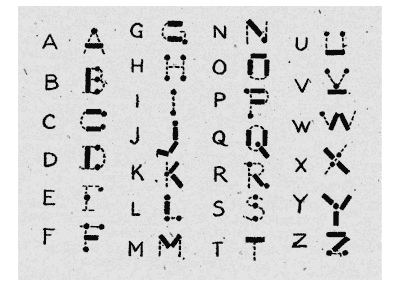

# 用路德维希·科赫的方法学习莫尔斯电码

> 原文：<https://hackaday.com/2020/02/21/learning-morse-code-the-ludwig-koch-way/>

大多数国家已经放弃了学习莫尔斯电码成为业余无线电爱好者的要求。正因为如此，你可能会认为莫尔斯电码已经死了。但事实并非如此。有些人喜欢怀旧。有些人认为你可以建造简单的设备来发送和接收莫尔斯电码。其他人认为莫尔斯电码比语音和一些老式的数字模式更可靠。不管什么原因，许多人想学习莫尔斯电码，它仍然是业余无线电爱好者的一部分。代码以难学而闻名，但事实证明，这主要是因为人们没有以聪明的方式学习代码。

 我不知道他们现在还做不做，但是一些青年组织曾经推广一些特别不好的学习代码的方法。第二个糟糕的方法是学习“点和划”,许多人确实是这样学习的。最糟糕的方法是使用一个像相邻的图像，试图将点和破折号映射成字母形状。这张图表至少可以追溯到 1918 年，当时一本女童军手册印制了这张图表。

即使你是一个视觉学习者，这也是一个坏主意。问题是，几乎不可能听到每分钟 20 或 30 个单词的声音，并把它们映射到这个视觉表现上。另一种直观的方法是使用二叉树，其中左分支是点，右分支是破折号。

如果你只需要每分钟掌握 5 个单词就能获得一枚奖章，你可能会侥幸过关。但是真正使用的话，一分钟 5 个字是很慢的。例如，以这种速度发送这个句子大约需要 3 分钟。就那一句话。

那么有哪些比较好的方法呢？让我们来看看。

## 试探一下

当你听到有人说“大象”这个词时，你不会(我们希望)把它翻译成单个的字母。你可能真的会听到音素，但大多数人甚至不会这么做。你只是听到一个声音，你的大脑知道这个声音意味着一只长着鼻子的灰色大动物。这就是你想用莫尔斯电码得到的。声音应该只是字母的意思，不需要解释它们。

这可能是第三糟糕的学习方法，不幸的是，这是我们很多人都学过的方法。对于初学者来说，发送莫尔斯电码非常慢是很常见的——尤其是在过去。这很好，但当你试图走得更快时，它会限制你。

如果你考虑大象的例子，这就像如果你正在努力学习英语，你的教练说“El…嗯……范特。”理解她的话很容易，但是理解正常人说话就比较难了。

## 加速开始:法恩斯沃思方法

今天，以唐纳德·法恩斯沃思命名的法恩斯沃思方法非常普遍。这个想法是以你想要学习的目标速度发送代码，但是要间隔一段时间，这样平均速度会慢很多。例如，你的教练可能每分钟发送 15 个单词，但是间隔开了，所以实际上是每分钟 5 个单词。

有道理。你听到了你熟练时会听到的声音。但是你会有时间考虑的。随着你变得越来越熟练，你会减少间隙，直到你在正常的间距。

## 另一途径

一种不太常见但非常有效的学习方法是以心理学家路德维希·科赫(Ludwig Koch)命名的科赫方法(我们认为这与因自然录音而出名的科赫是同一个原因)。像 Farnsworth 方法一样，你以目标速度发送字符。不同的是你只发两个角色。当复制代码的人可以准确地复制 90%的代码时，教练会添加第三个字符。你继续这三个字符，直到学习者回到 90%。然后第四个字符出现，整个过程重复，直到学习者可以复制所有的字符。

这是令人惊讶的有效，因为它自然地让你注意到声音，而不是点和破折号。科赫能够在 14 小时内教会一个班的学生以每分钟 12 个单词的速度抄写代码。然而，这种方法直到最近才被经常使用。

## 数字时代开启少走的路

Koch 方法的问题在于，它很难用传统的标准方法来教授代码。唱片、录音带、纸带发送机(就像下面视频中的指示仪)和无线电广播没有一种简单的方法来让你练习你所知道的字母组加上一个额外的字符。在大班里也很难做到这一点，因为一两个较慢的学习者会耽误整个班级。

所以，理想的情况是，你有一个老师来教几个人甚至一个人，或者你需要一台可以发送莫尔斯电码的电脑。这在今天很容易，但并不总是这么简单。

 [https://www.youtube.com/embed/-7J44bDItE4?version=3&rel=1&showsearch=0&showinfo=1&iv_load_policy=1&fs=1&hl=en-US&autohide=2&wmode=transparent](https://www.youtube.com/embed/-7J44bDItE4?version=3&rel=1&showsearch=0&showinfo=1&iv_load_policy=1&fs=1&hl=en-US&autohide=2&wmode=transparent)

## 获得学习

如果你想学习代码，或者你想学得比你现在知道的更好，科赫方法非常简单。如果一群学生能在 14 小时内学会代码，你也应该能。即使每天花一个小时，那也只有两个星期。

有很多资源，但我们喜欢的是 [LCWO](https://lcwo.net/) (在线学习 CW——CW 或连续波是莫尔斯电码的火腿语)。该网站不需要任何费用，并且会跟踪你的进度。一旦你学会了，你就可以练习文本、单词、呼号和普通的业余无线电交流。

即使你不再需要莫尔斯电码来获得业余爱好者执照，它也确实开辟了新的机会。如果你不想做业余无线电，想想你可以做的所有 Arduino 项目，其中设备可以用闪烁的 LED 向你发出信号，你可以用一个开关触点来命令它。并不是说我们会用那样的计划来数 21 点牌。我们永远不会那样做。如果你不想使用电脑，但仍然需要一个教练，你可以试试这个 [1939 代码训练器](https://hackaday.com/2019/01/09/morse-code-keyboard-1939-style/)。