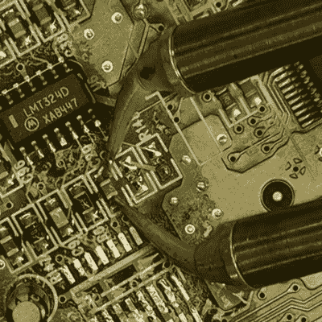

# 学会优雅地去荒凉

> 原文：<https://hackaday.com/2021/07/24/learning-to-desolder-gracefully/>

当你刚开始学素描时，你用石墨。为什么？它很便宜，能很好地训练你识别不同的颜色，最重要的是，它是可擦除的。当你学习的时候，你会犯错误，而不犯错误是游戏的重要部分。当然，电子产品也是如此，所以当你教别人焊接时，不要忽视教他们去焊接。

I want these!

我们可以整天争论按下熔融金属撤销按钮的最佳方式，但事实是这是理所当然的。我有很好的运气与焊料编织，也许是一个小热风枪拉起不情愿的 SOIC 表面贴装芯片，但没有什么比一个焊料吸盘清理几个通孔。(我没有尝试过[用压缩空气](https://hackaday.com/2021/01/06/bad-idea-for-desoldering-actually-might-be-pretty-smart/)爆破接头这种有问题但久经考验的做法。)

对于大块零件移除，你真正要做的就是加热电路板，有很多方法可以做到这一点，从花哨到愚蠢。[低温合金](https://hackaday.com/2021/06/02/make-your-desoldering-easier-by-minding-your-own-bismuth/)在真正困难的情况下提供帮助。对于移除成排的引脚接头，它可以帮助沿着成排的引脚添加更多的焊料，直到它成为一个熔化的斑点，然后点击 PCB 并观察该部分——以及热的液态金属！—直接退学。

但更重要的一点是，学习新技术的重要一步是学会消除你的错误。当你知道你可以拔出焊接编织带，然后叫“重做”的时候，这一切就不那么可怕了。别忘了通量。

This article is part of the Hackaday.com newsletter, delivered every seven days for each of the last 200+ weeks. It also includes our favorite articles from the last seven days that you can see on [the web version of the newsletter](https://mailchi.mp/hackaday.com/hackaday-newsletter-649368). Want this type of article to hit your inbox every Friday morning? [You should sign up](http://eepurl.com/gTMxQf)!