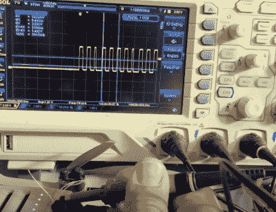

# LED 黑客教 DJI 迷你 2 无人机新招

> 原文：<https://hackaday.com/2021/04/20/led-hack-teaches-dji-mini-2-drone-new-tricks/>

尽管它的比例很小，但 DJI 迷你 2 的推重比足够高，可以携带相当数量的行李。所以毫不奇怪，有一个遥控有效载荷释放的家庭工业可以栓在这种流行的四轴飞行器的底部。但是[【tter ev 3】想要一种能更好地与 DJI 的软件](https://github.com/tterev3/mini2-payload)集成的东西，而不是依赖一个单独的发射器。

正如下面视频中所解释的，他的解决方案是接入控制无人机前面 RGB LED 的信号。由于用户可以通过 DJI 智能手机的官方应用程序随时改变 LED 的颜色，因此解码该信号以确定选择了哪种颜色就像给发射器添加了几个新的通道。在这种情况下,[tterev3]只需要解码一种颜色以用作“放下”信号，但不难想象如何通过多几行代码将这一概念扩展到触发几种不同的动作。

Examining the LED control signal.

[tterev3]编写了一些软件来解码发送到带有 PIC18F26K40 微控制器的 LED 的 48 位数据，该微控制器反过来使用 L9110H H 桥来控制一个微型齿轮电机。为了获得反馈，他使用了一个粘在释放臂上的小磁铁和一个霍尔效应传感器。

考虑到他实际上可以从一个用于 LED 的连接中获得多少电力，他给了这个版本自己的电池，当无人机运行时，它会慢慢充电。你可能会争辩说，由于发动机只需要启动一次就可以放下有效载荷，[tterev3]很可能在飞行过程中根本没有给它充电。但是，由于能够解码额外的颜色信号，这里展示的技术为未来的发展带来了很大的希望。

多年来，人们一直在为商用四轴飞行器捆绑额外的硬件，但像这样的修改实际上让飞行器释放其有效载荷并飞走，这对于环境监测和[建立网状通信网络](https://hackaday.com/2021/04/08/18650-brings-esp8266-wifi-repeater-along-for-the-ride/)具有特别的前景。

 [https://www.youtube.com/embed/DBzJd7ATzxQ?version=3&rel=1&showsearch=0&showinfo=1&iv_load_policy=1&fs=1&hl=en-US&autohide=2&wmode=transparent](https://www.youtube.com/embed/DBzJd7ATzxQ?version=3&rel=1&showsearch=0&showinfo=1&iv_load_policy=1&fs=1&hl=en-US&autohide=2&wmode=transparent)

