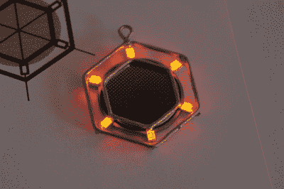

# LED 珠宝巧妙地利用了黄铜

> 原文：<https://hackaday.com/2019/05/13/led-jewelry-makes-neat-use-of-brass/>

可穿戴电子产品既有趣又时尚。然而，以对佩戴者来说既实用又舒适的方式巧妙地集成电子组件存在一定的挑战。本着这种精神， [[Jiri Praus]已经成功创造了一些发光的耳环，它们非常容易佩戴。](https://www.instructables.com/id/LED-Jewelry/)

The body of the earring also acts as the conductor and battery holder, all in one.

耳环从黄铜棒开始，用钳子弯曲并在末端焊接。按照一个纸模板，用手就可以得到整齐而精确的弯曲，这是制作一对相匹配的线所必需的。通过精心的设计，黄铜棒被焊接到 led 上，然后更多的棒被用于创建一个硬币电池的集成支架，该电池为灯供电。

多亏了[Jiri]的聪明设计——我们以前曾以盛开的线框郁金香的形式展示过——不需要电线。构成珠宝主体的黄铜棒也作为导体将电流传递给发光二极管。纽扣电池的内阻也消除了对串联电阻的需求。结合起来，这有助于创造一个简单和有吸引力的成品，应发光几个小时。

[在](https://hackaday.com/2017/02/12/tiny-led-earrings-are-a-miniaturization-tour-de-force/)之前，我们也见过其他 LED 耳环设计。有很多方法可以尝试发光的珠宝，如果你做了一些新奇的事情，[一定要让我们知道。](http://hackaday.com/submit-a-tip)