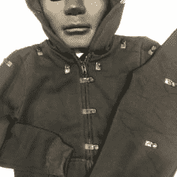

# LED 棒人服装点亮夜晚

> 原文：<https://hackaday.com/2018/10/31/led-stick-person-costume-lights-up-the-night/>

有时一个简单的想法可以产生奇妙的结果。几串 LED 灯带固定在一件黑色连帽衫和运动裤上，就这样……[一件万圣节 LED 手杖人服装](https://glowyzoey.com/)。“Glowy 佐伊”的创造者[Royce]最初将一些在黑暗中发光的手杖人套装放在一起，以便在晚上到达斜坡时脱颖而出。现在他把这个简单的想法用在了服装上，并以此做了一笔小生意。

> 
> “我有很多多余的零件。我收拾好一切，开始焊接工作。”罗伊斯·胡坦

这套衣服本身由纽扣和缝成图案的缎带环组成，这些图案将 LED 灯条围绕在夹克的兜帽周围，并延伸到每只手臂。为了使灯光效果流行，一个全黑塑料面具被用来覆盖佩戴者的脸。如果愿意的话，用 EL 线代替 LED 灯条并不困难。我们打赌你们中的许多人可以直接从垃圾箱里拿出这个。

几年前，当闪亮的佐伊简笔画套装出现在吉米·法伦的深夜节目中时，它们甚至受到了一些主流电视媒体的关注。请注意，访问 Glowy 佐伊网站可能会带你回到过去，因为它有一个在 Web 1.0 时代非常流行的自动播放顺口溜。事实上，在他们 YouTube 频道的视频中也使用了同样的广告词:

 [https://www.youtube.com/embed/ZX6DRZGlLyg?version=3&rel=1&showsearch=0&showinfo=1&iv_load_policy=1&fs=1&hl=en-US&autohide=2&wmode=transparent](https://www.youtube.com/embed/ZX6DRZGlLyg?version=3&rel=1&showsearch=0&showinfo=1&iv_load_policy=1&fs=1&hl=en-US&autohide=2&wmode=transparent)

如果你错过了，看看 Hackaday 上的这件[性感的幽灵骑士服装](https://hackaday.com/2018/10/26/ghost-rider-costume-is-smoking-hot/)。