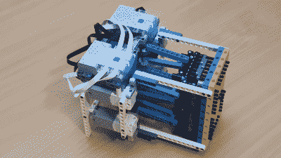

# 乐高十四段展示需要大量的马达

> 原文：<https://hackaday.com/2022/04/12/lego-fourteen-segment-display-needs-plenty-of-motors/>

黑客们喜欢七段显示器，他们会很乐意对你几乎可以在上面拼写的愚蠢的单词等等大加渲染。不太受欢迎的是它们更大的表亲，14 段和 16 段显示器，它们得到了所有关于事物的字母数字，因此人类更容易阅读。你甚至可以用乐高建造前者，[如【奥德】所展示的。](https://www.youtube.com/watch?v=tvGzUWtm828)

A look at the mechanism driving the display.

这些“片段”是由乐高轴组成的，当它们被“打开”时，就会被推过黄色的孔矩阵。整整七个马达用于使单字符显示器工作，每个马达驱动两个部分。需要两个乐高驱动的控制器砖块来驱动这里发生的一切，这使得最终的设计不仅在机械上复杂，而且在电子上也复杂。

有趣的是，这些也不便宜；这个版本的零件总成本可能在 50-100 美元之间。你可能不想用这种设计来构建一个完整的滚动留言板，即使它在黑色和出租车黄色下看起来光彩夺目。

我们以前也看过[ord]的作品，这些机械宏伟的 7 段乐高展示。休息后的视频。

 [https://www.youtube.com/embed/tvGzUWtm828?version=3&rel=1&showsearch=0&showinfo=1&iv_load_policy=1&fs=1&hl=en-US&autohide=2&wmode=transparent](https://www.youtube.com/embed/tvGzUWtm828?version=3&rel=1&showsearch=0&showinfo=1&iv_load_policy=1&fs=1&hl=en-US&autohide=2&wmode=transparent)

【感谢 Keith Olson 的提示！]