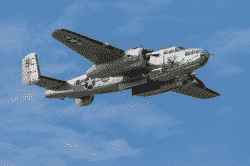
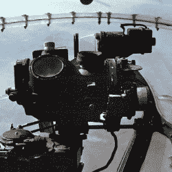

# 少即是多——或者如何用 20 美分替换价值 25000 美元的炸弹瞄准器

> 原文：<https://hackaday.com/2022/04/14/less-is-more-or-how-to-replace-a-25000-bomb-sight-for-20-cents/>

取决于你问谁，诺顿投弹瞄准器要么是第二次世界大战期间最高的高科技，要么是为政府承包商提供工作和金钱的被夸大的失败。不管怎样，这在当时都是超级绝密。它也很贵。它们每个大约花费 25，000 美元，整个项目花费超过 10 亿美元。安全措施过了头。不飞行时，投弹瞄准器被从飞机上取下，锁在一个保险库里。有一个烟火装置，如果它有被捕获的危险，它会自毁。那么，为什么二战中最著名的飞行任务之一是用价值 20 美分的机械加工金属来代替诺顿呢？好问题。

你经常听到“少即是多”的说法，在这种情况下，这是一个准确的想法。不过，我经常说“适可而止”。不过，在这种情况下，少一点就足够了。太平洋战区的一次著名任务没有飞越北欧有三个原因。这一切都与士气、技术和保密有关。

## 任务

A B-25 in Flight

有时候，外表很重要。如果你曾经测试过用户对等待输出的反应，你会发现他们更能容忍看着屏幕上的数据慢慢滚动，而不是等待数据突然出现。杜立特尔对日本的突袭就是这样。这并不实际，也不太可能改变战争的结果，但它让人们感觉到正在做一些事情。

偷袭珍珠港后，美国严重不安。尽管夏威夷不是大陆的一部分，但它是美国的一部分，美国人强烈感受到日本可能袭击美国领土的威胁。美国需要反击，但别无选择。由于这次袭击，海军的大部分人员都退役了。那个时代的飞机不能满载炸弹和燃料穿越太平洋。美国人也没有能够完成这次旅行的导弹。

进入吉米·杜利特尔。在几乎所有人都认为无法报复的地方，杜利特尔和其他几个人确信他能找到办法。他组建了一个 B-25 米切尔轰炸机中队，并着手准备飞往日本。

## 少…少得多

B-25 的正常航程为 1300 英里，但它需要从航空母舰上起飞至少 2400 英里才能打到日本。所有的东西都必须用来减轻飞机的重量，并为额外的油箱腾出空间。枪支、防爆板、防寒设备和一些无线电不得不搬走。

A Norden ready to fly

新的燃料箱占据了一些创造出来的空间。另一件必须扔掉的东西是诺顿投弹瞄准器。官方说法是低空轰炸不好。然而，重量也很重要，这可能是主要原因，至少有一架飞机可能被击落并被俘获。陆军航空兵不想冒险去北欧。原来，德国人在战前就收到了这些计划，并有他们自己的版本，但当时没人知道。

## 但是你仍然需要一个瞄准器

Photo BY【pi 3.124】[CC BY-SA 4.0](https://creativecommons.org/licenses/by-sa/4.0/deed.en)

不过，你还是需要某种投弹瞄准器。在那里，查尔斯·罗斯·格林宁在一些机械加工的帮助下创造了他所谓的“马克·吐温”投弹瞄准器。报纸后来称它为“20 美分投弹瞄准器”，因为它使用的材料很少。这是来自维基百科的描述:

> [马克·吐温]由一个 7 英寸(18 厘米)乘 7 英寸(18 厘米)的四边形组成，以 10 度为增量刻上一个 90 度的圆弧，水平放置在诺登山。当四边形向左或向右转动时，一个手柄使飞行员方向指示器偏转，为飞行员指示规定的航向。一个 5.25 英寸(13.3 厘米)乘 7.25 英寸(18.4 厘米)的垂直块，根据炸弹大小、高度、风力条件和地面速度设置投掷角度。垂直件有一个瞄准杆，后部有一个“V”形缺口，与前面的一个点对齐，就像步枪瞄准器一样。投弹手将投弹瞄准器对准目标的方向，当他靠近时抬起尾巴，直到他到达投放角度，这时他将释放炸弹。

简单，本身。然而少即是多。至少在某些情况下，廉价的瞄准器可能比诺顿的实际性能更好。这次突袭算是成功了。它并没有造成太大的实际损失，所有的飞机都被丢弃了，但是它对盟军的士气产生了积极的影响，而对日本民众产生了相反的影响。

## 经验教训

有一个著名的老故事，美国国家航空航天局花钱建造了太空笔，而俄罗斯人只是用铅笔。事实证明这个故事不是真的(美国国家航空航天局没有出资开发费希尔太空笔)。但这让我想起了 20 美分的投弹瞄准器。虽然你可以削减太多，但有时少就是多。

我想我们经常忘记这一点。我们经常听说相对简单的系统由于不必要的过多软件而失败。例如，查看 EDN 关于臭名昭著的[丰田固件问题](https://www.edn.com/toyotas-killer-firmware-bad-design-and-its-consequences/)的报告。诚然，这可能是做工差而不是过于复杂的情况，但话说回来，我宁愿有几个专用的 CPU 在裸机上执行非常具体的任务，而不是一些带 RTOS 的大处理器处理这么多至关重要的任务。

如果你想了解更多关于诺登的炒作，我们之前已经讨论过了。我们也谈论过[那个时代的重型轰炸机](https://hackaday.com/2019/09/24/a-virtual-tour-of-the-b-17/)。

标题图片:[计算机历史博物馆的诺顿投弹瞄准器](https://commons.wikimedia.org/wiki/File:Norden.JPG)艾伦·j·克罗宁，CC BY-SA 3.0