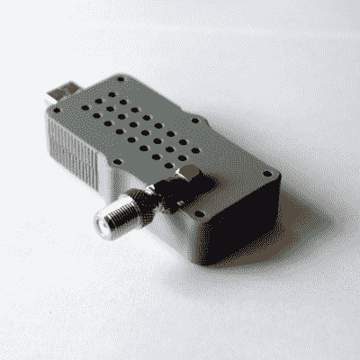

# 从为期一天的 RTL-SDR 外壳项目中吸取的经验教训

> 原文：<https://hackaday.com/2018/12/14/lessons-learned-from-a-1-day-rtl-sdr-enclosure-project/>

[ByTechLab]需要一个外壳来安装他的基于 R820T2 的 RTL-SDR，它带有一个 SMA 连接器。决心在不到一天的时间里设计和 3D 打印一个，他学到了一些关于 3D 打印实用设计的东西，并与他的 CAD 文件一起在网上分享。

RTL-SDR 是一系列经济的软件定义无线电接收机，并且[ByTechLab]的外壳(GrabCAD 上的 CAD 文件[和 Thingiverse](https://grabcad.com/library/rtl-sdr-dongle-case-1) 上的 STL [是针对其型号的。然而，他学到的经验教训适用于一般的外壳设计，其中一些专门适用于 3D 打印。](https://www.thingiverse.com/thing:3093321)

他首先制作了 PCB 的基本模型，并确保包含所有大型元件。有了这个，他就可以在外壳内部建立正确的空间模型，以确保浪费的空间最小化。PCB 没有任何类型的安装孔，因此该模型也有助于选择在何处放置一些凸片来固定 PCB。这解决了外壳设计的问题，但也值得注意制造方法，以便发挥其优势。对于 FDM 3D 打印来说，这意味着大多数弯曲形状和圆形边缘都是微不足道的。这也意味着，你自己能做的最大的事情就是设计零件，使它们可以在没有任何支撑的情况下以稳定的方向打印。

这可能不是一个有经验的 3D 打印机和建模师所不知道的，但每个人在某种程度上都是新手，学习他人的经验可以真正节省时间。对于更有经验的人，我们介绍了更加深入的实用 3D 打印外壳设计指南。

[ByTechLab]对定制外壳的渴望部分是因为 RTL-SDR 设备有许多形状和大小，正如你在这篇对 19 个不同单元的[评论中所看到的(其中只有 14 个实际工作。)](https://hackaday.com/2017/09/05/19-rtl-sdr-dongles-reviewed/)