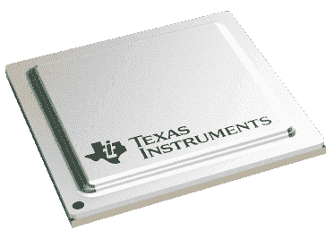

# 让战争的筹码溜走

> 原文：<https://hackaday.com/2022/09/13/let-slip-the-chips-of-war/>

我们将大胆预测，未来的历史书将会注意到，在全球疫情之后入侵一个主权国家的决定并不完全是最佳时机。事实证明，疫情促成的全球电子产品短缺不仅仅影响到我们这些有和平意图的人，因为俄罗斯的战争机器在制造现代武器及其相关控制设备所需的零件方面存在一些供应问题。

正如您所料，这些器件中有许多是电子产品，在某些情况下，它们来自我们日常使用的供应商。这篇来自 *POLITICO* 的[文章包括一个嵌入的电子表格，按紧急程度分类](https://www.politico.eu/article/the-chips-are-down-russia-hunts-western-parts-to-run-its-war-machines/)，完整的零件号、制造商，甚至莫斯科期望支付的价格！

Chips from US-based firms such as Texas Instruments are particularly hard for the Kremlin to source.

那么我们到底在谈论什么部分呢？最高优先级列表中最便宜的芯片是 Marvell 的“Alaska”88e 1322，这是一种双千兆以太网 PHY，根据莫斯科的说法，成本仅为 7.10 美元。最贵的是 10M04DCF256I7G，这是一款 Altera(现为英特尔)Max-10 系列 FPGA，售价 1101 美元(或 66815 卢布，用于记账)。

但困扰他们的不仅仅是芯片，Airborn 的军用规格 D-sub 连接器无法获得，所有类型的基本无源部件、电阻器、二极管、分立晶体管也是如此。电容尤其成问题(不是一直都是)。ADI 公司的大量芯片，以及 Maxim、Micrel 等公司的许多芯片。甚至 Nexperia 的微型逻辑芯片。

当然，这部分是由设计决定的。更严厉的制裁阻止俄罗斯直接购买这些部件，这是为了尽可能使持续的侵略在经济上不愉快。但正如《政治报》的文章所指出的，在西方不知情的情况下，很难阻止一些中间人“帮忙”。毕竟，一旦一个零件上市，几乎不可能保证它最终会被焊接到哪里。

感谢[金泰]的提示！