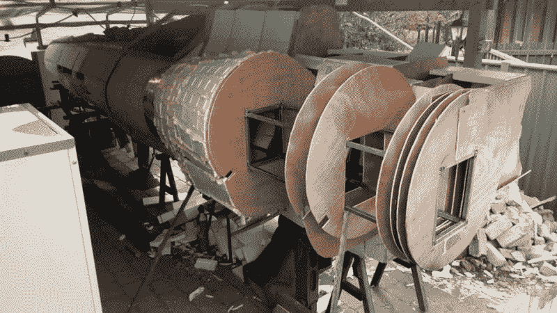

# 真人大小的殖民毒蛇在澳大利亚着陆

> 原文：<https://hackaday.com/2022/06/02/life-sized-colonial-viper-touches-down-in-australia/>

别担心，这种 8.4 米(27 英尺)的澳大利亚毒蛇不会咬人，但它很可能会对任何离堪培拉太近的赛昂突袭机造成伤害。[正如最近 *Riotact*](https://the-riotact.com/meet-the-52-year-old-nerd-building-a-life-size-spaceship-in-his-canberra-shed) 所报道的，创作者【巴兹·阿姆】已经在他的工棚里辛辛苦苦地拼凑了这个 1:1 比例的殖民地毒蛇马克 2 号的复制品，这个复制品来自重新想象的*太空堡垒卡拉狄加*系列，到现在已经有几年了，在这一点上，事情真的开始走到一起了。

自 2017 年以来，[Baz]一直在他的个人网站上[维护这个虚构飞船的建造日志，内容涵盖从为驾驶舱显示器供电的电子设备到车床加工 30 毫米大炮的令人惊讶的复杂木工。他甚至记录了他与该剧特效团队成员进行的采访，以尽可能让他的版本的蝰蛇与屏幕保持一致。](https://www.buildsbybaz.com/category/viper-build/)

Plywood bulkheads are mounted to an internal metal frame.

不管你怎么看这个建筑，它都令人印象深刻。但我们特别欣赏的一件事是[巴兹]设法重新利用本来会是垃圾的东西的技巧。例如，主驾驶舱显示器实际上是一个从汽车上拉下来的仪表板导航系统，发动机的涡轮叶片是从铝制路标上切下来的。他甚至设法通过从当地飞行员那里收集损坏或未校准的设备，为蝰蛇配备了一系列真正的飞机仪器。

虽然蝰蛇可能看起来随时准备投入行动，但仍有相当多的工作要做。这架飞机的机身由金属、木材和泡沫制成，需要涂上玻璃纤维，打磨，然后喷漆，以匹配电视上的对应物。[巴兹]说，这个过程至少还需要一年时间，但他也立即提到，他正在考虑添加一个带有冷气推进器的功能性反应控制系统——所以我们要冒险说，这可能是那些永远不会完全完成的项目之一。请注意，我们不是在抱怨。尤其是当你考虑到《T2》太空堡垒卡拉狄加《T3》系列在结局中巧妙收尾的不稳定记录时。

 [https://www.youtube.com/embed/-1lCoVtn_yU?version=3&rel=1&showsearch=0&showinfo=1&iv_load_policy=1&fs=1&hl=en-US&autohide=2&wmode=transparent](https://www.youtube.com/embed/-1lCoVtn_yU?version=3&rel=1&showsearch=0&showinfo=1&iv_load_policy=1&fs=1&hl=en-US&autohide=2&wmode=transparent)

 [https://www.youtube.com/embed/wwPGUrWO7F0?version=3&rel=1&showsearch=0&showinfo=1&iv_load_policy=1&fs=1&hl=en-US&autohide=2&wmode=transparent](https://www.youtube.com/embed/wwPGUrWO7F0?version=3&rel=1&showsearch=0&showinfo=1&iv_load_policy=1&fs=1&hl=en-US&autohide=2&wmode=transparent)

感谢[Kez]的提示。