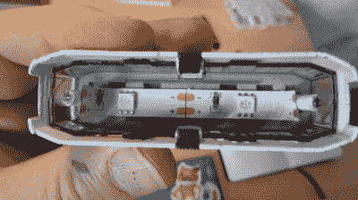

# 点燃一辆小火车需要小工具

> 原文：<https://hackaday.com/2020/03/04/lighting-up-a-tiny-train-needs-tiny-tools/>

一辆[voidnill]用一个小 LED 条片段照亮的小玩具火车展示了修改现有产品和处理一般小东西带来的几个挑战。一个是，在修改某些东西时，通常很难绕开现有的设计选择和材料。第二个是问题被放大了，一切都是如此的渺小。

【void nill】的大量照片说明了从钻小铆钉和攻螺丝孔到安装一个小开关、LED 灯条和作为电源的纽扣电池的一切。当事情这么小的时候，一些通常的解决方法就不适用了。例如，氰基丙烯酸酯胶似乎是安装小型塑料零件的好主意，但 CA 胶很容易渗透到微型电源开关等组件中，并堵塞内部，使其无用。

[voidnill]使用大量仔细的切割和耐心来完成所有工作，并展示了优质工具的重要性。LED 条形碎片由三个小纽扣电池驱动，虽然胶带可以作为电池支架，但[voidnill]认为 3D 打印的定制电池框架真的可以做到这一点。

这种制作或修改小东西的工作真正让人们看到了像[这张内部装有 N 轨距铁路模型的咖啡桌](https://hackaday.com/2019/06/22/coffee-tables-computers-and-railways/)这样的项目背后的努力。