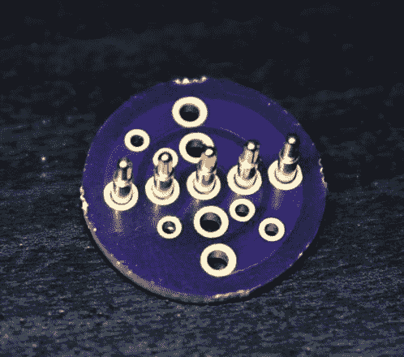

# 光剑使用弹簧针使组装变得轻而易举

> 原文：<https://hackaday.com/2018/11/07/lightsaber-uses-pogo-pins-to-make-assembly-a-breeze/>

今年 Supercon 上有无穷无尽的精彩项目，但其中一个真正突出的是[【斯科特】的光剑](https://thefirebrandforge.com/page/lightsaber/)。如果你走来走去，看到有人带着一个*非常亮的* RGB 设备，带着一个镀铬手柄挂在腰带上，很可能就是这个，尽管可能很难直视。从外面看，军刀看起来像一个精心打磨的 cosplay 道具，它就是！但是，当斯科特迅速将设备分解成零部件时，很明显，在组装电子设备时投入了额外的精力。

像任何一把好的光剑复制品一样，剑刃被点燃了，而且亮得令人惊叹。构造相当简单，它是一个三角形核心上背靠背的三个 WS2812B LED 灯条，安装在带扩散器的半透明聚碳酸酯管内。不是特别不寻常。但为了方便运输和储存，刀片可以在一瞬间从刀柄上弹出，所以这些条不能被焊接进去。连接器本来是可以工作的，但是当他们断开光剑刃的时候，谁会想要飞行的电线呢？答案？弹簧针！Scott 将电源线、地线和数据线从带线中引出，放入一个带有滑环式电镀环的小电路板中。在刀柄上，有一个匹配的弹簧针阵列来传递电源和数据。所有条的数据线都连在一起，最大限度地减少了连接数量，外部两个电源环有一个以上的引脚，以提高载流能力。一个方便的副作用是刀片上没有*没有*led 的地方；木条一直延伸到刀身的末端，与刀柄内的主板相接。

剑柄上布满了 18650 的组件和一个装有定制盾牌的小盒子，所有这些都装在一个印刷的中框内。整个建筑都是关于易于组装的坚固设计。主板通过安装在两端的垂直 PCB 进行装订，一个在顶部连接到刀片，一个在底部连接到扬声器。底部有一个可选的蓝牙无线电空间，允许远程 RGB 控制。

Scott 将其作为产品销售，但也提供了每个组件的详细说明和零件清单。这里是[叶片的组装说明](https://thefirebrandforge.com/lightsaber/blade-and-plug-assembly/)。[刀柄在这里](https://thefirebrandforge.com/lightsaber/graflex-hilt-assembly/)。pogo 适配器就在[奥什公园这里](https://oshpark.com/profiles/TheFrebrandForge)。与 GitHub 有[链接的固件概述在这里](https://thefirebrandforge.com/lightsaber/software/)。休息后查看手柄组件和刀片附件的演练！

 [https://www.youtube.com/embed/oc1o9m1Pok0?version=3&rel=1&showsearch=0&showinfo=1&iv_load_policy=1&fs=1&hl=en-US&autohide=2&wmode=transparent](https://www.youtube.com/embed/oc1o9m1Pok0?version=3&rel=1&showsearch=0&showinfo=1&iv_load_policy=1&fs=1&hl=en-US&autohide=2&wmode=transparent)

