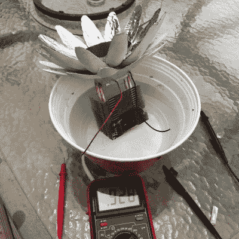

# 百合动力舱让塞贝克效应看起来不错

> 原文：<https://hackaday.com/2018/08/11/lily-power-pods-make-the-seebeck-effect-look-good/>

Small proof of concept generating just under one volt in cloudy conditions.

塞贝克效应(更广泛的热电效应的一部分)是温差如何直接转换成电压的，它是热电偶和珀耳帖结等器件背后的工作原理。利用这种效应，努力从环境中获取有用的电流，已经产生了一些有趣的想法，比如[Josh Starnes]的[Lily Power Pods](https://hackaday.io/project/159239)。

这个特殊设计的有趣之处在于艺术角度与功能性的交叉。从电学角度来说，这些吊舱的热电发电机的一侧被太阳加热，而另一侧被浸没在水中冷却，温差产生了可测量的电压。[乔希]设计了类似花朵的豆荚，箔花瓣有助于将阳光导向热电发电机的黑色“热面”，而水则负责冷面。

箔花瓣是收集和直射阳光的最佳方式吗？他们不是，但想法是让豆荚看起来不像是漂浮的大块机器。由于吊舱必须漂浮在水中并暴露在阳光下，因此它们将具有高能见度。[Josh]似乎觉得它们不碍眼很重要。毕竟，一台效率较低但不受欢迎的发电机仍然比一台被象征性地摘下帽子并被告知走开的发电机产生更多的电力。

The [HackadayPrize2018](https://hackaday.io/prize) is Sponsored by:     