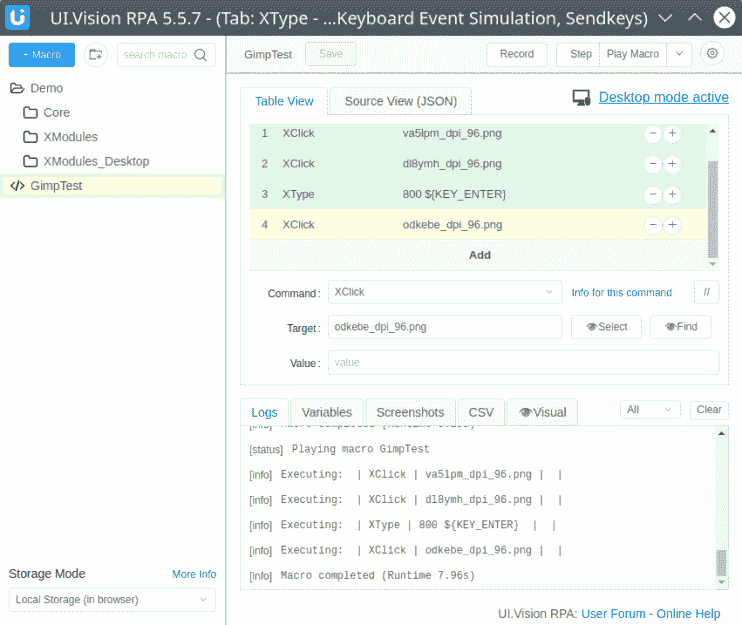
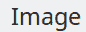
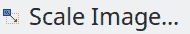

# Linux-Fu:通过匹配屏幕截图实现 Chrome 和桌面的自动化

> 原文：<https://hackaday.com/2020/06/15/linux-fu-automation-for-chrome-and-the-desktop-by-matching-screenshots/>

我会第一个承认。这几乎不是——至少不是专门的——一篇 Linux 文章。主题？Chrome 或 Firefox 的自动化工具。但在你按后退键之前，听我说完。当然，这个 Chrome 插件最初是作为一个自动测试网页和在浏览器中自动完成重复任务的工具。但是，它可以将这种能力扩展到计算机上的所有程序。因此，从理论上讲，您可以用它来图形化地构建宏，这些宏可以以令人惊讶的复杂方式与桌面应用程序进行交互。理论上，反正；有几个问题。

这个程序有几个不同的名字。大多数文档称之为 [UI Vision RPA](https://ui.vision/rpa) ，尽管也有一些参考 Kantu，它似乎是一个更老的名字。RPA 是机器人流程自动化的缩写，是一个行业术语。

让我们兜一圈，看看到底是怎么回事。

## 超越宏记录

我用 Chrome 测试了它，它在 Windows 和 Linux 上都运行得很好(可能还有 MacOS，但我没有测试)。然而，桌面模式需要一点欺骗。我最终解决了这些问题——算是——它们可能会也可能不会影响交易，这取决于你的设置。

UI 视觉 RPA 相当巧妙。如果只是自动化网页，可以录制宏。当你在录制过程中与浏览器交互时，程序可以通过监控浏览器中的域对象模型(DOM)来查看你在做什么。然后，它能够找到相同的东西，并在播放过程中重复你的动作。

它可以通过多种方式识别元素，包括 CSS 标识符、模式匹配，有时还会使用光学字符识别(OCR)。这是更令人兴奋的事情之一，是与 OCR 的耦合。例如，脚本可以在网页上找到股票代码，然后使用 OCR 以文本字符而不仅仅是图像的形式读取其旁边的价格。

## 你可以给它看菜单命令的图片

要控制你电脑上的所有 GUI 程序，你需要下载并安装该软件的一些扩展。完成后，您可以转到“设置”并打开桌面模式。问题是录制在桌面模式下不起作用——你必须以更手动的方式设置脚本。您可以使用类似于`XClick`、`XMove`和`XType`的命令。现在的目标选择机制非常不同，而且——如果有效的话——非常聪明。

脚本 GUI 使用这样的模块，每个命令一个。对于要匹配的图像，每个命令上都有一个空格。这个框旁边有两个按钮:选择和查找。当你按下“选择”时，程序会给你三秒钟的时间，然后给你的整个桌面截图。这将在一个简单的图像编辑器中弹出，您可以在想要查找的内容周围画一个框。三秒钟的延迟让您可以下拉菜单或进行任何其他所需的设置。你可以不使用选择按钮来设置你自己的图片，但是你必须找出放图片的位置和文件命名规则，所以这不是很方便。

当宏执行时，或者当您点击 Find 按钮时，系统会获取另一个屏幕截图。这一次，它尝试匹配您在命令中提供的图像，然后进行移动、单击或键入字符。你可以用一个置信度来放松图片与搜索图片的接近程度。默认情况下，这是 80%,但您可以在设置中全局更改它，或者通过给单个文件名添加后缀来更改它(如 ffis9y_dpi_120.png@0.5 表示 50%的置信度)。

当这种方法奏效时，效果很好。还有一个命令来做与搜索图像相关的事情。换句话说，你可以找到一个图标，然后点击它旁边的按钮。除了创建各种鼠标点击和移动，该程序还可以模拟击键。你可以在下面看到这个项目关于桌面自动化的视频。

 [https://www.youtube.com/embed/wH0MLIUdD-Q?version=3&rel=1&showsearch=0&showinfo=1&iv_load_policy=1&fs=1&hl=en-US&autohide=2&wmode=transparent](https://www.youtube.com/embed/wH0MLIUdD-Q?version=3&rel=1&showsearch=0&showinfo=1&iv_load_policy=1&fs=1&hl=en-US&autohide=2&wmode=transparent)


## 一个例子:在 Gimp 中调整图像大小

我经常做的一件事是调整图片大小，以适应黑客文章的 800 像素宽度。所以我决定看看自动化是否可以用 Gimp 做一个这样的宏。确实可以，但有一些问题我稍后会描述。

你可以从两个方面来看这个剧本。图形版本如下所示:

[](https://hackaday.com/wp-content/uploads/2020/05/gmac.png)

如果你在使用这个程序的时候把鼠标悬停在这个神秘的文件名上，你会看到第一个图像是 Gimp 图像菜单。第二个是显示“缩放图像”的菜单项，第 4 行的图像是缩放按钮的图片。

以下是这些图像在脚本中出现的顺序:

[](https://hackaday.com/2020/06/15/linux-fu-automation-for-chrome-and-the-desktop-by-matching-screenshots/ex1-6/)

The Gimp Image Menu

[](https://hackaday.com/2020/06/15/linux-fu-automation-for-chrome-and-the-desktop-by-matching-screenshots/ex2-2/)

Submenu Item

[](https://hackaday.com/2020/06/15/linux-fu-automation-for-chrome-and-the-desktop-by-matching-screenshots/ex3-2/)

Scale Dialog Box Button

您也可以将代码视为 JSON:

```

{
  "Name": "GimpTest", 
  "CreationDate": "2020-5-20", 
  "Commands": [
    {
      "Command": "XClick", 
      "Target": "va5lpm_dpi_96.png", 
      "Value": ""
    }, 
    {
      "Command": "XClick", 
      "Target": "dl8ymh_dpi_96.png", 
      "Value": ""
    }, 
    {
      "Command": "XType", 
      "Target": "800 ${KEY_ENTER} ", 
      "Value": ""
    }, 
    {
      "Command": "XClick", 
      "Target": "odkebe_dpi_96.png", 
      "Value": ""
    }
  ]
}

```

## 什么不起作用以及一些解决方法

这个项目有一些严重的问题。首先，如果你有多台显示器，它将无法工作。作者意识到了这个问题，所以他们可能会在作品中进行修正，我不确定。然而，一个更严重的问题是，它在我的两台运行 KDE 霓虹的 Linux 电脑上似乎根本无法运行。在与开发人员进行了一点互动后，他们决定在 Ubuntu 的某些版本上，截图选择功能不起作用，并建议我手动截图。然而，这部分工作在我的两个设置。不起作用的是它为宏回放或查找按钮所做的模式匹配。

起初，我被难住了。当我知道它不能在多显示器上运行时，我让它在 Windows 上运行，所以我知道我正确地使用了这个程序。但是在我的 Linux 机器上，什么都不能用。我终于明白了一些事情。我的 Surface Book 和我台式机上的一个超大显示器都是可缩放的。这似乎是阻止程序正常运行的原因。将缩放比例设置为 100%使其按预期工作。

因此，如果您只有一台显示器，并且不使用缩放功能，这可能行得通。但是我希望持续的发展将会扩大支持的范围。目前有许多粗糙的边缘，可能是因为桌面自动化不是该项目的主要目标。我发现了一些事情:

*   用于桌面插件的 Linux 安装程序 1install.sh 使用 Bash 语法，但在解释器中有/bin/sh。一些 Linux 发行版将/bin/sh 映射到 Bash，但许多发行版没有。因为该文件没有执行权限，所以您可以将它放入 Bash，这样它就可以工作了。
*   安装文件将本机消息传递文件复制到您的浏览器目录中。然而，它不知道谷歌的 Chrome 测试版。我不得不手动将`~/.config/google-chrome/NativeMessagingHosts`(一个目录)复制到`~/.config/google-chrome-beta`。
*   不使用选择工具创建图像的过程不是很愉快。看起来文件必须在正确的目录中，并且遵循工具为您生成的文件的命名约定。
*   除非在左侧窗格中选择了您正在处理的宏，否则 find 功能似乎不起作用(情况并非总是如此)。有时看起来按钮什么也不做，你必须记住选择宏。

还有一个限制，尽管它不是一个 bug。OCR 功能(您不必使用)依赖于远程服务器。不仅有些人会反对将他们的桌面截图发送到一个未知的服务器，而且每天有 100 次转换的限制。在免费版本中，单个宏中的鼠标点击次数和字符数也有限制。有办法付出才能得到更多，我也不能怪他们，至少对于服务器端的 OCR。运行计算密集型服务器不是免费的。但是，您不必使用 OCR，所以这对您来说可能是问题，也可能不是问题，这取决于您想要做什么。

## **承诺**

从好的方面来看，该系统似乎非常通用。如果你不喜欢编程或脚本语言的 GUI 脚本，你可以选择它们。在任何主流平台上都有一个单一的脚本工具是非常有吸引力的。看起来，如果这个程序可以在多台显示器上工作，并且可以在通用的设置上工作(例如，缩放多台显示器)，它将会是一个大赢家。事实上，我认为这是一件值得关注的事情，看看它是否会有所改善。除非你只使用一个未缩放的屏幕。然后，它似乎工作得很好。

不过，如果你想让你的浏览器自动化，这似乎没什么问题。我在一个网站上有大约 4000 个垃圾邮件条目，每次只能删除其中的 30 个。我就是这样发现 UI 视觉 RPA 的。我需要一种反复点击删除按钮的方法，它很容易就完成了任务。

有没有 goto 自动化工具？我们之前已经讨论过自动化 X11 的技术，但是这些技术在其他平台上对你没有帮助。他们也不做图文匹配。当然，你总是可以用硬件来[自动化。](https://hackaday.com/2014/07/26/pwning-timberman-with-electronically-simulated-touchscreen-presses/)