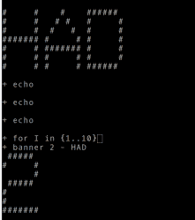
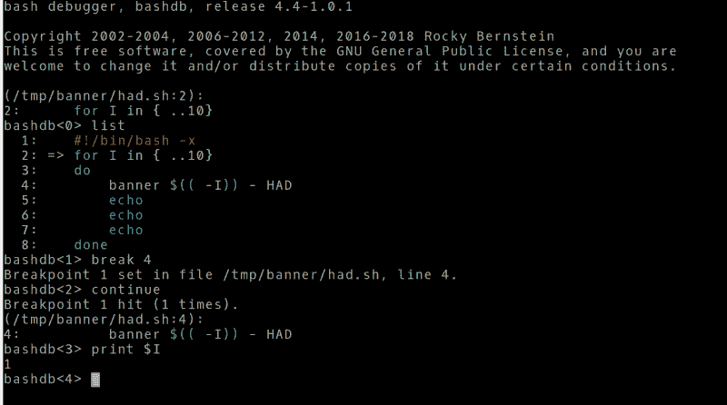

# Linux Fu:调试 Bash 脚本

> 原文：<https://hackaday.com/2019/12/11/linux-fu-debugging-bash-scripts/>

最近一篇关于调试构造的帖子让我大吃一惊。有相当多的评论说，只要有`printf`，就不需要调试器。就这一点而言，我们都调试过这样的系统，在那里你除了一个闪烁的 LED 或者其他可以与用户交流的东西之外什么都没有。然而，很难否认调试器可以帮助处理复杂的代码。

说你只需要`printf`就像说你只需要机器语言一样。技术上准确——你可以用机器语言做任何事情。但是有一个汇编程序或某种语言来帮助你解决问题，肯定会使事情变得更容易。如果你写一个简单的 bash 脚本，你可以使用相当于`printf`的命令——也许那是`echo`命令，尽管在一个典型的系统上通常有一个`printf`命令，如果你想使用它的话。然而，如果您知道如何找到 bash，您还可以用它做其他事情，包括一个非常酷的调试器。

我假设您已经知道如何使用`echo`和`printf`，但是让我们深入研究如何逐行使用跟踪执行，而不需要每隔一行使用`echo`语句。在这个过程中，您将学习如何开始使用 bash 调试器。

## 描摹

阅读起来并不容易，但是您可以通过在 bash 调用中添加-x 选项来跟踪正在运行的脚本的整个执行过程。至少有三种方法可以做到这一点。首先，您可以在当前会话中执行`set -x`。这样做的问题是，您在 shell 提示符中发生的任何有趣的事情也会显示出来。这使得输出更加难以阅读。如果您敢于使用这种方法，您可以在 shell 提示符下用`set +x`关闭跟踪。

```

#!/bin/bash -x
for I in {1..10}
do
   banner $((9-I)) - HAD
   echo
   echo
   echo
done

```

[](https://hackaday.com/wp-content/uploads/2019/10/session2.png) 您可以在从命令行执行脚本时添加标志:`bash -x ./had.sh`或者添加到脚本第一行的 shebang 中。通常，在文件的顶部会有`#!/bin/bash`，只需在那一行加上-x。

例如，下面的脚本中有一些错误。我把-x 放在最上面，所以如果你运行它，你会看到轨迹是什么样子。注意以加号开始的行。这是正在执行的脚本行。其他行实际上是脚本的输出。

## 安装 Bash 调试器

有一个 bash 调试器可用。然而，Ubuntu 和类似的发行版已经有一段时间没有把它包含在他们的软件回购中了。你当然可以[自己去拿](https://sourceforge.net/projects/bashdb/)。您会想知道您正在使用的 bash 版本(试试`bash --version`)。下载与您现有版本相匹配的版本，并按照说明进行操作。

调试器本身是用 bash 编写的。它使用一个特殊的陷阱，在每条语句结束时触发，专门用于调试。理论上，您可以使用该陷阱创建自己的调试器，但这需要相当多的工作。

## 使用调试器

至少有两种方法可以调用调试器。你可以用脚本名运行它，这个名字很安全:`bashdb had.sh`。

唯一的问题是它会混淆$0 和脚本本身在调用树中的显示。使用–debugging 选项运行 bash 也将运行程序，或者至少应该运行。这对我很有效，但说来奇怪，有些人对这种方法有困难。

如果你在`bashdb`程序上寻求帮助，有很多选择，但没有一个是你会经常使用的。在程序内部，您有类似于`gdb`命令的命令。您可以通过在提示符下键入“help”来查看它们。

在`bashdb`程序中寻求帮助将显示如何设置断点，查看回溯，甚至在满足特定条件时运行命令。这些命令中有相当一部分值得进一步研究:

*   列表–显示带有行号的脚本
*   break–在一行上设置断点(注意:tbreak 设置一次性断点)
*   回溯–查看调用堆栈
*   条件–设置条件断点
*   显示–设置在每次停止前打印变量
*   handle–设置陷阱处理
*   单步、下一步、跳过–单步命令
*   跟踪，取消跟踪——类似于-x 参数
*   手表，手表–设置手表

调试过程是熟悉的。无论是单步执行代码，还是设置断点来暂停程序流，这都可以让您比回显信息更灵活地跟踪问题。

[](https://hackaday.com/wp-content/uploads/2019/10/session.png)

我的剧本有两点错误。嗯，至少有两件事。首先，我的意思是让横幅倒数:10，9，8，等等。我还希望所有的东西都在一条线上。其中一个很容易用调试器找到。

如果你想要一个视频演示，下面的这个很旧了，但是仍然不错。

 [https://www.youtube.com/embed/jbOQJDSTksA?version=3&rel=1&showsearch=0&showinfo=1&iv_load_policy=1&fs=1&hl=en-US&autohide=2&wmode=transparent](https://www.youtube.com/embed/jbOQJDSTksA?version=3&rel=1&showsearch=0&showinfo=1&iv_load_policy=1&fs=1&hl=en-US&autohide=2&wmode=transparent)


不需要调试 shell 脚本的最好方法是一开始就不要放入 bug。有一些工具可以帮助你[为那个](https://hackaday.com/2017/03/29/lint-for-shell-scripters/)奋斗。同样，你可以用 C 语言编写你的 [shell 脚本。](https://hackaday.com/2019/09/17/linux-fu-shell-scripts-in-c-c-and-others/)