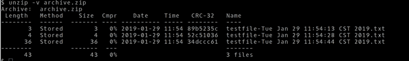

# Linux Fu:更容易的文件观看

> 原文：<https://hackaday.com/2019/01/31/linux-fu-easier-file-watching/>

在 Linux Fu 的[早期文章中，我提到了如何使用`inotifywait`来有效地观察文件系统的变化。评论中有很多做同样工作的替代方法，这很好。但是有一个非常容易使用的工具没有出现，所以我想谈谈它。那个工具就是`entr`。它不是那么通用，但是它易于使用，并且涵盖了许多常见的用例，在这些用例中，您希望在文件更改时发生一些操作。](https://hackaday.com/2018/06/07/linux-fu-watch-that-filesystem/)

这个程序非常简单。它在其标准输入上读取文件名列表。然后，它将运行一个命令，并在输入文件发生变化时重复该命令。我们一会儿会谈到几个选项，但事情就是这么简单。例如，在你用你的包管理器安装了`entr`之后试试这个。

1.  打开两个外壳窗口
2.  在一个窗口中，打开您最喜欢的编辑器，创建一个名为/tmp/foo 的空文件并保存它
3.  在第二个窗口中发出命令:`echo "/tmp/foo" | entr wc /tmp/foo`
4.  回到第一个窗口(或您的 GUI 编辑器),在观察第二个窗口的同时，对文件进行一些更改并保存它

如果找不到`entr`，可以从[网站](http://eradman.com/entrproject/)下载。

通常，您会将来自`find`或类似命令的输出提供给`entr`。

## 它不是什么

我之前提到过`incron`是一种将动作附加到文件变更的方法。它也使事情变得更容易，尽管可能不像`entr`那么容易。顾名思义，`incron`对文件系统的改变就像`cron`对时间的改变一样。也就是说，每当发生指定的文件系统更改时，它都会导致一些操作发生。它能在重启或其他情况下存活下来，除非你取消它。这与`entr`非常不同。使用`entr`，该命令就像普通应用程序一样运行。只要它在运行，目标文件中的更改就会触发指定的操作。当你停止程序时，它就结束了。通常，您会以一个 Control+C 或一个“q”字符结束。

说到键盘，你也可以按空格键来手动触发这个动作，就像一个文件改变了一样。所以，与`incron`不同的是，`entr`是一个交互工具。你会希望它在前台运行。

## 选择

有几个命令行选项:

*   -c–执行命令前清除屏幕
*   -d–跟踪不以“.”开头的目录
*   -p–在事件发生之前不要执行命令
*   -r–在执行命令之前取消之前运行的命令
*   -s–在第一个参数上使用 shell

/_ 占位符获取引起触发的第一个文件的名称，尽管这似乎不能与-s 一起正常工作。例如:

```
find /tmp/t/data -name '*.txt' | entr cp /_ /tmp/archive
```

当其中一个。txt 文件发生变化，它会复制到`/tmp/archive`。

d 选项有一个特点。有了它，你可以使用一个目录名或文件名，该程序将监视该目录以及任何文件。文件更改表现正常。但是，目录中的任何新文件都会导致`entr`停止。这让你可以像这样循环写东西:

```
while true; do
  ls -d src/*.[ch] | entr -d make
done
```

该循环确保`entr`总是查看正确的文件列表。如果您删除其中一个文件，这也会导致错误退出。`ls`命令提供了所有。c 和。src 目录中的 h 文件。该命令足够智能，可以推断出目录，因此不需要显式设置它。

## 缺少更改

如果您正在运行一个持久化的程序，那么-r 选项是很好的——例如，您可能使用`kdiff3`来显示最近更改的文件和原始副本之间的差异。该选项使`entr`在启动新程序之前终止程序。如果没有这个标志，`entr`也有可能错过文件更改。例如，创建一个名为 foo 的文件，并尝试这样做:

```
echo foo | entr -ps 'echo change; sleep 20'
```

在另一个 shell 中，更改`foo`。您将看到在原始 shell 上打印的更改消息。如果您等待 20 秒，您将看到类似“bash 返回退出代码 0”的内容现在再次更改`foo`，但是在看到 bash 消息之前，再次更改它。一旦 20 秒计时器超时，`entr`将返回等待状态，新的变化将不会触发！

退出`entr`并使用选项-psr 而不是-ps 再次启动。现在再次做同样的测试。您将看到变更寄存器和原始 bash 脚本从未完成。但是，如果 20 秒内没有任何更改，最后一个脚本将正常退出。

## 例子

在该工具的手册页中有大量的例子。例如:

```
find src/ | entr -s 'make | head -n 20'
```

这将获得源代码树(包括子目录)中所有文件的列表，当有任何变化时，运行`make`。`head`命令只显示输出的前 20 行。

许多编辑器会自动备份文件，但是如果你的编辑器没有，那么用`entr`自动归档会非常简单，不过，老实说，如果你想要真正的版本控制，可以使用`git`或其他东西:

```
echo testfile.txt | entr -s 'AFN=/tmp/testfile-$(date).txt; cp testfile.txt "$AFN"; zip -j archive.zip "$AFN"'
```

这将在 archive.zip 中存储 testfile.txt 的每个版本以及文件名上的时间戳:

[](https://hackaday.com/wp-content/uploads/2019/01/ss2.png) 
在这个脚本中使用/_ 很有吸引力，但是它似乎不能很好地与-s 选项一起工作。

## 拥抱变化

我怀疑我会像使用`incron`一样使用`entr`。然而，对于小的一次性项目，这是非常方便的，我可以看到在这种情况下利用一些。然而，像往常一样，对于任何给定的任务，通常有许多方法来完成它。工具箱里有`entr`不会有坏处。

还有其他方法。比如上次有人在评论里提到`systemd`可以带一个“[路径单元](https://www.freedesktop.org/software/systemd/man/systemd.path.html)，可以在文件或目录出现或改变时触发。这仍然在内部使用`inotify`，所以它实际上只是另一个包装器。尽管如此，如果你喜欢`systemd`，这是一个一致的方式来建立类似于`incron`的东西，但在`systemd`的触角之下。