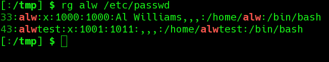
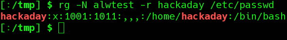
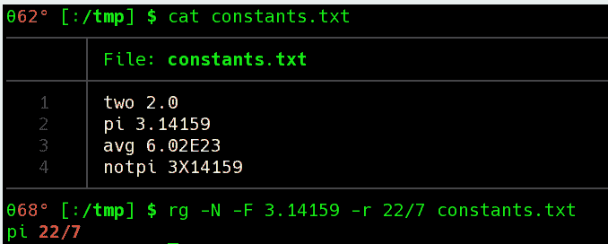

# Linux Fu:使用 Ripgrep 进行全局搜索和替换

> 原文：<https://hackaday.com/2020/10/14/linux-fu-global-search-and-replace-with-ripgrep/>

如果你只是一个普通的 Linux 用户，你可能知道如何使用`grep`。即使您不是正则表达式专家，也可以很容易地使用 grep 在文件中搜索匹配从简单字符串到复杂模式的行。当然 grep 看着没问题，但是如果你想找东西改呢？例如，您可能希望将“HackADay”的每个实例都改为“Hackaday”。你可以使用`sed`，但是有点难用。您可以使用`awk`，但是作为一种通用语言，对于这样一个简单而普通的任务来说似乎有点大材小用了。这就是 [ripgrep](https://github.com/BurntSushi/ripgrep) 背后的想法，它实际上有命令名`rg`。使用 rg，您可以做 grep 使用更现代的正则表达式可以做的事情，也可以做替换。

## 安装 Ripgrep 的注意事项

最好的办法是从您的存储库中获取 ripgrep。当我尝试运行 KDE Neon 时，它告诉我可以使用 apt 安装一个版本，或者使用更新的快照版本。我通常讨厌安装 snap，但我还是这样做了。它通知我必须在安装行中添加–classic，因为 ripgrep 可能会影响 Snap 沙箱之外的文件。由于该程序的全部目的是改变文件，我不认为这太令人惊讶，所以我做了安装。

## 简单用法

如果你想用`rg`作为 grep，请便。一个令人耳目一新的升级是它在打印到 stdout 时输出行号:

[](https://hackaday.com/wp-content/uploads/2020/09/rg1.png)

如果您不想要行号，请使用-N 选项。您也可以用-r 指定一个替换:

[](https://hackaday.com/wp-content/uploads/2020/09/rg2.png)

但是，假设您想用替换文件创建一个新文件。在这种情况下，发送`--passthru`选项，这样即使所有的行不匹配，它们也会被发送出去。

相反，您可能只想打印出匹配的部分，而不是整行。`-o`选项可以做到这一点。你也可以使用许多类似 grep 的选项。例如，`-v`将反转匹配，以便只打印不匹配的行。

## 重写

Linux 多任务处理的一个经典问题是试图覆盖一个文件。例如，试试这个:

```

cd /tmp
cp /etc/fstab test.txt
cat test.txt  # plenty of stuff there
cat test.txt > test.txt
cat test.txt  # oops, the file is now empty

```

不过，这是`rg`的一个常见用例。当然，您可以将输出发送到一个临时文件，然后用临时文件替换原始文件。但这似乎不太雅观。名为`sponge`的实用程序是一种更简洁的方式。Sponge 将其标准输入复制到一个文件中，但是它会等到没有更多输入时再这样做。将上面的第二行替换为:

```

cat test.txt | sponge test.txt

```

因此，要在文件中进行替换，您可以使用类似如下的内容:

```

rg --passthrough 'Jen' -r 'Jennifer' invite.txt | sponge invite.txt

```

## 风味

默认情况下，`rg`使用 Rust 中的正则表达式。众所周知，这些技术速度很快，但是在性能方面有一些限制。您可以使用`-P`选项来选择 PCRE2 正则表达式，它具有更多特性，但可能会更慢。另一个选择是使用`--engine=auto`。这将导致 rg 使用 Rust 表达式，除非您似乎使用了需要 PCRE2 的特性。如果您提供多个表达式，它们都将使用相同的表达式引擎，因此任何 PCRE2 表达式都将强制使用该引擎。

使用 PCRE2 引擎，您可以进行环视、反向引用等操作。如果当您只想查找一些文本时，引用正则表达式有困难，那么您会喜欢使用`-F`选项。这导致搜索表达式成为普通字符串:

[](https://hackaday.com/wp-content/uploads/2020/09/rg3.png)

还有很多其他的选择。尝试使用`--help`选项查看所有内容。您可以跨行匹配，匹配二进制文件，使用 CRLF 作为行终止符，显示上下文行，或通过外部程序过滤每个文件。

## 工具箱

这是一个简单的工具，你当然可以没有它，但是用它做很多普通的事情比没有它好得多。当然，要充分利用任何类似 grep 的工具，你真的需要知道[正则表达式](https://hackaday.com/2018/03/09/linux-fu-regular-expressions/)。如果你想要一个学习正则表达式的有趣方法，试试[纵横字谜](https://hackaday.com/2016/01/31/crosswords-help-you-learn-regular-expressions/)。