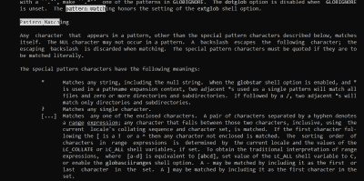
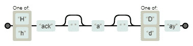

# Linux Fu:Globs Vs . Regexp

> 原文：<https://hackaday.com/2021/10/07/linux-fu-globs-vs-regexp/>

我曾经在工作中问过一个软件开发人员，我们在代码中调用了多少次 fork()。我承认，这是一个非常大的项目，但我预计答案最多是两位数。开发人员回来从一张纸上读出一些数百万的数字。我告诉他们，我们不可能有数百万次调用 fork()，当然，我们没有。问题是开发人员不清楚正则表达式和 glob 之间的区别。

像 grep 这样的工具使用正则表达式来创建搜索模式。我可能会编写`[Hh]ack ?a ?[Dd]ay`作为正则表达式来匹配“HackaDay”和“Hack a day”，甚至是使用 grep、awk 或许多编程语言的“Hackaday”。

## 那么什么是 Glob？

问题是 shell 也使用模式匹配，并使用许多与正则表达式相同的字符。叉叫？开发者使用的模式是`fork*`。如果您担心有以`fork`开头的呼叫，但随后又有其他呼叫(比如可能是`execl`、`execv`或其他几个呼叫之一的`exec`呼叫),那么这可能没什么大不了的。

如果 shell 看到这个模式，它会寻找任何以`fork`开头，后面有零个或多个字符的内容。但作为正则表达式，意义就大不一样了。这个模式实际上意味着:字母 `f o r`后面跟着零个或多个字母`k`。所以`for`会匹配。`fork`也会如此。`forkkkkk`也一样。还有像`forth`、`format`和`formula`这样的东西。所以匹配的数字是巨大的。

## 全球生存指南

Globbing 通常是 shell 的一个功能。当你输入如下内容时:

```
ls a*
```

ls 程序永远看不到`a*`。相反，它会看到 shell 的以字母 a 开头的文件扩展列表。如果没有匹配 glob 模式的文件，那么 ls 会看到您输入的文本，并且可能会打印一条错误消息，指出它找不到`a*`。至少，这是默认行为。如果 shell 找不到匹配，您可以修改它的操作(查找`nullglob`和`failglob`)。

这是一件好事，因为这意味着程序不必编写自己的 globbing，所有这些在一个 shell 中是一样的。当然，可能会有差异，这取决于您使用的 shell。您还可以在一些 shells 中关闭 globbing。在 bash 中，您可以发出:

```
set -f
```

不过，你可能会觉得这很令人沮丧，所以用下面的话来消除它:

```
set +f
```

全球最常见的特殊字符是:

*   *–零个或多个字符
*   ？–任何字符
*   []–一类字符，如[abc]或[0-9]
*   [^]–反面人物
*   [!]–与[^]相同

如果文件名中包含年份，如`post07-26-2020.txt`，您可以编写以下 globs:

*   post * 2020 . txt–2020 年以后的所有帖子
*   post*202？。txt 2020-2029 年的所有帖子(甚至，202Z 任何字符都将匹配)
*   post 0[345]* 2020 . txt–2020 年 3 月、4 月和 5 月的所有帖子
*   贴吧[！0][01]* . 2021 . txt–2021 年 10 月或 11 月的帖子

你可以用一个球做很多事情，但是你不能做所有的事情。Bash 有其他的扩展选项可以提供帮助，但是这些选项在技术上并不是 globs。例如，您可以输入:

```
process post{01,02,03,11,12}-*2020.txt
```

但是，无论文件是否存在，它都会扩展到:

```
post01-*2020.txt post02-*2020.txt post03-*2020.txt post11-*2020.txt post12-*2020.txt
```

然后，shell 将为实际的文件名聚合这些模式。您可以在 bash 手册页上了解更多信息。搜索模式匹配。



The bash man page has a lot on pattern matching

## 一点正则表达式语法

正则表达式更具表现力，但也更具可变性。每个提供正则表达式的程序都使用自己的代码，在某些情况下，它与其他程序有很大的不同。好消息是，您想要使用的大多数正则表达式不会有所不同。通常，只有那些不太明显的特性会发生变化，尽管如果你碰到了其中的一个特性，这并不是什么好事。

基本语法可能最好用 grep 来表示。但是，如果您使用的是其他的东西，您需要查看它的文档，看看它的正则表达式有什么不同。

最大的问题是,`*`和`?`字符与它们的 glob 对应物有完全不同的含义。`*`表示零个或多个先前的模式。所以`10*`会匹配`1`、`10`、`100`、`1000`等等。



Our subject regexp represented graphically thanks to [Regexper](https://regexper.com)

问号表示前面的模式是可选的。因此，`10?5`将与`105`和`15`匹配得一样好。对于任何字符，在正则表达式中，您使用句点。所以，回到我最初的例子，`[Hh]ack ?a ?[Dd]ay`你可以看到这对于一个 glob 来说是没有意义的。如您所见， [Regexpr](https://regexper.com) 网站在图形化解释正则表达式方面做得很好。

## 更加困惑

更奇怪的是，从版本 3 开始，bash 在脚本中提供了正则表达式，因此您可以拥有一个包含 globs 和正则表达式的脚本，这两者都将用于 bash。

还有一个事实是，bash 提供了一种不同风格的 glob ，你可以用`shopt -s extglob`打开它。这些实际上更接近正则表达式，尽管语法有点颠倒。

## 学习正则表达式

我曾想过给你提供一份普通正则表达式的备忘单，但后来我意识到我不可能比 Dave Child 做得更好，所以我决定[给你指出那个](https://cheatography.com/davechild/cheat-sheets/regular-expressions/)。

正则表达式以难懂著称，这种名声并非完全不值得。但是我们已经研究了让正则表达式[更有文化](https://hackaday.com/2020/09/11/linux-fu-literate-regular-expressions/)的方法，如果你需要练习，试试[纵横字谜](https://hackaday.com/2016/01/31/crosswords-help-you-learn-regular-expressions/)。