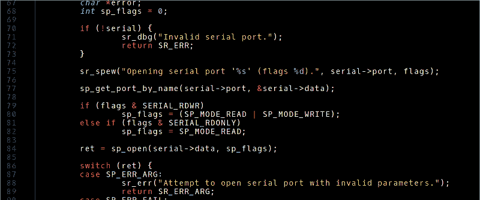
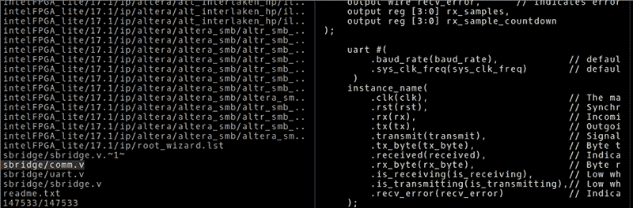

# Linux Fu:让您的命令行现代化

> 原文：<https://hackaday.com/2018/08/29/linux-fu-modernize-your-command-line/>

如果您在桌面、Raspberry Pi 或服务器上使用 Linux 及其相关工具，您可能使用过命令行。有人爱，有人恨。然而，我们中的许多人已经使用 Linux 很多年了，有时在此之前使用 Unix，我们倾向于使用相同的旧的可靠的工具。[Remy Sharp]最近发表了一篇文章，讲述了他是如何创造出别名来用伟大的现代替代品取代那些旧工具的，这绝对值得一读。

老实说，当我们第一次看到这个帖子的时候，我们几乎跳过了阅读。除非你是一个完全的初学者，否则很多 Linux 技巧文章是相当无趣的。但是[Remy]有很多非常棒的工具，以及他是如何安装它们的，包括 bat 和 fzf，bat 很像 cat，但有语法着色(见上图)，fzf 是一个命令行历史搜索工具。他甚至展示了如何从命令行加入 fzf 和 bat 来制作一个非常酷的文件浏览器(见下文)。

这也不是所有的替代品。当然，他有 htop，我们已经用了很长时间了。htop 还有一些更好的替代品，比如 [glance](https://haydenjames.io/alternatives-top-htop/) 。还有 prettyping(相当于 ping，而不是 pret type ),这是 ping 的一个很好的替代方法。我们不太相信有必要替换 find 和 grep，因为我们对它们非常满意，而且我们有自己最喜欢的 diff 替换版本，它可以启动 GUI，所以我们没有尝试这些。

你可能不喜欢清单上的所有选择——我们不喜欢。但是这就是 Linux 的好处。你可以用你想要的，或多或少。这是另一个我们最喜欢的别名，以少代多。我们也喜欢 cdfunc 和 fasd，我们使用一个将 [.bash.rc 置于 git 控制之下的系统来管理所有这些疯狂的行为。这也使它在机器之间保持同步。](https://hackaday.com/2017/05/23/stupid-git-tricks/)

如果你喜欢工具来帮助运行你的系统，[我们之前谈过几个](https://hackaday.com/2017/11/09/linux-fu-system-administration-made-easier/)。如果你不在乎[雷米]选择 tldr 而不是人类，你可能会喜欢我们让[在 Bash](https://hackaday.com/2018/02/02/linux-fu-a-little-help-for-bash/)上帮忙。当然，如果你不介意放弃 bash，我们知道很多人喜欢 Fish 和 zsh，它们也有很多额外的特性。