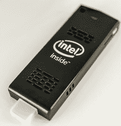
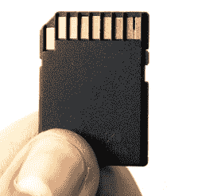

# Linux Fu:移动/usr

> 原文：<https://hackaday.com/2020/09/03/linux-fu-moving-usr/>

Linux 变了。最初受 Unix 的启发，有一些大家都理解的很好理解但没有很好执行的规则。程序做一些小事情，并使用管道进行通信。X Windows 服务器并不总是在你的本地机器上运行。`/usr`中没有任何东西导致系统启动。

这些天，我们有系统控制一切。如果你在一台显示器上运行 Chrome，它会被锁定在那台显示器上，它真的希望那是本地显卡。将`/usr`移动到另一个分区将很容易阻止你启动，除非你采取预防措施。我搬了`/usr`还活着讲了这件事。如果你需要的话，你会想听听我的故事。

很多人对 systemd 持批评态度——包括我——但这真的不是 systemd 的错。随着我们有了更多的程序员，他们中的许多人受到了其他系统的影响，在这些系统中，事情以不同的方式运作，这就是这些原则的丧失。不过，我不只是在咆哮。我最近的一次经历让我想起了这一切，同时，我也学到了一些关于引导过程的现代状态的东西。故事从一个朋友给我一个英特尔计算棒开始。但是我遇到的问题并不局限于那个硬件，而是现代 Linux 发行版如何管理它们的启动过程。

## 故事

[](https://hackaday.com/wp-content/uploads/2020/07/pc.png) 我说过，我的一个朋友给了我一个英特尔计算棒。这是早期的一个相当贫血。特别是，它只有 1 GB 的内存和 8 GB 的闪存。它启动了一个旧版本的 Ubuntu，正如你所料，非常慢。但是我喜欢它的外形，而且我有一个可以使用永久电脑的新车间，所以我决定升级它。

有一些常见的问题。BIOS 升级导致网络中断。升级到 KDE Neon 修复了网络，但新的内核有可怕的 C 状态错误，导致挂起。幸运的是，这很容易解决。所以经过一些努力，我有了一个合理的工作系统。算是吧。

## 问题是

问题是 8GB 的闪存。我放了一个 64GB 的 sd 卡进去，但是我不想用它启动。安装了霓虹灯和一些其他必要的东西，闪光灯非常接近 100%满。我的计划是将`/opt`、`/home`和`/usr`移到 sd 卡上。我以为会很容易。

传统上，这是一个简单的过程。首先，复制文件，使用不改变隐藏文件和链接的东西。很多人使用 rsync，但通常使用 tar。然后你删除旧的目录(我先重命名，只是为了安全起见，一切正常后再删除)。最后，创建一个新的空目录，并在引导时更改`/etc/fstab`来挂载磁盘。

对于`/home`和`/opt`来说，这很好。该系统将启动没有困难，我已经在任何时间工作。我知道`/usr`会有点难，但是我想我可以在一个没有 GUI 的 root shell 中，或者只是从一个 USB 驱动器启动，然后做同样的工作。

[](https://hackaday.com/wp-content/uploads/2020/07/sd.png) 我其实预料到了四个坐骑。我在`/sdcard`安装了整个 sd 卡。然后我把坐骑从`/sdcard/opt`绑定到`/opt`，从`/sdcard/home`绑定到`/home`。`/usr`坐骑也是绑定坐骑，但不会那么容易。

## 更大的问题

我试图移动`/usr`导致系统停止启动。为什么？原来 systemd 处理挂载`/etc/fstab`中的东西，systemd 需要`/usr`中的东西。我想如果 systemd 不需要读取`/etc/fstab`的话，它可能会足够聪明来引导系统，所以我决定使用 systemd 的本地设施来安装 sd 卡。

Systemd 可以像处理服务一样处理挂载。这意味着它将管理挂载，并将其编织到依赖项中。因此，在挂载某些磁盘之前，可能需要准备好服务或其他挂载，当然，其他服务和挂载也可能依赖于该磁盘。理论上，这是完美的，因为在挂载`/sdcard`之前尝试挂载`/sdcard/home`是没有意义的。

下面是`/etc/systemd/system/sdcard.mount`中的挂载定义

```

[Unit]
Description=Main SDCard Mount
DefaultDependencies=no
Conflicts=umount.target
Before=local-fs.target umount.target
After=swap.target

[Mount]
What=/dev/disk/by-uuid/b3b6ac3b-2109-487c-af34-c49586412cea
Where=/sdcard
Type=ext4
Options=defaults,errors=remount-ro

[Install]
WantedBy=multi-user.target

```

显然，UUID 会根据您的磁盘而变化。不太明显，这个文件必须命名为 sdcard.mount。如果挂载点是，`/usr/lib`那么这个文件必须是 usr-lib.mount。

一旦挂载完成，您就可以挂载`/home`:

```

[Unit]
Description=Home SDCard Mount
DefaultDependenices=no
Conflicts=umount.target
Before=local-fs.target umount.target
RequiresMountsFor=/sdcard

[Mount]
What=/sdcard/home
Where=/home
Type=none
Options=bind,x-systemd.requires-mounts-for=/sdcard

[Install]
WantedBy=multi-user.target

```

注意挂载需要`/sdcard`。一旦你把这些文件放到正确的位置并重新加载系统，你就可以启动这些单元，文件就会挂载。您可以启用它们，使它们在引导时启动。除了文件名之外，`/opt`单元看起来完全一样。

## 没那么快！

这还是把问题留给了`/usr`。当然，编写单元很容易，但问题是 systemd 需要一些来自`/usr`的库，所以系统会拒绝引导。我考虑过将这些库复制到`/lib`或者初始 RAM 磁盘中的某个地方，但是当结果证明是相当多的时候，我决定不这么做。

我最终决定，在引导过程的早期安装所有东西将是正确的答案。这样，systemd 可以想象它有一个完整的磁盘。我实际上考虑过使用 lvm 将磁盘连接在一起，但是由于很多原因，我认为这样做不好，而且可能会有同样的问题。我想控制 sd 卡和内部存储器上的内容，所以是时候看看 initramfs 脚本了。

## 引导(某些)Linux 系统

[](https://hackaday.com/wp-content/uploads/2020/07/tux.png) 大多数现代 Linux 发行版不直接引导你的根文件系统。相反，他们有一个压缩文件系统，加载到 RAM 中，然后启动。这个系统负责让系统为真正的引导做好准备。除此之外，它挂载根文件系统，然后使其成为真正的根。

对于 Debian 风格的发行版，这是 initramfs，您可以在`/etc/initramfs-tools`中找到一些用户可定义的脚本。预定义的大部分在`/usr/share/initramfs-tools`中。在脚本目录中，您会看到许多子目录，后缀为-top、-bottom 和-premount。

可以想象，init-*发生在系统初始化时，local-*发生在装入本地磁盘时。不要将这些与钩子脚本混淆。当您构建初始文件系统时，会执行一个钩子脚本。如果您需要静态修改引导环境，这很有帮助。我们想要的脚本是那些在引导时执行的脚本。

顶层脚本首先运行，然后是预装载，最后是底层脚本。所以 init-top 先运行，init-bottom 最后运行。在这两者之间，运行其他脚本，在本地底层，根文件系统应该准备就绪。

## 文档和陷阱

如果你阅读[文档](http://manpages.ubuntu.com/manpages/xenial/man8/initramfs-tools.8.html)，你会看到脚本有一个特定的格式。然而，有一些例子是误导的。例如，模板脚本显示 sourcing `/usr/share/initramfs-tools/hook-functions`加载常用函数。如果`/usr`已经存在，那就太好了，但对我们来说，它还没有。其他一些脚本使用引导环境中的副本，位于`/usr/share/initramfs-tools/scripts/functions`。这就是我在剧本中使用的:

```

#!/bin/sh
PREREQ=""
prereqs()
{
echo "$PREREQ"
}

case $1 in
prereqs)
prereqs
exit 0
;;
esac

. scripts/functions
# Note: our root is on /root right now, not /
mount /dev/mmcblk2p1 /root/sdcard
mount -o bind /root/sdcard/usr /root/usr
mount -o bind /root/sdcard/home /root/home
mount -o bind /root/sdcard/opt /root/opt

```

唯一棘手的部分是，我们最终的根文件系统不在`/`，而是在`/root`，所以挂载反映了这一点。

## 结果呢

当然，我必须禁用`/opt`和`/home`的 systemd 挂载，尽管我可以将它们保留下来，不放在这个脚本中。现在，当 systemd 获得控制权时，它可以在`/usr`中找到它想要的所有东西，并且系统启动。移动这三个目录给我留下了大约 70%的内部存储空间，并且只占用了 sd 卡的一小部分。

可能有许多其他方法可以做到这一点。我提到了 lvm，或者您可以恢复到旧的 init 脚本。但是一旦你想通了，这确实很可靠并且非常灵活。

英特尔棒很小，但我们已经看到了更小的。如果你在家尝试，不要忘记登录 eMMC 设备[并不总是一个好主意](https://hackaday.com/2019/10/17/worn-out-emmc-chips-are-crippling-older-teslas/#more-379566)。