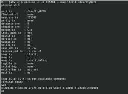
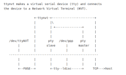

# Linux Fu:无束缚的串行

> 原文：<https://hackaday.com/2021/02/11/linux-fu-serial-untethered/>

串行端口曾经随处可见。在某种程度上，它们仍然是，因为许多看起来像 USB 设备的东西实际上看起来像一个串行端口。问题是，今天，世界运行在网络上。当然，你可以买一个终端服务器，把串口转换成以太网端口，但是这有什么意思呢？在本文中，我将向您展示如何使用一些可用的 Linux 工具通过网络传输串行端口。它并不完美，也不会在所有情况下都有效，但当它有效时，它就会很好地发挥作用。

## 一切都是文件，直到它不是

在过去的某个时候，Unix——Linux 的前身——几乎把所有的东西都当作一个文件，所有的文件都或多或少是平等的。程序不关心文件是在本地、在网络上、来自磁带驱动器还是通过命名管道到达。

但是事情开始改变了。尽管串行端口在 Linux 下只是一个文件，但它有一些特殊的属性，可以让您设置，例如波特率。更糟糕的是，一些程序“知道”太多关于文件的信息，并坚持某些命名约定。所以，从理论上讲，你应该能够创建一个网络套接字，将一端连接到串口，另一端连接到程序，然后就完事了。理论上。

[](https://hackaday.com/wp-content/uploads/2021/01/de9.png) 当然做法不同。这在一些非常简单的情况下可能行得通。您可以使用一个名为`socat`(类似于 cat 的插座)的实用程序来设置它。然而，如果你试图伪造的程序试图设置一个波特率，例如，它可能会放弃。有些程序甚至不会识别你的假串口。

## 关于 socat

这个`socat`程序就像一根神奇的适配器电缆，简单地将所有东西从一个地方传输到另一个地方，同时还处理反向流量。该程序可以读取文件、管道、设备、套接字和其他一些项目。例如，您可能希望构建一个简单的 TCP 代理来将本地主机上的连接转发到另一台主机。使用`socat`很简单:

```
socat TCP4-LISTEN:88 TCP4:10.1.1.125:8000
```

这将只处理一个连接，但是您甚至可以要求`socat`派生一个新的连接来处理多个请求。

## 问题是

但是，如果您尝试使用串行端口这样做，如果没有大量的设置，它不太可能工作。这是一个如此普遍的愿望，有几个程序可以提供帮助。大多数 Linux 发行版将支持`ser2net`，这是一个用来处理将串行端口转换为套接字的任务的程序。如果`ser2net`不适合你，也有一些 Python 代码作为例子与[`pyserial`库](https://github.com/pyserial/pyserial/blob/master/examples/rfc2217_server.py)一起提供，但是你的发布版本`pyserial`可能太旧而不支持它。如果是这种情况，你需要在你的包管理器之外安装它，例如使用`pip`。我假设你用的是`ser2net`。

`ser2net`程序通常作为系统服务安装，你可以编辑`/etc/ser2net.conf`来配置它。我去掉了所有默认行，并添加了两个我想要显示的串行端口以及我想要的波特率:

```
7777:telnet:0:/dev/ttyUSB0:115200 8DATABITS NONE 1STOPBIT remctl
7778:telnet:0:/dev/ttyUSB1:115200 8DATABITS NONE 1STOPBIT remctl
```

然后你需要重启服务(可能是`systemctl restart ser2net`；如果第一次未能重新启动，请重试，因为有时它会在旧副本完全关闭之前尝试启动)。

对于调试，您可能希望停止该服务并运行，同时显示一些调试消息:

`ser2net -d -C "7778:telnet:0:/dev/ttyUSB1:115200 8DATABITS NONE 1STOPBIT remctl"`

无论哪种方式，一旦服务运行，您指定的端口(我的配置文件中的 7777 和 7778)将像关联的串行端口一样工作。

几个音符。如果你正在用 3D 打印机做这件事，并且有 Octoprint 之类的东西在运行，你需要在设置好这一切之前关闭它或者让它离开打印机端口。这适用于任何拥有您想要打开的串行端口的程序。对于一些标准端口，您需要确保登录没有保持端口打开并等待用户。具体如何工作将取决于您的设置。你的防火墙也是如此。如果您在端口 7777 上监听，并且使用了防火墙，您需要设置它以允许该端口上的连接。不要忘记，您通常也必须是 root 用户才能打开低编号端口。

## 客户端

在客户端，你可以使用`socat`，但是一些程序会发现它不是一个真正的串口。尽管如此，你仍然可以尝试:

```
socat pty,link=$HOME/dev/ttyNET0,waitslave tcp:10.1.1.125:7777
```

不过，有些程序只会在`/dev`中寻找设备。如果是这种情况，您需要以 root 用户身份运行`socat`(使用`sudo`，然后设置`/dev/ttyNET0`，这样您就有了读写权限(例如`sudo chmod 666 /dev/ttyNET0`)。

## 测试 1、2、3…

不过，与其马上尝试你的程序，我建议你使用类似`picocom`的东西来测试。例如，在运行`socat`之后的客户机上，您应该能够运行如下内容:

```
picocom -b 115200 $HOME/dev/ttyNET0
```

[](https://hackaday.com/wp-content/uploads/2021/01/pico.png)

Picocom can talk across the network using a virtual serial device

显然，您需要使用正确的名称和波特率。你应该可以和远程设备通话。如果没有，在你运行常规程序之前找出原因。如果你的串行设备不是基于文本的，你可能会更幸运地使用 [cutecom](https://gitlab.com/cutecom/cutecom/) ，但是，唉，程序知道你的假串行端口是假的，不会让你选择它。另一方面，该程序是开源的，所以你可以很容易地创建一个本地版本，使用任何你喜欢的设备名称。当然，还有其他选择。比如`gtkterm`会让你接假串口。

如果您遇到协议错误，您可能会发现串行端口已经移动(例如，它是`/dev/ttyUSB0`，现在是`/dev/ttyUSB1`)或者您有一个无效的波特率。该错误消息不是很有帮助，但是在排除故障时不要忘记使用`ser2net`中的-d 选项。

[](https://hackaday.com/wp-content/uploads/2021/01/2021-01-31-19.41.27-gitlab.com-5bdaca0b7ca2.png)

The `ttynvt` program doesn’t have great documentation graphics, but they are accurate.

当你运行常规程序时，它可能会起作用。然而，它也可能抛出一个错误，或者在某些情况下，拒绝让您选择文件，因为它不是真正的串行端口。在某些情况下，你只是运气不好。然而，一个理解串行端口的更智能的客户机也可能有所帮助。`[ttynvt](https://gitlab.com/lars-thrane-as/ttynvt)`计划就是一个例子。您可能需要从源代码中构建它，但这很容易做到。这确实取决于`libfuse`，但除此之外不需要任何外来的东西。

一旦你建立了它，试着这样做:

```
sudo src/ttynvt -M 199 -m 6 -n ttyNET0 -S 10.1.1.125:7777
```

这将创建`/dev/ttyNET0`设备(因此您需要成为 root 用户)。在我的系统上，新设备为 root 和拨出组设置了读写权限。但是，根据您的设置，您可能需要检查并修复权限。

再次用`picocom`测试，然后尝试你的目标程序。交叉手指！

## 为什么，哦为什么？

我最初的目标是使用远程桌面在大型机器上为我的激光切割机运行 Lightburn 软件。我希望激光切割机插入本地机器的 USB 端口，并让软件与更大的计算机上的假端口进行对话。

唉，到今天为止，Lighburn 对我的顽皮把戏太聪明了，拒绝展示我的虚拟串口。据我所知，没有办法强迫它使用我选择的文件名，所以我甚至不能尝试看看它是否工作。然而，我能够用一些其他的 g 代码软件来测试设置，它确实工作。我已经向 Lightburn 提到了这一点，所以当你读到这封信的时候，问题可能已经解决了。

“一切都是文件”的范式非常强大。不幸的是，每年它变得越来越不真实，这导致当你想做像这样有趣的事情时，要经历更多的困难。尽管如此，在真正的 Linux 时尚中，总是有办法到达那里。毫无疑问，我可以跟踪 Lighburn 正在进行的打开端口的调用，并找到一种方法为串行客户端伪造它们。不过，我希望我不需要这么做。