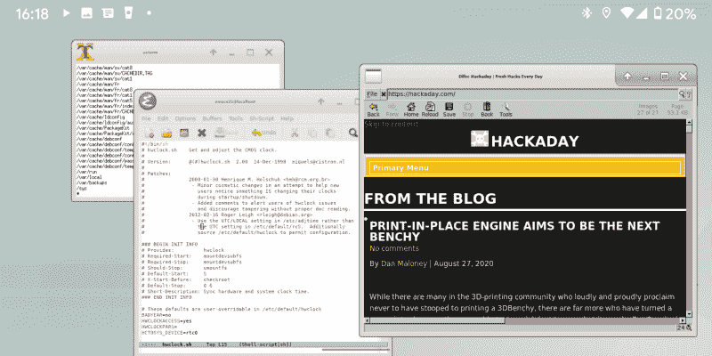
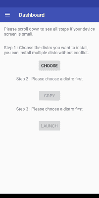

# Linux Fu:Linux Android 融合

> 原文：<https://hackaday.com/2020/10/07/linux-fu-the-linux-android-convergence/>

你放在口袋里的安卓手机，基本上就是一台运行 Linux 的小电脑。那么，为什么在你的手机上获得一个可用的 Linux 环境如此困难呢？如果你能运行 Linux，你就能把你的手机变成超便携笔记本电脑的替代品。

当然，最显而易见的方法是直接在手机上安装 Linux 发行版。这是非常极端的，老实说，你可能会失去很多手机功能，除非你用的是像 PinePhone 这样的 Linux 专用手机。然而，使用一个名为 AnLinux 的安装程序，以及一个终端程序和一个 VNC 客户端，你可以得到一个可行的设置，而不需要使用手机的操作系统，甚至不需要 root 访问权限。让我们看看我们能做什么。

## 安林努克斯

AnLinux 利用了 Android 实际上是 Linux 的事实。它允许您挂载一个镜像文件，该文件包含来自多个发行版中任何一个的根文件系统，包括 Ubuntu、Kali、Fedora、CentOS、OpenSuse、Arch、Alpine 等。除了创建执行 chroot 来“挂载”映像的脚本之外，安装程序还使用 PRoot 来模拟 root 访问。

PRoot 拦截您进行的任何通常需要 Root 访问权限的调用，并使它们在当前上下文中工作。为了做到这一点，它使用`ptrace`系统调用来有效地调试你的软件。使用 PRoot，您可以在没有 Root 用户的情况下做类似 chroot 的事情，并且 PRoot 还在您的伪文件系统上提供假用户权限。

AnLinux 本身并不是一个大程序。它会安装操作系统映像，并创建可以为您启动环境的脚本。然后你就有了一台运行在你的 Android 手机里的假 Linux 电脑，而 Android 还在运行。只需使用终端程序或 VNC 浏览器从外部 Android 操作系统连接到它，就可以了。

听起来像是组装的，确实如此，但它也能工作。完美吗？不。有些东西需要真正的根访问才能工作。但是如果你降低你的期望，它会出奇的好。

## 你需要什么

显然，你需要一个安卓设备。它必须至少运行 Lollipop，但可以是 32 位或 64 位 Arm 或 x86 设备。您还需要大量空闲存储空间来存储磁盘映像，因此 sd 卡或大型设备非常重要。

您还需要:

*   [AnLinux](https://github.com/EXALAB/AnLinux-App) (从 [Google Play](https://play.google.com/store/apps/details?id=exa.lnx.a) 轻松安装)
*   [Termux](https://github.com/termux/termux-app) (也上[打](https://play.google.com/store/apps/details?id=com.termux))
*   VNC 客户端(我建议 [VNC 查看器](https://play.google.com/store/apps/details?id=com.realvnc.viewer.android)
*   蓝牙键盘(可选)
*   蓝牙鼠标(可选)
*   手机的 HDMI 输出电缆(可选)

Termux 和 VNC 客户端是你真正需要访问假的 Linux 机器。最后三项是物质享受。

你可能会更喜欢外置键盘，即使它是一个很小的可折叠键盘。蓝牙键盘是最简单的方法，虽然你也可以使用 USB 主机电缆和集线器来插入 USB 设备，但这不太便携，我还没有实际测试过这个理论。

如果你对设备屏幕不满意，HDMI 输出电缆可以让你连接到一个大显示器。不过，VNC 的客户端可以放大和缩小，所以没有外部屏幕也是可行的。至少，你应该有一个支架或固定器来保持手机直立。

我发现的唯一问题是视频输出电缆不能同时给我的手机充电，让它靠电池运行。这并不是所有的手机都是如此，甚至可能不是所有的电缆都是如此，所以你可能要检查一下你是否可以在更长的时间内同时充电。

## 入门指南

 一旦你安装了 Termux，你就可以用它把一个普通的终端接入你的安卓设备。你不是 root——好吧，如果你给你设备设置了 root，你可能是，但是我假设你没有。下一步是为 Linux 发行版安装一个映像。

为此，打开 AnLinux 并从菜单中选择仪表板。有三个按钮，但是你只能按第一个。当你按下那个按钮时，你可以选择你想要安装的发行版。安装多个是可能的，但是你需要大量的存储空间，并且你必须为你想要安装的每一个重复这些步骤。

 一旦你选择了你的发行版，另外两个按钮就会亮起。第二个按钮让您用下载和安装 Linux 系统所需的命令加载剪贴板。通常会有一些`pkg`命令、一些`wget`命令和一个要执行的 shell 脚本。

第三个按钮启动 Termux，这样您就可以将命令粘贴到终端窗口中。一旦完成，您会发现一个允许您启动发行版环境的 shell 脚本。安装将是最少的，以节省空间。有类似的按钮设置屏幕来启用一个`ssh`服务器，并设置各种桌面环境。一旦你完成了安装，你就不必重复了。您可以简单地打开 Termux 并运行 shell 脚本来启动您的假 Linux 系统。

## 获取图形

如果你想运行一个图形环境，你只需要选择桌面环境的菜单，然后按下更多的按钮。您的选择将根据您所使用的发行版而有所不同。比如对于 Ubuntu，你可以选择 Xfce4、Mate、LXQt 或者 LXDE。您可以执行类似的步骤来选择您最喜欢的窗口管理器，例如，Awesome 或 IceWM。

首先，您必须使用安装程序留下的脚本来启动发行版。然后还有另一个脚本来启动 VNC 服务器。脚本的名称取决于您安装的内容，但是 AnLinux 安装程序会告诉您需要知道的内容。

启动 VNC 服务器后，将您的 VNC 浏览器连接到脚本在本地主机地址上提到的指定端口，您就进入了虚拟 Linux 机器。在我的 Pixel 2XL 上的性能真的不差，虽然它无论如何都不会取代我的巨型 Linux 桌面。

## 不是玩具

这可能看起来像一个玩具，正如我所说的，它不会取代大多数人真正的 Linux 系统。但有时你需要把车停在路边，登录一个服务器。拥有一整套你已经习惯的工具会很有帮助。你能不能安装一个类似于[juice shh](https://play.google.com/store/apps/details?id=com.sonelli.juicessh)的东西，然后直接连接到遥控盒上？当然了。或者在远程服务器上使用 VNC。但是如果有人发给你一个 OpenOffice 电子表格，你需要在你的手机上查看，并且你想使用`sshfs`来安装你的远程驱动器，同时充满了宏，这就是解决方案。

如果你带着一个小的便携式显示器，一个键盘和一个鼠标，这也可以让你不再需要带着笔记本电脑到处跑。更重要的是，当你在某个地方时，你可以借到所有这些东西。当然，这是一种妥协，但它是可行的，而且往往比什么都没有好。