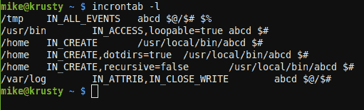

# Linux Fu:Incron 故障排除

> 原文：<https://hackaday.com/2020/10/28/linux-fu-troubleshooting-incron/>

你可能知道`cron`，一个让你安排程序在不同时间运行的程序。我们还谈到了`incron`，它非常类似，但它不是对时间做出反应，而是对文件系统中的变化做出反应。如果你曾经想写一个程序，比如说，检测一个文件中的变化，并自动将它上传给一个程序员，备份它，通过电子邮件发送到某个地方，或者其他任何东西，那么 incron 可能是你的选择。虽然我们之前已经讨论过它，但 incron 有一些特性，使得调试问题非常困难，所以我想分享一些我在使用 incron 时使用的技巧。

我之所以想到这一点，是因为我想建立一个简单的系统，在这个系统中，我有一个受 git 控制的文档目录。更改该文件夹中的 markdown 文件会生成 Word 文档和 PDF 文档。相反，改变一个 Word 文档会产生一个降价版本。

用 pandoc 很容易做到这一点——它支持许多不同的格式。诀窍是只在更改过的文件上运行它，而且是在它们更改的时候。这个任务并不难，但是确实需要调试一下，因为它有点不简单。

## Incron 评论

设置 incron 可能有点麻烦。我将假设您有办法使用像`apt`这样的包管理器来安装它，并且您的系统使用 systemd 来启动和停止服务。

然而，事情远不止如此。您需要在`/etc/incron.allow`文件中被命名(而不是在`/etc/incron.deny`中被命名)。一旦你设置好了，它很容易使用。直到它不是。



每个用户都有一个`incrontab`。使用:`man 5 incrontab`了解一下。要编辑它，请使用以下命令:

```

incrontab -e

```

每行有三个字段，每个字段之间必须使用一个制表符。第一个字段是要监视的目录或文件，第二个字段有逗号分隔的条目，告诉 incron 您正在寻找什么样的更改以及一些其他选项。最后一个字段是要运行的命令。

您可以在命令行中使用一些特殊字符。例如，`$@`给出目录名。`$#`宏是文件名，而`$%`给出字符串形式的事件类型(`$&`是相同的数字代码)。如果你需要一个真正的美元符号，就把它翻倍。

这些事件是像`IN_CREATE`、`IN_DELETE`、`IN_MODIFY`和许多其他事件。您可以一起使用任意数量的它们，只需在它们之间使用逗号。稍后我会有更多的话要说。还有一些选项，比如`IN_DONT_FOLLOW`，它会停止符号链接解引用。你也可以设置`recursive=false`停止监控子目录和`loopable=true`，这应该可以阻止一个常见的问题，但并不总是如此。

您会在互联网上看到有时会过期的文档。当前的开发是在 GitHub 上进行的，但是主要开发者在 2012 年就停止了，在有人开始修复 bug 之前有两年的时间。有时，阅读您必须确切了解发生了什么的版本的源代码是值得的。

## 有什么不好？

incron 服务遭遇身份危机。无论是从功能上还是名字上，肯定都和 cron 差不多吧？从表面上看，那是真的，但细节却大相径庭。首先，incron 的旧版本不允许在表中添加注释。所以你可能认为你已经注释掉了一些东西，但是你没有。最重要的是，很难从您的命令中获得输出，甚至是体面的状态。虽然不是不可能，只是很难。最近的版本确实允许评论，但这是一个漫长的过程，你的版本可能是也可能不是最新的。

另一个经常出现的问题是，您在程序中采取的任何触发文件系统更改的操作都可能会使您陷入死循环。你可能会认为 incron 会发现这一点并采取措施。相反，您的私有 incrontab 中的一行代码可能会导致整个守护进程崩溃。

更复杂的是，许多程序做了一些你意想不到的事情，破坏了一些事件。例如，您可能会想，如果您想知道文件何时更改，您应该在 _MODIFY 中进行监控。有道理。但是大多数编辑不是这样工作的。如果您编辑文件，它有时会在/tmp 中的文件副本上工作，然后保存操作实际上是一个移动。有时候功能相似的程序会有不同的事件流。例如，`scp`和`rsync`处理文件的方式不同，当一个新文件出现时，需要不同的处理方式，这取决于哪个程序把它放在那里。

## 第一个技巧:在使用命令时记录日志

这就引出了第一点。使用 IN_ALL_EVENTS 关键字编写一个临时规则，并使用一个小 shell 脚本来记录您认为文件会发生什么情况。您可能会发现结果令人惊讶，在您开始编写真正的脚本之前，最好理解您的用例的事件流。

假设您有一个名为 echoarg.sh 的脚本:

```

#!/bin/bash
fn="$1"
shift
echo "$@" >>"$fn"

```

只是一个快速而肮脏的脚本，但是您可以将它与 incron 一起使用:

```

/home/user/tmp/itest IN_ALL_EVENTS /bin/bash echoarg.sh /home/user/tmp/echoarg.log $% - $@/$#

```

当然，文件名应该有引号，但是因为我们只是将它们打印出来，所以这并不重要。有一点需要注意:有些安装不允许 incron 写入/tmp 这样的地方，甚至不允许监视那里的文件。您最好坚持使用您知道自己拥有的目录(在本例中是/home/user/tmp)。下面是在`~/tmp/itest`目录下运行`touch foo`的结果:

```

IN_ATTRIB -  /home/user/tmp/itest/foo
IN_CREATE - /home/user/tmp/itest/foo
IN_OPEN - /home/user/tmp/itest/foo
IN_CLOSE_WRITE - /home/user/tmp/itest/foo

```

## 更多需要担心的事情

每个发行版打包的东西都有点不同，所以您可能需要阅读一些文档。例如，在基于 Debian 的系统上，incron 记录的一点点数据都会被写入系统日志。但是在其他一些常见的发行版中，它重用了 cron 日志文件。

这个程序对空格和制表符也非常挑剔。所以第二场和第三场之间的一个杂散空间会把事情弄糟。程序名后面的制表符也是如此，shell 将把制表符和下一个标记作为程序名的一部分。

说到外壳，incron 在寻找外壳和设置环境方面非常奇特。您的版本可能会有所不同，但最安全的做法是假设您将需要一个通向所有内容的路径和 incrontab 中的一个显式 shell。如果在`PATH`或者其他环境配置中需要特殊的东西，在脚本中做。即使你运行的是二进制文件，写一点包装器也是值得的，这样你就可以按照你想要的方式设置一切。至少，当您运行您的测试时，将运行时环境转储到一个临时日志文件中，这样您就不会发现您错过了许多您期望的环境。

使用$(date)这样的命令是注定要失败的，因为 incron 会吃掉美元符号。如果你觉得幸运，可以尝试使用$$(日期)。

## 大事件

在理解了要处理的事件之后，您需要编写脚本，并在不使用 incron 的情况下尽可能多地测试它。在我的例子中，我编写 autopandoc 的想法是以后添加 PDF 函数:

```

#!/bin/bash
if [ -z "$1" ]
then
     exit 1
fi
if [ ! -f "$1" ]
then
     exit 2
fi
dir=$(dirname "$1")
ffilename=$(basename -- "$1")
ext="${ffilename##*.}"
filename="${ffilename%.*}"

case "$ext" in
doc*) newext="md"
;;
md) newext="docx"
;;

*) exit 3
esac

if [ ! -f "$dir/generated" ]
then
    mkdir "$dir/generated"
fi
exec pandoc "$1" -o "$dir/generated/$filename.$newext"

```

这很容易从带有假目录、文件和事件参数的命令行运行，并确保逻辑如您所愿。相信我，这比在 incron 事件中调试要容易得多。

我的第一次尝试一点也不顺利，也没有什么解释。通过查看日志，我可以看到文件事件正在发生，但是没有证据表明我的脚本——无论多么简单——正在运行。事实证明，向表中添加一个显式的/bin/bash 可以让一切正常工作。

然而，如果我写回同一个目录，让 incron 停止重新触发被证明是具有挑战性的。我创建了一个子目录，这将触发一个更改，然后创建另一个子目录，触发另一个更改。最终，因克伦会死去。不仅仅是我的用户的工作线程。Incron 会为所有用户而死。我认为您可以更改 systemd 来重新启动它，但这并不是一个真正的解决方案。

有几个选项可以阻止 incron 对同一个文件进行多次反应，但是创建一个新文件仍然会导致事件，老实说，如果没有的话，如果您试图处理多个用户，这将是另一个问题。我撑船结束，但首先，让我们看看你如何可以窥视在一个 incron 运行期间发生了什么。

## 是原木！

正如我提到的，日志文件可能出现在几个不同的地方。如果您使用 KDE，KSystemLog 会很方便，因为它可以在事件发生时过滤并显示给您。当然，您也可以使用 tail -f，但是您可能需要一个 grep 来减少噪声。

如果您使用 systemd，您可以尝试这样做:

```

journalctl -f -u incron.service

```

这相当于 incron 日志文件的`tail -f`。看 incron 反复触发/my_dir/subdir/subdir 上的事件…会告诉你很多关于你剧本的内容。

## 其他提示:自己运行守护进程，使用 strace，最大化你的手表

您可以使用自己选择的方法(例如，`systemctl stop incron`)停止 incron 守护进程，然后使用`-n`选项自己运行`incrond`。它向你展示了程序在做什么。请确保以 root 用户身份运行它。

另一件可能的事情是使用`strace`来运行程序。这将显示该程序进行的所有系统调用，因此如果您想知道它打开了哪些文件以及这些文件打开的结果，可以这样做:

```

sudo strace incrond -n

```

`-n`选项使程序停留在前台。只是记得在你完成后杀死它，并再次启动服务。当然，如果你在一台与其他人共享的机器上，这可能是一个非常粗鲁的想法。

如果您开始使用 incron，您可能会发现文件系统监视已经用完了。如果有，请尝试:

```

sysctl fs.inotify.max_user_watches

```

您可以使用临时更改允许的数量

```

sysctl -w fs.inotify.max_user_watches=1000000

```

通过编辑/etc/sysctl.conf 或向/etc/sysctl.d 添加一个文件来使其永久化。

## 有用吗？

一旦你让事情运转起来，它就会运转得很好。不过，对于产品来说，我担心一个错误的脚本会导致整个服务崩溃。还有其他选择。如果你不介意 systemd，还有[个路径单元](https://www.freedesktop.org/software/systemd/man/systemd.path.html)。GitHub 上有几个可能的替代品，尽管最近似乎没有一个被维护。

像大多数 Linux 工具一样，有时这是正确的选择，有时您会想要使用其他的工具。但是理解你的盒子里所有的工具仍然是值得的。