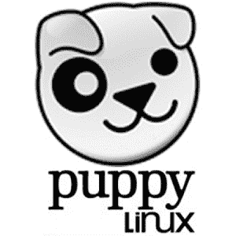

# Linux 的营销问题

> 原文：<https://hackaday.com/2019/10/31/linuxs-marketing-problem/>

风靡一时的经典电影《办公室空间》是对软件工程师在隔间农场生活的严厉批判，尽管它并不总是有意为之，但它确实做对了很多事情。其中之一是汤姆·斯米考斯基的角色，他的工作是“与客户打交道，这样工程师就不必这么做了”。这部电影在某种程度上将汤姆和他的工作视为笑点，但他的角色实际上对于大多数依赖工程师或程序员提供核心产品的真实企业来说非常重要。

工程师可能很难与客户沟通，而且通常没有时间(甚至不愿意)来处理与客户互动的后勤工作。客户可能会对理解工程师或向他们清楚地传达自己的想法感到沮丧。像 Tom Smykowski 这样的人经常需要弥合差距，消除双方的粗糙边缘，但在 Linux 世界中，很少有 Toms 可以依赖。在许多情况下，客户或用户必须直接与工程师打交道，这对任何一方都不是很好。Linux 有一个营销问题，如果它想增加它在 PC 领域的市场份额，它需要一个营销解决方案。

如果您曾经深入到 Linux 的多样化和分层世界，而不是安装像 Ubuntu 或 Mint 这样的预打包发行版，您可能会遇到这样的人，他声称“Linux”的正确说法实际上是“GNU/Linux ”,或者大声疾呼二进制 blobs 是多么危险，或者许多其他主题。这些观点中的任何一个事实上可能都是正确的，但是会立刻拒绝那些仅仅寻找一个高质量软件的人，他们可能并不关心自由/开源软件的细节或者参与创建软件的人的动机。的确，这些开发人员和编码人员应该被赞扬和尊重，因为他们创造了这个世界，但不能指望他们有效地推销他们的产品，因为他们不是营销人员。这些关于软件的信念被热情地持有和坚定地相信，但是并不是与外界互动的好方法。这里的核心问题是，对某个主题有深刻了解的人通常很难将这些知识与公众联系起来，他们需要一些帮助。

## 2099 年:桌面上的 Linux 年

让我们更深入地研究一下这个与 Linux 相关的问题，并对操作系统使用率的当前状态有一个大致的了解。对于台式机和笔记本电脑，Windows 占据了 87%的市场份额，macOS 以大约 10%的份额落后，Linux 不到 4%。微软和苹果都有庞大的营销预算，也受益于一些制度优势。但是，如果我们看看那些不依赖市场销售的系统，比如超级计算或服务器世界，Linux 在各方面都占主导地位。[现在几乎 100%的超级计算机都使用 Linux。如何定义网络服务器是有争议的，Linux 的数字从 70%到 98%不等，这取决于你是否把云服务和子域计算在内，但不管怎样，Linux 运行着绝大多数的网络。甚至智能手机也是由 Linux 驱动的 Android 主导的，大约 65%的设备，20%使用 iOS，剩下的是褪色的黑莓，Windows Phones 和其他设备的混合体。](https://itsfoss.com/linux-runs-top-supercomputers/)

从这些数字中，我们可以推断出在 Linux 环境中工作有一些内在的好处。它不仅在需要原始计算能力的时候占据主导地位，无论是在超级计算机还是网络服务器上，而且它还必须具备一些作为个人电脑有效工作的能力，否则 Android 不会在智能手机和平板电脑上如此受欢迎。由此可以得出结论，微软和苹果主宰桌面世界的唯一原因是，他们的产品背后有一个营销团队，在他们和这些公司的工程师和程序员之间为客户提供了一个舒适的客户服务层，同时也淹没了 Linux 甚至存在于个人计算领域的信息。

## 你处理不了 Linux

为了举例说明在 Linux 世界中理解行话是多么令人沮丧，让我们看看 [Puppy Linux](http://puppylinux.com/) ，这是一个专门设计用于在 jump drive 或传统硬件上运行的 Linux 版本。它在 21 世纪初就已经出现了，所以对游戏来说并不新鲜。它的主要特点是体积小，能够将其状态保存到安装它的跳转驱动器，在重新启动之间和不同机器之间保留设置和文件。

Cute, but he can bite!

安装过程并不简单，尽管它的年龄，并需要两个独立的跳跃驱动器或一个单一的跳跃驱动器和一台计算机与小狗已经安装。看起来发行的网站应该有说明，或者至少有说明的链接。相反，首页在很大程度上是一篇关于 Puppy Linux 如何实际上不是一个“发行版”*本身*的论文，以及一篇关于什么算不算真正的 Linux 发行版的技术描述。

令人困惑的是，在这一段下面是一组标有“官方发行版”的下载链接。这是一个客户与工程师有太多直接互动的完美例子。这就好像我们在被允许使用螺丝刀完成一项简单的任务之前，必须先听一堂关于 Phillips 和 Torx 螺丝区别的讲座。我们首先需要知道如何安装和使用软件，然后一旦我们知道如何使用它，我们就可以调查它的细微差别和意识形态。

当然，我们稍微挑了一下 Puppy Linux 来帮助说明一个观点，但是这种趋势在 Linux 世界中并不罕见。另一方面，在管理 Ubuntu 发行版的 Canonical 公司可以找到一个反例，说明即使是用户和开发人员之间的简单缓冲也可以工作，而且工作得很好。他们的主页信息丰富，易于理解，没有杂乱的术语。下载页面和软件安装说明都清晰可见。不过也有一些小问题，比如 64 位版本尽管可以在英特尔硬件上运行，却被贴上了“AMD”的标签，这是一个被遗忘的时代的不必要的延续，当时 32 位处理器是标准。尽管如此，这是一个很好的例子，说明当一群了解人们需求的人在软件的创造者和用户之间充当一个汤姆·斯米考斯基式的角色时，Linux 发行版是多么顺利。

## 问题在于选择

部分问题也在于 Linux 及其大部分相关软件都是免费和开源的。在软件质量、灵活性和可定制性方面通常是优势的东西，当没有收入来实际资助一个营销团队时，就会变成劣势，而这个营销团队将能够解决潜在未来用户和软件创作者之间的核心沟通问题。Canonical、Red Hat、SUSE 和其他公司都取得了不同程度的成功，但这并没有说明另一个问题:开源软件的分裂本质不仅导致了软件本身的分裂，也导致了资源的分裂。

想象一下，如果有数百个不同版本的 macOS，所有苹果用户都必须了解它们，然后决定哪一个最适合他们的需求。相反，从用户的角度来看，苹果保持了团结，这对它来说更好。与 Canonical 的 620 万美元相比，他们的年度运营预算为 710 亿美元，这肯定不会伤害苹果，并进一步巩固了营销(和预算规模)的重要性。

[“Penguins”](https://www.flickr.com/photos/65143725@N08/5927271192) by [TomaLaPlaya](https://www.flickr.com/photos/65143725@N08)

现在，我在这里做一些假设，即“Linux 社区”是一个铁板一块的团体，而不是一个松散的联盟，这些人在计算世界中有特定的、通常是不相关的兴趣。所有与 Linux 相关的事情都没有单一的联系点，这使得将整个社区作为一个整体来概括有点困难。为此，Linux 社区没有单一的“目标”,甚至没有人关心在个人计算领域拥有 1-2%的市场份额。

作为一名电气工程师和一个偶尔在代码中遇到困难的人，我不可否认地处于整个社区的边缘，但这种批评来自于对每个使我有可能使用自由软件的人的尊重和钦佩，即使我有时不得不努力工作来解决问题。自从我为了 5.10 Breezy Badger 放弃 XP 以来，我一直只使用 Linux，我喜欢生活在这样一个世界里，在那里我不会被迫每天进入 Windows 环境的公司地狱场景，没有别的原因，只是因为大多数人已经知道如何使用 Windows。

通过有凝聚力的营销策略，我认为这可能成为现实，但这不会通过关于“自由中的自由”或“GNU”的正确发音或使用 Gentoo 而不是 Arch 的好处的热情洋溢的文章来实现。只有当有人能把所有分散的群体团结在一个有凝聚力的、简单的信息周围，并把它推销给公众时，它才会到来。我们需要一个能把“妄下结论”变成一百万美元的人。