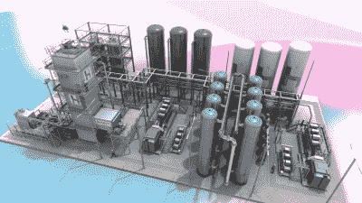
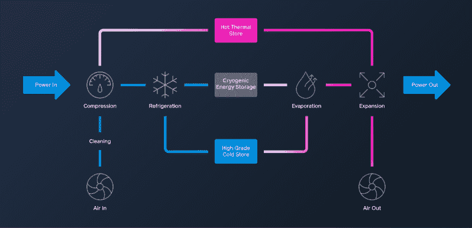

# 液态空气能量储存:使用常规旧环境空气的电网电池

> 原文：<https://hackaday.com/2020/07/24/liquid-air-energy-storage-a-power-grid-battery-using-regular-old-ambient-air/>

当你想到可再生能源时，你会想到什么？我们大胆猜测，风能和太阳能很可能是最重要的。是的，只要风和日丽，风能和太阳能都很棒。但是所有那些短暂而凄凉的冬日呢？雨天？晚上吗？

Render of a Highview LAES plant. The air is cleaned, liquefied in the tower, and stored in the white tanks. The blue tanks hold waste cold which is reused in the liquefaction process. Image via [Highview Power](https://www.youtube.com/watch?&v=kDvlh_aG7iA)

不利的条件意味着储存是任何使用可再生能源的可行解决方案的重要组成部分。要么必须储存能量本身，要么必须储存按需产生能量的手段。

一个可能的答案一直就在我们的眼皮底下——空气。普通的旧环境空气可以被冷却和压缩成液体，储存在储罐中，然后再加热到气态来做功。

这项技术被称为低温储能(CES)或液态空气储能(LAES)。这是一种相当新的能源方案，十年前由英国发明家彼得·迪尔曼作为汽车发动机首次开发出来。最近，这项技术被重新设想为电网存储。

英国公用事业公司 Highview Power 已经采用了这项技术，并在世界各地进行测试。他们刚刚开始建设世界上最大的液体空气电池工厂，该工厂将利用非高峰能量为周围的空气液化器充电，然后储存液体空气，在需要时通过涡轮再次气化来发电。涡轮机将仅用于在用电高峰期间发电。就其本身而言，LAES 过程并不十分高效，但该系统通过捕捉过程中的废热和冷并对其进行再利用来抵消这一点。最大的好处是，唯一的废气是普通的，可呼吸的空气。

A high-level overview of the LAES process. Image via [Highview Power](https://highviewpower.com/technology/)

这个所谓的超级工厂正在英国曼彻斯特附近建造，预计将于 2022 年完工。它将能够为近 20 万个家庭连续供电 5 个小时，即使他们在加冕街的演职员表一滚动就打开水壶。这家工厂将拥有 250 兆瓦时的存储容量，几乎是[霍恩斯代尔电力储备](https://hackaday.com/2019/12/16/the-hornsdale-power-reserve-and-what-it-means-for-grid-battery-storage/)的两倍——这是去年在一场特别混乱的风暴夺走了近 200 万人的电网后，特斯拉在南澳大利亚建立的化学电池。

与其他可再生能源相比，LAES 有很多优点。一些现有的绿色能源计划有很高的储存要求，例如，抽水水力发电需要一座山。同样，[你可以在一堆沙砾中储存能量](https://hackaday.com/2019/12/04/can-you-store-renewable-energy-in-a-big-pile-of-gravel/)，但是你需要一大堆沙砾。液态空气工厂一开始占地面积很小，但它们也是模块化的，因此它们可以堆叠起来以获得更大的产量。它们还可以与其他组件结合使用，如只在高需求期间运行的调峰电厂。

鉴于最近西伯利亚的热浪，看到这样的大规模可再生能源项目真是太好了。Highview Power 在英国、欧洲和美国还有其他项目正在进行中，所以也许有一天我们可以去参观一下。在你等待报道的时候，看看下面 LAES 一家工厂的动画演示。

 [https://www.youtube.com/embed/kDvlh_aG7iA?version=3&rel=1&showsearch=0&showinfo=1&iv_load_policy=1&fs=1&hl=en-US&autohide=2&wmode=transparent](https://www.youtube.com/embed/kDvlh_aG7iA?version=3&rel=1&showsearch=0&showinfo=1&iv_load_policy=1&fs=1&hl=en-US&autohide=2&wmode=transparent)

