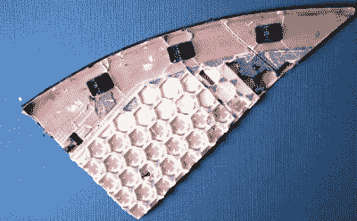

# 真的撕开了 SpaceX Starlink 天线

> 原文：<https://hackaday.com/2020/11/25/literally-tearing-apart-a-spacex-starlink-antenna/>

虽然 SpaceX 的 Starlink 卫星群远未达到其预计的最终规模，但该公司有足够多的鸟儿在低地球轨道上飞来飞去，开始一段有限的测试期，他们称之为*比什么都没有好*。如果你足够幸运被选中，你必须为硬件支付 500 美元，另外每月支付 100 美元的服务费。尽管得到一个相当高的门槛，[【肯尼斯·凯特】还是决定把他的星联碟献给拆解之神](https://www.youtube.com/watch?v=iOmdQnIlnRo)。

我们说牺牲是因为[肯尼斯]不得不真的破坏盘子才能看到里面。如果不把它全部拆开，你似乎不可能真正进入异常薄的天线阵列，这在一定程度上要归功于将结构背板固定在 PCB 上的大量粘合剂。相控阵面向天空的一面是允许天线跟踪快速移动的 Starlink 卫星的关键元件，当它们经过头顶时，它也被层压到由塑料六边形网格层、无源天线元件和外部玻璃纤维蒙皮组成的叠层上。简而言之，里面肯定有*不可由用户维修的部件。*

The dish hides many secrets under its skin.

除了试图分析天线内部发生的射频魔法，[Kenneth]还带领观众参观了一些更容易识别的 PCB 组件；挑选一些东西，如以太网磁性电源，GPS 接收器，一些闪存，以及用于控制碟形天线底部平移和倾斜电机的 H 桥驱动器。

这种天线似乎也是一种独立的计算机，配有 ARM 处理器和 RAM 来运行瞄准相控阵的软件。说到这里，毫不奇怪地发现，不仅驱动令人眼花缭乱的天线元件阵列的 IC 是 PCB 上数量最多的组件，而且它们似乎是某种专门为 SpaceX 设计的定制硅。

简而言之，关于这种高科技接收器的实际工作原理，我们还有很多不知道的。虽然[Kenneth]在试图理解这一切方面做了令人尊敬的工作，我们也钦佩拆开这样一个罕见而昂贵的套件所需的奉献精神，但黑客社区真正掌握 SpaceX 投入到他们雄心勃勃的全球互联网服务中的[技术还需要一段时间。](https://hackaday.com/2020/02/20/how-does-starlink-work-anyway/)

 [https://www.youtube.com/embed/iOmdQnIlnRo?version=3&rel=1&showsearch=0&showinfo=1&iv_load_policy=1&fs=1&hl=en-US&autohide=2&wmode=transparent](https://www.youtube.com/embed/iOmdQnIlnRo?version=3&rel=1&showsearch=0&showinfo=1&iv_load_policy=1&fs=1&hl=en-US&autohide=2&wmode=transparent)

【感谢亚历克斯的提示。]