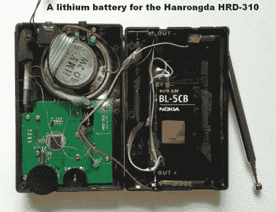
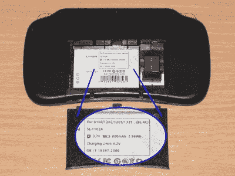
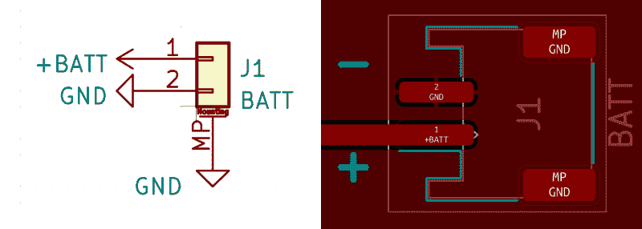

# 锂离子电池很容易找到

> 原文：<https://hackaday.com/2022/10/03/lithium-ion-batteries-are-easy-to-find/>

在第一篇文章中，我已经向您概述了作为我们项目基础的锂离子电池，并描述了黑客应该如何对待他们的锂离子电池。但是如果你还没有锂离子电池呢？您从哪里获得项目所需的锂离子电池？

拆开笔记本电脑电池，无论是普通的 18650 还是现代的袋电池，[仍然是一个很好的途径](https://hackaday.com/2011/09/19/things-to-do-with-your-laptop-batteries-when-theyre-dead/)-许多黑客走这条路，这个话题被许多人广泛涉及。然而，18650 电池可能不适合你的项目大小，薄电池还没有完全充斥市场。让我们看看除了笔记本电脑，您还有哪些选择。

## 智能手机电池是一个可行的来源

A [radio rebuild project](https://19max63.wordpress.com/a-lithium-battery-for-the-hanrongda-hrd-310-radio/) using a Nokia battery

第一个被低估的锂离子电池，特别是袋状电池，是智能手机电池。当然，我们都见过手机电池比手机更早耗尽，在许多现代手机中，电池是粘在一起的，更难取出。然而，如果你需要一个小电池为你的设备供电，在当地商店购买智能手机电池仍然是值得的。

例如，用户可更换的电池仍然由诺基亚等制造商生产和销售，电池通常在 1000 毫安左右，对于一个长时间睡眠的小型 ESP32 或 Pi Pico 项目来说绰绰有余。如果你想让你的设备可以被其他人重复使用，并让电池采购变得简单，也许可以绕过[锂离子运输限制，](https://twitter.com/dongsentech/status/1012613847755059200)或者如果你是一家车库创业公司，渴望得到一个小批量的原型，智能手机电池是一个不错的选择。

更重要的是，没有什么能阻止你将手机使用的相同触点放到你的 PCB 上。你可以从网上维修店、LCSC、全球速卖通或者更多地方找到这些联系人。智能手机电池有一个保护电路，通常是内置的热敏电阻和单线或 I2C 电量计。最重要的是，你得到了一个具有活跃供应链的电池，这意味着你可以在你的项目中机械地和电气地设计它，而不用担心几个月后当一个非常特定的电池的所有本地库存突然耗尽时需要重新设计。需要记住一件小事——虽然老式诺基亚电池有第三个引脚，但它不是热敏电阻引脚——而是一个[固定值电池识别电阻。](https://pinoutguide.com/CellularPhones-A-N/nokia_bl-4c_battery_pinout.shtml)

我们已经在 iPhone 电池[、](https://mozzwald.com/articles/2016/08/01/iphone-battery-charger-tester-breakout-and-hdq-gas-gauge-stats)和智能手机电池[上看到过类似的临时插脚固定器。](https://hackaday.com/2014/07/16/finally-an-easy-to-make-holder-for-lithium-ion-batteries/)我第一次遇到它是在我看到使用诺基亚格式电池的中国收音机的图片时，从那以后我一直在把它们设计成小尺寸的东西。你不必寻找“真正的”细胞，具有良好评价的第三方细胞是一个体面的来源，往往提供更多的每美元价值，但最底层的细胞可能会令人失望。

蒸发有助于让锂离子电池变得更容易使用。首先，[一次性 vapes 为我们提供了可重复使用的小电池](https://hackaday.com/2022/05/05/2022-hackaday-prize-disposable-vape-pens-turned-project-parts/)——记住要采取保护措施。然而，vape 商店也是具有高电流能力的 18650 电池的一个不错的来源，如果你是一个设计带有 18650 支架的设备的爱好者，当你可以要求你的接收者去 vape 商店以适度的加价购买 18650 时，你不必担心电池运输限制不公平地影响小规模生产商。

也有专门的商店出售锂离子电池和电池，18650 和小袋一样，价格便宜，地面运输便宜。Quad 和其他遥控车辆把它们吃光了，所以像 Hobby King 这样的商店经常有很好的交易。在欧洲，Nkon 是必去之地之一，我已经非常成功地从那里获得了 3.5 Ah 的细胞，价格与全球速卖通假冒的“6.5 Ah 细胞”列表相当。说到这一点，我不能说我推荐全球速卖通——直到今天，他们在向你空运细胞时似乎需要诉诸技巧，这些细胞有时仍会被海关检查随机查获，质量不合格的细胞在那里占有不可忽视的市场份额。

## 小心机械

一旦你得到了一些细胞，你如何将它们连接到你的电路中？如果它们是 18650 年代的，有一个支架是很好的——Thingiverse 不缺乏可印刷的支架，商业制造的支架使用起来不那么令人沮丧。当涉及更高电流的应用时，叶片接触保持器比基于弹簧的保持器更好；否则，你可能永远不会注意到有什么不同。必要时，如果你有四个盘状磁铁，你可以将两根电线夹在两个磁铁之间，然后将它们卡在你的 18650s 上作为支架——我曾经为黑客马拉松做过一次，当时我们急需为可穿戴设备中的 Raspberry Pi 3 供电，但周围没有合适的电源。

对于袋式电池，如果它有终止于插头的电线，最好有一个插座-如果需要，将其从原始设备上拆下。否则，您可以用引脚接头制作插头，即使它是非极化的——您需要添加自己的极性机制，即颜色编码。记住，电源上的母接头，电源输入上的公接头——短接电池比意外短接未连接的电源输入更糟糕。

如果你的袋状电池没有连接器，只有凸片，你会想要焊接到这些凸片上，但一个好的做法是在焊接之前，在焊点和电池之间夹上一个鳄鱼夹，用于散热。这些标签直接连接到电池内部的聚合物层，过热可能会缩短电池寿命。

您还需要确保眼袋细胞没有被刺破或挤压的风险，并且如果细胞开始膨胀，这种情况也不会发生。首先，这意味着如果你的电路板的底部也有通孔插脚伸出来，就不要把它粘到电路板的底部。拥有一个 3D 打印的支架，至少有一面墙是柔软而薄的(如果不是开放的),这将是有帮助的——并确保细胞不会在它决定膨胀的情况下最终卡在这个支架中。可更换的智能手机电池往往更坚固，但你仍然会受益于额外的机械保护。

## 标准化连接器，但不完全是

KiCad symbol: Conn_01x02_MountingPin; footprint: JST_PH_S2B-PH-SM4-TB_1x02-1MP_P2.00mm_Horizontal

一个很好的锂离子电池连接器是两针 JST-PH——这是你在野外随机电路板上最常看到的连接器，因此你应该为它储备连接器和电缆。当谈到 PCB 侧连接器时，您应该得到 SMD 版本，JST 零件号为 [S2B-PH-SM4-TB](https://www.findchips.com/search/S2B-PH-SM4-TB) 以及使用“1x2P PH 2mm”可搜索的替代产品。遗憾的是，这种连接器的通孔版本很薄，没有外壳安装引脚——金属引脚会相对快速地脱落，而 SMD 版本非常坚固，可以固定在板上。

当你进入为项目添加电池电源的最佳状态时，如果你提前从 Adafruit、Aliexpress 或其他商店储备一些 JST-PH 线索，会有很大帮助——我从 Lilygo 商店得到了 50 包。压接你自己的，虽然在技术上是可能的，但可能会导致电线很容易从压接处拉出，这是一个巨大的痛苦，往往发生在最不合适的时刻。我们已经广泛讨论了压接的主题；要点是，如果你没有合适的压接工具，最好买一束预先压接的电线。拔出 JST-PH 连接器时，最好用平切钳或锡剪抓住它的翅膀。

小心——尽管 JST-PH 连接器用于各种不同业余制造商的电路板上，[JST-PH 2 针电池插头有两种不同的引出线](https://community.particle.io/t/why-isnt-battery-polarity-always-the-same-in-jst-pins/44474/4)。像 Adafruit、Sparkfun、HobbyKing 和其他公司使用的引脚排列是正极(红色)是引脚 1，负极(黑色)是引脚 2，而许多中国卖家的做法正好相反——负极是引脚 1，正极是引脚 2。幸运的是，这种分歧并没有延伸到微控制器板——we mos 和 Lolin 板似乎与 Adafruit 和 Sparkfun 使用相同的引脚排列。

反向插入电池基本上肯定会杀死您的主板-确切地说，至少是它的电源管理组件。对于 JST-PH 2 引脚，这意味着您应该经常检查您的引脚。如果你自己设计电路板，你应该在连接器旁边的丝网上做引脚标记，这是更多 PCB 设计师在电路板上添加 JST-PH 电池连接器时应该遵循的做法。令人欣慰的是，你可以[轻松地将 JST-PH 插头](https://docs.particle.io/hardware/power/batteries/#reversing-polarity)重新连接到你想要坚持的任何标准——在重新连接插头时，注意不要在将触点从外壳中拔出时使电池短路。

## 乘飞机

如果你带着一个电池供电的 DIY 设备，去机场可能听起来很吓人，但这比听起来更可行——如果你想在登机时带上你的设备，你可以。请记住——锂离子电池和装有锂离子电池的设备必须放在您的随身行李中，它们必须像您的笔记本电脑和手机一样通过安全扫描仪。在某种程度上，让你的设备更像样会有所帮助，如果你想让你的机场安检排队体验无缝，让电池与设备分开是一个好主意。同样，袋状电池和 18650 在运输时最好存放在某种坚硬的箱子里。结合一些表象和预防措施，你的作品可以与你同行。

下一次，我们来谈谈电子产品的基本原理——1s 配置下的电池充电、将锂离子电压转换为更友好的 3.3 V 电压、保护和电源路径，以及可以放在您的电路板上的现成示例。