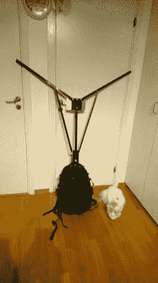
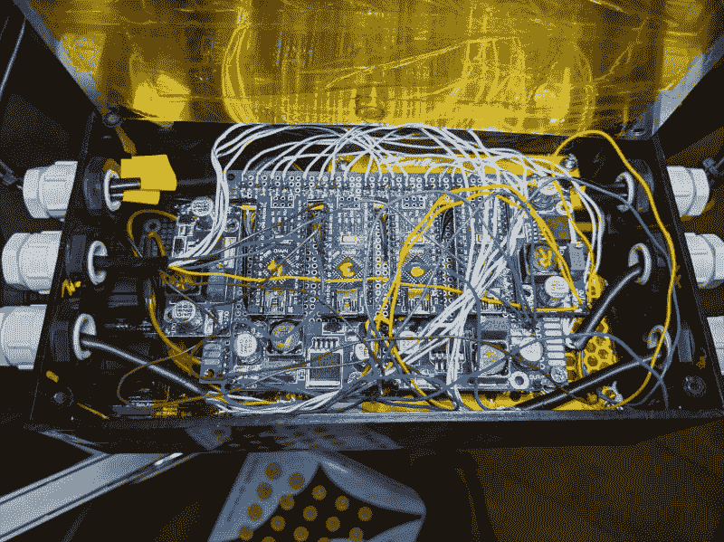

# Ljusmaskinen(最终)将狂欢带到了街头

> 原文：<https://hackaday.com/2020/07/16/ljusmaskinen-takes-the-rave-to-the-streets-eventually/>

当人类从疫情的另一边出来时，将会有堆积如山的令人敬畏的项目亲自展示。例如，这款[背包式 DMX 照明被瑞典黑客【Tim Gremalm】设计成一款移动锐舞装备](http://tim.gremalm.se/ljusmaskinen/)。面对面的狂欢现在还没有发生，但这只是意味着有时间给这个东西增加许多功能，直到锁定成为过去。

支撑照明设备的框架集成到这个背包中，我们认为这就是电池存放的地方。Y 形桅杆上有四盏 PAR 灯。顺便说一下，这意味着[抛物线铝反射器](https://en.wikipedia.org/wiki/Parabolic_aluminized_reflector)，通常用于舞台照明，但在这种情况下，卤素灯泡已被三个 4w RGBW led 取代。黄色矩形是 10 瓦板上芯片 LED 面板，用作闪光灯。

    Festmaskinen audio rig in 2015

但是仅仅有灯光并不能使它成为一个狂欢派对——这个派对既需要音乐，也需要一种方法来同步灯光效果。五年前,音乐部分已经制作完成，并在 West Pride 哥德堡音乐节(仅次于斯德哥尔摩的瑞典第二大音乐节)上使用。该项目名为 Festmaskinen，与 Ljusmaskinen(光机)合作。所以两个人背着锐舞，一个带着音乐，另一个带着灯光，这才是派对！

灯光控制器板使用一组四个 Arduino Nano 板和四个电压调节器来控制每个 PAR 灯。所有这些都是通过 DMX 输入板的控制拼接在一起的，该输入板也控制 COBs。(在此图中，DMX 板隐藏在灯光控制板下方。)当然，你需要一些可以处理音频并将其转换为 DMX512 的东西，以将这些灯光动画带入生活，为此他伸手拿了一个树莓 Pi。

[Tim]有一个我们在下面嵌入的工作中的钻机的快速演示。我们所缺少的是，当作为背包佩戴时，这种头重脚轻的结构如何处理。希望他能走出他低矮的家，让舞台灯光在不久后飘扬！

> [View this post on Instagram](https://www.instagram.com/p/CCHMzK0llFL/?utm_source=ig_embed&utm_campaign=loading)
> 
> [A small black box, The #qlcplus session](https://www.instagram.com/p/CCHMzK0llFL/?utm_source=ig_embed&utm_campaign=loading)
> 
> [hosted by # Ljumaskinen and running on #raspberrypi was shared by Tim Gray malm](https://www.instagram.com/timgremalm/?utm_source=ig_embed&utm_campaign=loading) (@ timgraymalm) on July 1, 2020 at 1: 1:15 PDT 【T52]