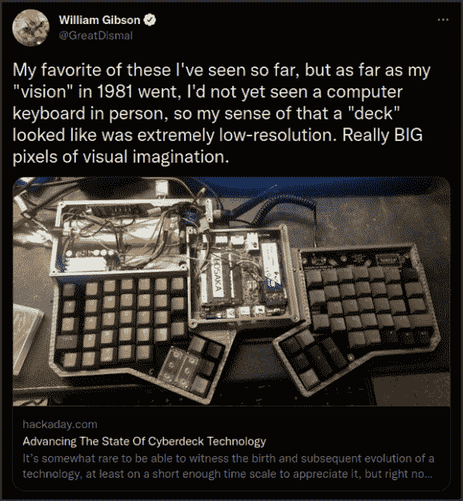

# 装载你的破冰船，2022 年赛博甲板大赛现在开始

> 原文：<https://hackaday.com/2022/08/08/load-your-icebreakers-the-2022-cyberdeck-contest-is-here/>

TL；博士:[参加 2022 年网络竞赛](https://hackaday.io/contest/186672-2022-cyberdeck-contest)，现在开始！

当威廉·吉布森第一次描述《燃烧的 Chrome》和《神经杀手 T2》中主角使用的“网络空间甲板”时，他只提供了一些具体的细节:它们允许用户探索网络空间，通常是便携式的，更熟练的所有者经常修改它们以适应他们的特殊需求。其他任何东西都留给个人的想象，这在很大程度上是因为作者本人并不确切知道这些东西在当时会是什么样子。尽管如此，对于一个当时在打字机上把所有东西都敲出来的人来说，这已经不错了。

Build your deck like Gibson is watching, because he is.

40 年后的今天，事实已经赶上了虚构。黑客和制造商社区已经在很大程度上接受了 cyberdeck 的想法，我们被这些定制计算设备中令人难以置信的创造力所震惊。

这就是为什么我们很高兴地宣布第一次，但很可能不是最后一次， [2022 网络平台竞赛](https://hackaday.io/contest/186672-2022-cyberdeck-contest)。用你的可扩展装备打动评委，你就可以获得三个价值 150 美元的 Digi-Key 购物狂欢中的一个，以资助你的下一部赛博朋克杰作。截止到 2022 年 9 月 30 日。

那么什么是虚拟甲板呢？这是一个很难回答的问题，但是既然我们在这里举办比赛，我们就必须试一试…

当然，它需要是某种计算机。它还应该有实际用途；尽管你的角色扮演道具可能令人印象深刻，但我们确实在这里寻找功能性设备。名义上，这意味着它将有一个键盘和某种显示器，但弄清楚它如何连接以及组件将采取什么形式才是有趣的地方。

最重要的是，它需要是个人的。你梦想中的电脑会是什么样子？它会有什么特点？这里没有正确或错误的答案——一个好的网络平台应该是建造它的人的反映，没有两个应该是完全相同的。

需要一些灵感吗？别担心，你来对地方了。在过去的几年里，我们已经看到了几十台这样的定制机器如果你需要一些帮助来朝着正确的方向前进。

## 细坂 R&D 省

除了三位获奖者，我们还将关注最能代表这些特殊类别的套牌:

*   **万能的**:你的甲板不仅仅做计算吗？它能刷新微控制器吗？兼做逻辑分析仪？作为你的合成器乐队的大脑？我们正在寻找能满足您需求的网络平台。
*   战后，我们不得不用剩下的一点科技来凑合。如果你的牌是用残局拼起来的，或者只是看起来像，这就是你的类别。
*   或者你的牌是相反的极性？是不是精致到和一辆小野仙台 7 没什么区别？(不一定非要字面上发光才算有光泽。)
*   在《神经漫游者》中，甲板让你完全沉浸在网络空间中。是的，这是小说之外的一个高要求，但是我们将庆祝你的小胜利！您的设备是否比标准的键盘、显示器和鼠标组合更具沉浸感？进来吧，牛仔！

## 矩阵在等待

准备好实现你的赛博朋克梦想了吗？只需为您的资料创建一个新的 Hackaday.io 页面，告诉我们它的情况，然后使用“提交项目至”按钮将其输入竞赛。我们有兴趣了解你的钻机是如何建造的，就像我们有兴趣看到最终产品一样，所以不要羞于谈论细节。

