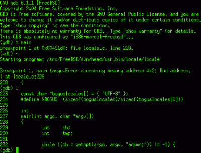

# 使用 GDB 进行本地和远程调试

> 原文：<https://hackaday.com/2020/11/06/local-and-remote-debugging-with-gdb/>

作为调试器，GDB 是一把名副其实的瑞士军刀。就像探索这些刀的所有非显而易见的用途一样，你对 GDB 的功能集范围的最初反应可能是困惑，随后的困惑和偶尔的笑声。对于瑞士军刀来说，这是一种可以理解的反应，因为一个人不太可能在军队战役中或被困在荒野中。类似地，真正学会欣赏 GDB 的特性集需要一个棘手的调试过程。

如果您已经使用 GDB 调试了一些代码，那么它很可能已经被 IDE 包裹得严严实实了。这当然是使用 GDB 的一种方式，但是将可用的功能限制在 IDE 公开的范围内。幸运的是，GDB 的命令行界面(CLI)没有这样的限制。学习 CLI GDB 命令还有一个好处，那就是即使在现场，也可以通过瑞士军刀网络版内 9600 波特卫星调制解调器上的 SSH 会话来执行关键的远程调试会话。

我是否做了太多的类比？大概吧。但是了解 GDB 的全部潜力是非常值得你花时间去做的，所以今天，让我们开始磨砺我们的数字工具集吧。

## 运行代码的 Godmode

[](https://hackaday.com/wp-content/uploads/2020/11/GDB-screenshot-green.gif)

Example GDB session.

调试器背后的概念相当简单:通常情况下，有些东西会阻止您编写的代码运行，或者您希望在应用程序执行时仔细查看它的某些状态。一种简单的方法是将变量值打印到终端或串行端口，但更有效的方法是使用像 GDB 这样的调试器，在代码执行时与代码交互工作。

这意味着暂停执行，向前和向后遍历代码的各个行，检查堆栈帧和部分内存，修改内存和特定变量的内容，等等。随着断点的设置和变量的观察，实际上应用程序执行的任何部分都可以被监控和影响。这包括当事情变糟，执行因某种错误条件而终止时，允许调用堆栈跟踪。

虽然 GDB 可以用于任何应用程序的二进制文件，但是当调试符号也被提供给调试器时，它会更加有用。这些调试符号是包含源代码以及其他信息的文本字符串。当编译器指示这样做时，它们被包含在二进制文件中。对于基于 [GCC](https://gcc.gnu.org/onlinedocs/gcc/Debugging-Options.html#Debugging-Options) 的编译器和 [LLVM](https://clang.llvm.org/docs/ClangCommandLineReference.html#debug-information-generation) 来说，这通常使用`-g`标志来完成。

## 本地英雄

运行本地调试会话是熟悉如何使用 GDB 命令行界面的好方法。使用 GDB 时，请务必随时准备好一个方便的[命令参考](http://www.yolinux.com/TUTORIALS/GDB-Commands.html)。这样做有助于熟悉更复杂的命令。

必须知道的是`break` (b)，用于设置断点，用于获取信息的信息，局部变量，线程等。此外还有`backtrace` (bt)和`continue`(c)`next`(n)和`step` (s)，分别用于打印出回溯、继续执行和以增量遍历代码。用 GDB 加载可执行文件后，程序用`run` (r)启动，它可以用任何命令行参数提供给可执行文件。

让我们编写一个非常简单的程序来进行调试练习:

```

/* hello.c - Hello World */

#include<stdio.h>

int main(void) {
        char hello[] = "Hello World";
        printf("%s\n", hello);
        return 0;
}

```

我们将在编译时使用`-g3`标志来包含调试符号。现在让我们看一下这个基于 C 的 Hello World 示例:

```
gcc -o hello -g3 hello.c
gdb ./hello

[..]
(gdb) b main
Breakpoint 1 at 0x1169: file hello.c, line 5.
(gdb) run
Starting program: /home/hackaday/hello
```

```
Breakpoint 1, main() at hello.c:5
5 int main(void) {
(gdb) n
6 char hello[] = "Hello World";
(gdb) n
7 printf("%s\n", hello);
(gdb)
```

我们首先在`main()`函数处设置一个断点，然后用`run`启动程序。在断点之后，每执行一次`next`(或者只是在一个空的输入上按 enter 来重复前面的命令)，我们将进入应用程序的下一行，而不进入函数调用。这就是`step`的作用。例如，如果我们在代码中使用`printf()`，使用`step`将导致我们检查该函数的每一行及其实现。这是否可取取决于个人的需要。

最后，我们可以检查变量和内存，使用`print` (p)打印变量，使用`x`打印内存地址的字节。例如:

```
(gdb) print hello
$1 = "Hello World"

```

大多数命令都非常简单、安全。禁止使用 GDB 的`set`命令，使用哪个不仅可以改变 GDB 的设置，还可以编辑内存内容。小心使用这个。

## 顶入遥控器

运行远程 GDB 会话与本地会话大致相同，明显的复杂之处是必须在远程系统上建立会话。所述远程系统可以是任何东西，从运行成熟操作系统的服务器、台式机或其他系统，到直接在裸机上运行的微控制器(MCU)。

GDB 在远程系统上建立调试会话的主要要求是要有一个 GDB 工具可以连接的 [GDB 服务器](https://en.wikipedia.org/wiki/Gdbserver) ( `gdbserver`)实例。然后，这个 GDB 服务器充当 GDB 和活动调试会话之间的桥梁。这种连接可以通过 TCP 或串行线路建立。这使得它成为一种高度便携的方法，既适用于远程服务器或桌面系统，也适用于具有 RS-232C 链路的工业电路板。

更有趣的是，使用 GDB 服务器方法来创建到微控制器平台(如 ST 的 STM32 Cortex-M 系统)提供的在线调试器功能的桥梁。这种方法只需稍加修改，就能适用于 Microchip 基于 ARM 的 SAM 和 AVR 平台。

## OpenOCD 作为 GDB 服务器

任何做过 MCU 开发的人都可能熟悉 [OpenOCD](http://openocd.org/) 。这个工具在各种 MCU 的编程中是非常宝贵的，而且还带有内置的 GDB 服务器。例如，假设想要在 STM32 MCU 上建立一个 GDB 会话，在 STM32F4-Discovery one 这样的通用开发板上。

第一步是启动 OpenOCD 的 GDB 服务器:

```
openocd -f board/stm32f4discovery.cfg
```

接下来，我们可以通过环回接口连接到这个服务器，同时也为 GDB(从 arm-none-eabi 工具链)提供包含固件的 ELF 二进制文件的路径:

```
arm-none-eabi-gdb --eval-command="target remote localhost:3333" "hello_world.elf"
```

GDB 现在将连接到 GDB 服务器，OpenOCD 使用 STM32F4-Discovery 板的板载 ST-Link/V2 接口的在线调试器功能。所有协议翻译现在都由 OpenOCD 完成，支持所有常见的 GDB 功能，即使我们正在调试的代码运行在开发板上的 MCU 上。

由于 MCU 已经启动了我们想要调试的固件，我们还需要再执行一个步骤，即重置 MCU 以获得我们可以使用的 GDB 会话:

```
(gdb) mon reset halt
```

MCU 现在将被重置并处于暂停状态，直到我们采取措施。我们现在将添加一个新的临时断点并继续:

```
(gdb) tbreak main
(gdb) c
```

在继续执行之后，这个临时断点将我们放在主函数的开始处，从这里我们可以根据需要设置断点和更多的断点。例如，我们可以在基于 STM32F4 的板上检查 GPIOA 外设的特定寄存器的值。假设我们想查看 GPIO_MODER 寄存器中的输入和输出状态是否设置正确:

```
(gdb) x/4tb 0x40020000
$1 = 0100 0000 0000 0000
```

`x`命令的特殊语法将单个 32 位地址打印为单字节块。GPIOA 外设位置可在 STM32F407 数据手册中找到，参考手册(RM)列出了该外设类型的存储器映射 IO 中特定寄存器的偏移量。这种情况下，MODER 寄存器的偏移量为 0x00，GPIOA 的地址为 0x40020000。字节顺序从左到右打印，这意味着第一个字节在左侧。

在这种情况下，我们可以看到 mode 1(针对引脚 1)设置为“01”，这意味着通用输出模式。

## 是时候停止猜测了

很多时候，我发现自己或其他人被困在代码行中，猜测哪一行可能是奇怪症状的原因。我只想说，这样做既不有趣也没有成效。除了像 Valgrind 这样的工具，像 GDB 这样的调试器是获得问题答案的完美工具，甚至是你不知道你想问的问题。这对于像嵌入式开发这样的东西特别有用，在这种情况下，来自新刷新的固件的即时反馈可能……不存在或者不完全符合预期。

建立一个严格的测试程序来隔离测试用例是值得的，并且使用像 GDB 这样的工具，用一个有针对性的测试计划就地解决有问题的固件。创建一个清单，列出当某些东西不工作时首先要检查的项目，然后从那里开始。

尽管调试有时看起来具有不确定性——海森伯格当然努力让它看起来如此——但最终每个问题都有一个好的、坚实的理由。你只需要找到用什么方式看什么部分。熟悉像 GDB 这样强大的工具绝对是一项重要的资产。