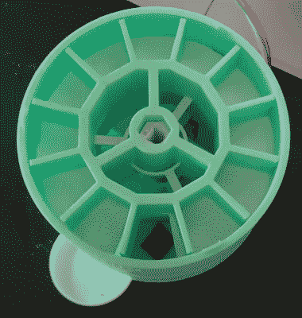

# 当地 IOT 猫对待分配器

> 原文：<https://hackaday.com/2022/11/22/local-iot-cat-treat-dispenser/>

[MostElectronics]和我们很多人一样，喜欢猫，所以想为他们最爱的猫做一个联网的零食分配器。结果是[一个巧妙的 3D 打印机构](https://www.youtube.com/watch?v=Mx5WoefZ2h0)连接到一个树莓派，它能够通过本地运行的网络应用程序提供食物。

从软件方面来说，Raspberry Pi 使用一个 RESTful API，人们可以通过一个静态 IP 连接到它。API 被实现为在独立的 web 服务器 Python 脚本下运行的 Python Flask 应用程序。web 应用程序本身会跟踪剩余的零食数量，并提供一个简单的界面，以便操作员在闲暇时分发零食。 [RpiMotorLib](https://github.com/gavinlyonsrepo/RpiMotorLib) Python 库用于通过其 ULN2003 控制器模块控制 28BYJ-48 步进电机，该电机用于旋转 treat 分配器的内部轴。

分配零食的机制是一个堆叠的、分隔的鼓，具有两个用于食物隔间的鼓层，该食物隔间转向掉落零食。底部滚筒通过与猫的托盘相连的滑槽分配食物，留下一个空的隔间，顶部滚筒可以通过交错的开口将食物投入其中来补充食物。每个分隔的零食鼓层提供 11 种零食，允许总共 22 种零食，其中两层堆叠在彼此的顶部。人们可以想象通过增加更多的层来扩展零食分配器以包括更多的鼓层。

源代码在 GitHub 上[可用](https://github.com/pythonprojectsforfun/WebsiteGPIOCSS/)，分发器的 STL 文件在 [Thingiverse](https://www.thingiverse.com/thing:5595111) 上可用。我们以前见过[猫的电子喂食器](https://hackaday.com/2016/12/23/cat-vs-human-escalates-with-armor-plated-feeder/)，有时会带来逐步升级的后果，从根本上动摇我们，让我们质疑我们的优越性。

休息后的视频！

 [https://www.youtube.com/embed/Mx5WoefZ2h0?version=3&rel=1&showsearch=0&showinfo=1&iv_load_policy=1&fs=1&hl=en-US&autohide=2&wmode=transparent](https://www.youtube.com/embed/Mx5WoefZ2h0?version=3&rel=1&showsearch=0&showinfo=1&iv_load_policy=1&fs=1&hl=en-US&autohide=2&wmode=transparent)

