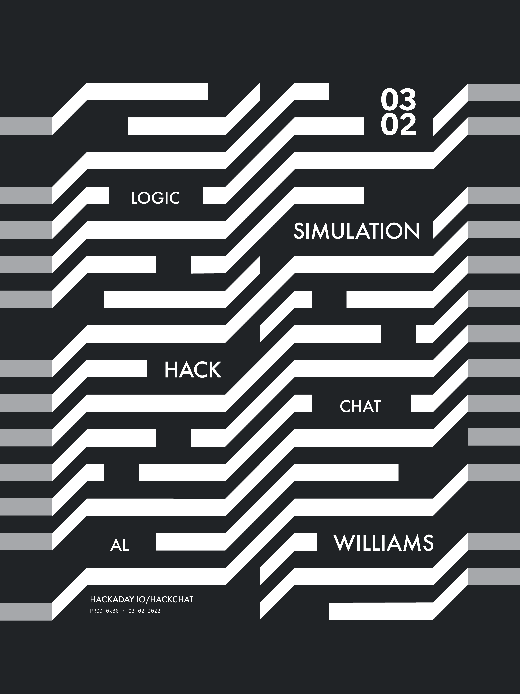

# 逻辑模拟黑客与铝威廉姆斯聊天

> 原文：<https://hackaday.com/2022/02/28/logic-simulation-hack-chat-with-al-williams/>

加入我们太平洋时间 3 月 2 日星期三中午的[逻辑模拟黑客聊天](https://hackaday.io/event/184060-logic-simulation-hack-chat-with-al-williams)与[阿尔威廉姆斯](https://hackaday.io/wd5gnr)！

我们中的许多人可能还记得——有些人天真地记得，有些人不太记得——我们第一次遇到真值表。这个由 1 和 0 组成的小网格看起来很简单，但对于一组给定的输入，它在逻辑电路输出的表格表示中拥有真正的力量。这使得更复杂的逻辑电路成为可能，但只是在一定程度上——添加足够的门、触发器和计数器，并且仅用铅笔和纸来跟踪什么是高电平和什么是低电平变得很成问题。

如果你已经到了让你的数字设计在你的头脑中不起作用的地步，或者如果你永远不能保持你的 NAND 和 nor 直线，那么你就准备好了数字逻辑模拟器。像 [Falstad](http://falstad.com/circuit/) 和 [LogiSim](http://www.cburch.com/logisim/) 这样的应用程序可以让你使用从离散逻辑门到加法器、计数器甚至算术逻辑单元这样的完整组件来构建设计。添加一些无源器件，如电容和电感，逻辑模拟器可能是你在接触试验板之前将设计带入虚拟世界的唯一工具。

为了帮助我们找出逻辑模拟器在我们设计过程中的位置，Hackaday 的特约撰稿人 Al Williams 将会加入我们的 Hack Chat。Al 在 2018 年运行了一个非常成功的 [FPGA Bootcamp](https://hackaday.io/project/159720-fpga-bootcamp-0) 系列，其中包括使用 Falstad 对数字逻辑的审查。他将在这个黑客聊天中详细阐述这一点，所以请提出您的问题和意见。你不会想错过这个的！

我们的黑客聊天是在 [Hackaday.io 黑客聊天群发消息](https://hackaday.io/messages/room/2369)中的实时社区活动。本周，我们将在太平洋时间 3 月 2 日星期三中午 12:00 坐下来讨论。如果你被时区束缚住了，我们有一个[方便的时区转换器](https://www.timeanddate.com/countdown/generic?iso=20220302T12&p0=224&msg=Logic+Simulation+Hack+Chat&font=cursive)。

