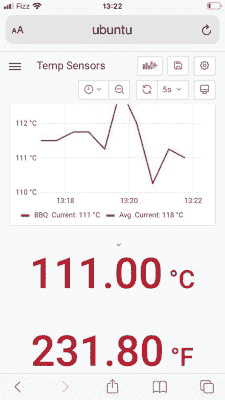

# 远程热电偶传感器 Sips 电池电源

> 原文：<https://hackaday.com/2022/07/20/long-range-thermocouple-sensor-sips-battery-power/>

有时你需要知道远处某样东西的温度。那可能是一个吸烟者，一个烤肉架，甚至是一个兔子窝。来自[谨慎的市长]的这个项目可能正是你正在寻找的。

【谨慎的市长】远程盯着肉，但不会泄露出去。

它由 MAX31855 热电偶放大器组成，设计用于与常用的 K 型热电偶一起工作。它连接到德州仪器 CC1312 微控制器，该微控制器通过 802.15.4 协议发送热量测量结果，这也是 Zigbee 和 Thread 等技术的基础。它能够在不消耗大量电力的情况下远距离发送无线电信息，使该项目能够使用 CR2023 硬币电池。结合不进行测量时使系统休眠的固件，[Discreet Mayor]预计该项目可以在单块电池上运行长达几年。

这些信息被拾取并记录在 Grafana 设置中的[，](https://hackaday.com/2019/01/23/howto-docker-databases-and-dashboards-to-deal-with-your-data/)，在这里它们可以很容易地用图表表示出来。对于额外的效用，任何超出预设范围的温度都会通过 IFTTT 触发智能手机警报。

密切关注温度是与吸烟者一起制作美食的关键，所以这个项目应该很好地为[谨慎的市长]服务。对于其他任何人来说，如果想毫不费力地远程监控温度，它应该也能做得很好！