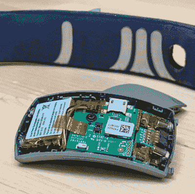

# 看看这个“冥想头带”的内部，并将其整合到你自己的项目中

> 原文：<https://hackaday.com/2022/10/23/look-inside-this-meditation-headband-and-integrate-it-into-your-own-projects/>

Muse 制造了各种旨在测量大脑和身体活动的可穿戴设备，[Becky Stern]对 Muse 的模型进行了详细的拆解，揭示了设备内部的情况。

Muse S 是一款柔软、有利于睡眠的生物反馈可穿戴设备，安装在镀银织物上。[Becky]不仅把它拆了，还提供了大量的放大图像，甚至还进行了 CT 扫描。头带嵌入了导电织物，设备的核心填充了三个独立的 PCB，这些 PCB 经过了彻底的检查。

虽然 Muse S 主要作为冥想辅助工具出售，并与配套应用程序配合使用，但幸运的是，没有必要用螺丝刀和烙铁四处挖掘，以将其集成到其他项目中。Muse S 得到了 Brainflow 项目的支持，该项目向不同的应用开放。Brainflow 是一个旨在获取、解析和分析来自生物传感器的 EEG、EMG、ECG 和其他类型数据的库。

如果你认为 Muse 和 Brainflow 听起来很熟悉，那可能是因为我们的另一个项目将 Muse 2 和 Brainflow 与 Skyrim VR 集成在一起，[创建了一个魔法系统，其有效性取决于玩家的精神状态](https://hackaday.com/2021/11/21/magic-in-vr-that-depends-on-your-actual-state-of-mind/)。毕竟，当用户可以使用硬件和软件时，好事就会发生。

你可以在视频中观看拆除的视频之旅，就在分页符下面。

 [https://www.youtube.com/embed/uawPZVzsa40?version=3&rel=1&showsearch=0&showinfo=1&iv_load_policy=1&fs=1&hl=en-US&autohide=2&wmode=transparent](https://www.youtube.com/embed/uawPZVzsa40?version=3&rel=1&showsearch=0&showinfo=1&iv_load_policy=1&fs=1&hl=en-US&autohide=2&wmode=transparent)

