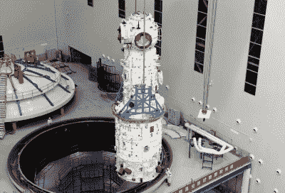

# 小心下面！中国的重型火箭将在几天内失控重返大气层

> 原文：<https://hackaday.com/2021/04/30/look-out-below-chinas-heavy-lift-rocket-due-for-uncontrolled-reentry-within-days/>

4 月 28 日，中国用最新版本的长征 5B 重型助推器成功将天河空间站的核心模块送入轨道。这种火箭旨在将大型物体发射到近地轨道，其独特之处在于，33.16 米(108.8 英尺)的第一级将有效载荷一直运送到轨道，而不是在较低的高度分离。不幸的是，尽管国际社会努力限制不必要的空间碎片，长征 5B 助推器的第一级现在正在太空中翻滚，预计将在未来几天内不受控制地重返大气层。

这个巨大的助推器已经被赋予了 COSPAR ID 2021-035-B ，地面跟踪站目前正在密切关注它，试图确定它将在何时何地重返地球大气层。在撰写本文时，它处于 169 x 363 公里的相对较低的轨道上，鉴于该物体的巨大表面积，它应该会迅速衰减。由于所涉及的变量，不可能确定助推器将在哪里重新进入这么远的地方，但令人担忧的是，如果它发生在人口稠密的地区，21 公吨(46，000 磅)助推器的碎片可能会撞击地面。

The Tianhe core module.

这是长征 5B 的第二次发射，第一次将于 2020 年 5 月 5 日进行。该助推器也被留在低轨道，并在六天后失控重返。在美国宇航局咨询委员会监管和政策委员会的一次会议上，管理员吉姆·布里登斯廷声称，如果火箭在 30 分钟前重返大气层，碎片可能会落在美国大陆上空。被怀疑是长征 5B 遗留物的物体在非洲被发现，[尽管没有伤亡报告](https://www.newsweek.com/debris-chinese-rocket-africa-1503950)。

中国首个空间站天宫一号于 2018 年不受控制地重返大气层。据信，8500 公斤(18700 磅)的大部分在穿越大气层时被烧掉了，剩下的部分无害地落入南太平洋。虽然小型卫星[越来越多地被设计成在重返大气层时安全解体](https://hackaday.com/2019/04/22/why-satellites-of-the-future-will-be-built-to-burn/)，但当我们扩大在低地球轨道的存在时，像这样的大型物体会带来更复杂的问题。