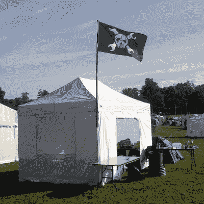
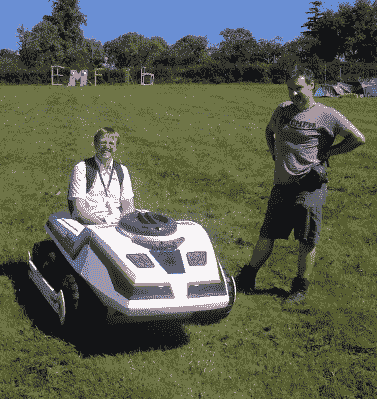

# 期待电磁场 2018

> 原文：<https://hackaday.com/2018/08/14/looking-forward-to-electromagnetic-field-2018/>

在欧洲的黑客空间中有一种兴奋的气氛，因为这个月是黑客营季节。在丹麦，他们有周四开始的波恩哈克，在义大利[IHC](https://www.ihc.camp/)在月初举行，而在英国这里，我们期待着[电磁场](https://www.emfcamp.org/)。我们很高兴能在八月和九月的尖端在 Eastnor Castle 参加几天的电磁场活动，周围都是我们社区最好和最聪明的作品。今年我们甚至会有一个休闲读者村。

如果你以前从未去过黑客训练营，这是一个不容错过的地方。从技术上来说，这是露营，但从最小的帐篷向上的每个结构都有主电源和千兆以太网。如果你用科技和其他来自我们世界的很酷的东西代替音乐，这就相当于一个音乐节。有各种各样有趣主题的讲座，有机会近距离观看你在 Hackaday 上读到的一些东西，最棒的是，欧洲相当大一部分黑客空间社区都在一个地方。他们是一个独特的刺激和令人兴奋的环境。

## 亮点之一是 Hackaday 读者村

In 2016 we had a single flag on a hackspace village, expect more this year!

营地的大部分将像往常一样由所谓的[村庄](https://wiki.emfcamp.org/wiki/Villages)组成；与特定利益集团或黑客空间相关的人居住的帐篷和其他结构的松散集合。

Hackaday 的读者第一次拥有了我们自己的村庄，所以请随时加入我们！将会有一些特殊兴趣村，许多英国黑客空间，就我个人而言，会有许多离家近的熟悉面孔，但也有许多来自更远的村庄。如果[比利时大使馆](https://wiki.emfcamp.org/wiki/Village:Belgian_Embassy)没有带来瓶装啤酒，我们会很失望，同时一定要品尝一下 stroopwafel 和一些来自[荷兰](https://wiki.emfcamp.org/wiki/Village:CampHolland)的安静优雅的音乐。我们的德国朋友们会像往常一样比其他人更好地团结起来，爱尔兰大使馆也承诺提供茶和饼干。

我们的村庄此刻有点像一本打开的书，因为它就在那里等着你，我们的读者。在过去，我们举办过一次聚会，我们想再次邀请您参加这次聚会，以及您可能喜欢的除了通常的闲聊之外的任何其他活动。想在 Hackaday 读者村举办一次聚会吗？请吧。挑选你最喜欢的话题:无人机，黑客踏板车，手持游戏，业余无线电，快速焊接，让我们一起拉一个时间表。前往[hack aday . io 活动页面](https://hackaday.io/event/160284)，点击图片下方左侧的“加入本次活动的团队”。

## 接下来:会谈和徽章

征集参与的活动已经结束，但我们正处于组织者忙于编制演讲日程的时期，所以我们还没有最终的计划。我们已经从朋友那里得到了一些关于可能接受提交的建议，这不是不可能的，可能会有一个黑客作家在阵容中的某个地方，但在官方时间表公布之前，我们最好把这些建议视为这里所说的。

Hitchin Hackspace’s Big Hak, a regular sight at the 2016 camp.

我们可以说的是，与所有这些活动一样，会谈将是高质量的，并涵盖极其广泛的主题。在某个舞台上总会有你想看的东西，你经常会在不止一个选择中左右为难。一个很好的期待来自他们的 YouTube 频道，在那里你会发现 2016 年和 2014 年录制的[演讲。](https://www.youtube.com/user/emfcamp1/videos)

我们不羡慕徽章团队的黑客营。在零预算和志愿者劳动的情况下，他们必须制作出一些令人惊叹的东西，一个功能齐全的电子会议徽章，具有令人惊叹的功能集，将从第一天起就让观众惊叹不已，并完美无缺地工作。我们为来自去年荷兰 SHA2017 的团队如此公开他们的进展而鼓掌，但我们不能责怪电磁场工作人员守口如瓶。 [2016](https://hackaday.com/2016/08/09/tilda-mk%cf%80-the-emf-camp-2016-badge/) 和 [2014](https://hackaday.com/2014/08/16/tilda-mke-the-emf-2014-badge/) 的徽章都是杰作，所以我们很乐意为他们服务。这里的重点是毕竟是一个黑客营地，而不是一个你必须去营地才能获得的徽章。

## 轮子上的乐趣和游戏

EMF 夏令营还会有很多其他的活动，但是我们的预览以一个个人的笔记结束。今年，我们将看到一个 [Hacky Racers](https://hackaday.com/2018/06/25/the-electric-vehicles-of-emf-camp/) 系列来到英国，各地的 hackerspaces 都是活动的蜂巢，因为喜剧电动交通工具是由坏掉的玩具和成堆的垃圾创建的。我们还不知道到底有多少选手能进入决赛，但我们已经看到不少选手在努力了。小心他们，确保你看到他们在赛道上的表现。

那就这样吧，EMF 营要来了，英国伊斯特诺城堡，8 月 31 日到 9 月 2 日。值得信赖的大众汽车将被装上一个 hackspace 村的所有装备，一个毫无竞争力的 Hacky Racer，可能最重要的是，一个小电水壶。那里见！