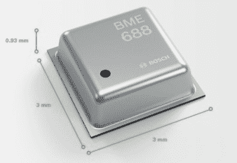

# LoRa 空气质量监测器提高了 DIY 物联网的标准

> 原文：<https://hackaday.com/2022/08/30/lora-air-quality-monitor-raises-the-bar-on-diy-iot/>

我们在 Hackaday 看到了数量惊人的自制环境监测器，总的来说，它们倾向于遵循一个相当可预测的模式。一个 ESP8266 与一个常见的温度和湿度传感器配对，也许一个定制的 PCB 被邀请参加聚会，最终结果是一些值通过 MQTT 被推出。这是一个很好的周末项目，但在 2022 年并不完全是开创性的。

这就是为什么我们发现来自[Mircea-Iuliu Micle] 的 [AERQ 项目如此令人耳目一新。这款设备不仅可以如你所料地采集温度和湿度，而且其博世 BME688 传感器还可以嗅出挥发性有机化合物(VOCs)和一氧化碳和氢气等气体。数据表实际上声称这是“第一个具有人工智能(AI)的气体传感器”，虽然我们不确定在这种情况下这到底意味着什么，但这种说法显然保证了单个数量的价格标签为 15 美元以上。](https://github.com/Mircerson/AERQ)

There’s an AI hiding in there someplace.

但奇特的传感器并不是 AERQ 在竞争中脱颖而出的唯一原因。它不是无处不在的 ESP 家族成员，而是使用 Wio-E5，这是一种相对奇特的 STM32 封装，集成了远程 LoRa 无线电。[Mircea-Iuliu]将其与 Linx USP-410 芯片天线配对，或者根据您想要使用的四层 PCB 版本，与外部天线的 u.Fl 连接器配对。整个系统由一个简单的 USB 连接供电，其 Mbed OS 固件设置为将所有收集的数据转储到[物联网](https://www.thethingsnetwork.org/)。

总的来说，这是一个非常专业的建筑，如果它坐落在现成的空气质量监测器中，肯定不会显得格格不入。虽然高端检测功能对于家庭使用可能有点大材小用，但[Mircea-Iuliu Micle]指出，随着新冠肺炎过渡到流行阶段，AERQ 可能会为那些举办室内活动的人提供有用的见解。