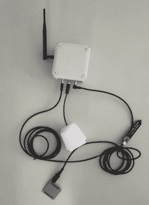
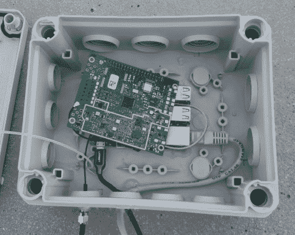
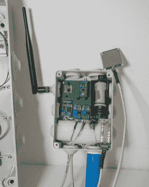
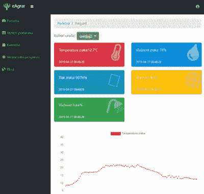

# 基于 LoRa 的设备监控

> 原文：<https://hackaday.com/2019/09/23/lora-based-plant-monitoring/>

克罗地亚工程师斯拉文·达姆扬诺维奇和马尔科·阿利发明了一种无线系统，农民可以通过这种系统监控农田的植物状况和天气。该系统使用 RFM95W 模块进行 LoRa 通信，设备设计为即插即用、电池供电，并具有长距离通信(距离网关最远 10 公里)。

它使用 ATMega328 微处理器，并包括用于测量土壤湿度(FC28 传感器)、叶片湿度(FC37 传感器)、压力(BME280 传感器)以及空气温度和湿度(DHT22 或 SHT71 传感器)的传感器。数据被发送到多通道物联网网关，该网关将信息转发到外部数据库，然后通过一系列图形和表格显示数据。

向网关发送消息的[软件](https://github.com/ph2lb/LoRaWAN_TTN_Env_Node)基于 C (LMIC)和低功耗库中的 LoRa MAC，由[【ph2lb】](https://github.com/ph2lb)开发。

塑料外壳的目的不仅在于美观，还在于保护温度和湿度传感器免受阳光和雨水的直接照射，因为阳光和雨水会影响读数并导致水泄漏到设备中。定制的 3D 打印外壳是防水的，可以作为太阳辐射屏障，保护 eAgrar 免受直接和反射的太阳辐射。

该项目的目标是帮助应对气候变化，由于天气冲击和来自田间的信息缺乏可预测性，气候变化对农业生产产生了负面影响。农民不得不依靠使用杀虫剂和化学制剂来防止疾病的发展，这反过来又污染了环境。该团队希望 eAgrar 能够提供更多信息来预测疾病的出现，并帮助农民降低成本，减少对植物的损害，增加产量，并随着时间的推移提高作物的质量，同时减少化学试剂的使用频率和数量。

该设备使用实时时钟(RTC)作为唤醒警报，由寿命为一年的 3.7V 锂离子电池供电，尽管还有一个 5V 升压转换器，可为最多四个 5V 传感器供电。JLCPCB 的定制 PCB 具有防锈焊盘和过孔，即使在高温下也能保持高质量。

对于 LoRa 无线传感器网络，系统设置允许远程控制设备，即使它们没有连接到互联网。无需对器件重新编程，即可修改睡眠时间和通信参数等设置。

    

目前，仪表板仍然是克罗地亚语，但它提供了大量的信息，如最近的测量结果，温度和湿度测量结果的图表，一个包含设备寿命开始时所有数据的数据表，以及一个供用户用来记录笔记的日历。

