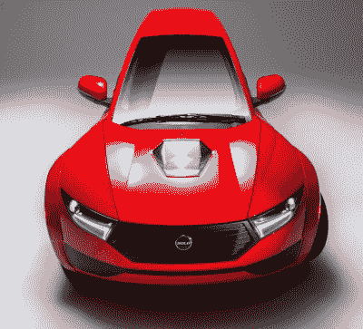
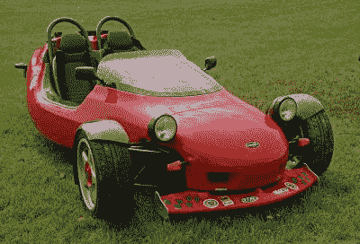
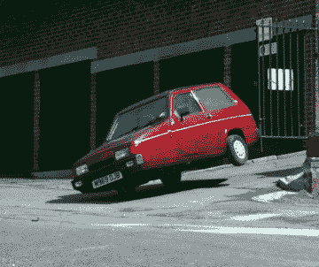
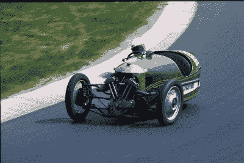

# 通勤途中丢失一个车轮；三轮摩托车争夺开阔的道路

> 原文：<https://hackaday.com/2020/05/27/losing-a-wheel-on-your-commute-3-wheelers-vie-for-the-open-road/>

对于有技术头脑的汽车爱好者来说，我们生活在一个有趣的时间点，我们正站在我们如何想象汽车的重大方向转变的边缘。十年之内，电动马达很可能会从奢侈品或边缘产品变成主流产品，而活塞发动机将会成为越来越小的利基市场的领地。

The Electrameccanica Solo three-wheeler car.

在这一过程中，汽车的外形有没有可能改变，或者几十年后汽车的基本形状会不会和我们习惯的一样？加拿大公司 Electrameccanica 肯定是这样认为的，因为他们已经推出了一种全新的通勤交通方式。他们的 Solo 是一辆三轮汽车，前轮两个车轮，后轮一个后轮配置。这是一个大胆的设计，但如果这是一个显而易见的设计，那么我们为什么不驾驶三轮车呢？

是时候研究一下三轮摩托车的一些特性了，并顺便参观一下过去在这种配置上的一些尝试。

## 三轮车的数量比你想象的要多

三轮汽车似乎并不是一个新现象，18 世纪末由尼古拉斯·约瑟夫·库格诺(Nicolas-Joseph Cugnot)发明的世界上第一辆机动车和 1885 年卡尔·本茨发明的所有现代汽车的第一个原型(T3)都有领先的车轮设计。在英国写这篇文章时，首先想到的是[摩根后轮跑车](https://en.wikipedia.org/wiki/Morgan_Motor_Company#Early_cars:_three-wheelers_and_4-4s)、[信心](https://en.wikipedia.org/wiki/Reliant_Motors)和[邦德](https://en.wikipedia.org/wiki/Sharp%27s_Commercials)系列前轮小型车和货车，也许还有[格林纳尔蝎子跑车](https://en.wikipedia.org/wiki/Grinnall_Specialist_Cars)作为摩根的精神继承者，在摩根决定重返游戏之前。

The Grinnall Scorpion is a three-wheeler I would definitely drive! Brian Snelson ([CC BY 2.0](https://commons.wikimedia.org/wiki/File:Grinnall_Scorpion.jpg))

对于许多读者来说，已经生产出的各种各样的三轮机器将会是一个惊喜。一级方程式赛车尝试了这么多次，人们可能会认为其中更多的赛车会获得长期牵引力，那么缺乏吸引力的三轮赛车到底是什么呢？

公平地说，人类重视一致性，因此，对于一辆新的三轮摩托车来说，最大的障碍之一可能是，如果你开着它去上班，别人会怎么想。我会开一辆可靠的罗宾，因为它是一辆古怪的小汽车，拥有著名的奥斯汀 7 汽车遗产中的最后一丝痕迹，我也想拥有一辆 [Piaggio Ape](http://www.piaggiocommercialvehicles.com/en_EN/models/ape/ape-classic/) ，因为它是意大利小型农场运输的缩影，也是一辆方便的小型皮卡，但我是一名住在农场的黑客空间居民，而不是公司阶梯上穿着西装的无人机。

目前，我开着一辆复古的大众汽车和一辆破旧的凯旋，不是出于需要，而是因为我喜欢它们；一辆现代汽车在各方面都是有意义的，但如果我开着一辆福特蒙迪欧，那么车内的某些东西就会报废。也许许多读者会和我一样有这种感觉，但对大多数人来说，害怕被嘲笑或与众不同是一个强大的动力，丰田卡罗拉比有点奇怪的小批量生产的汽车更安全。

然而，我们不是来传递社会评论的，相反，我们的权限在于我们所写的技术。如果三轮汽车做实用的小型汽车运输，有什么技术上的原因让它们逊色吗？

## 三轮摩托车在弯道上真的更糟糕吗？

尽管英国广播公司的 *Top Gear* 在战略位置的压舱物[上耍花招，取笑信赖的三轮车滑稽地不稳定](https://www.youtube.com/watch?v=QQh56geU0X8)，但事实是，在正常驾驶条件下，它们在弯道中的操控并不比 20 世纪 50 年代至 70 年代的许多同龄人更差。在前轮驱动汽车操控近乎完美的时代，人们很容易忘记曾经有一段时间，许多四轮车在路上行驶时需要小心驾驶。我的胜利宣言当然引起了一些怀疑[。](https://www.canleyclassics.com/?archive=swing-springs)

为了衡量当你把一辆车推到极限时会发生什么，我和我在赛车社区的一些朋友聊了聊。我也从一个浪费在摩托车上的年轻人那里学到了一些知识。

如果你把一辆四轮车推到一个角落，外侧前轮上的力增加，内侧后轮上的力减少，因为汽车既因减速而向前倾斜，又因转弯的向心力而滚动。下图中的 Mini 的左后轮离开了地面，尽管车身侧倾减小了左前轮上的力，但它仍然保持三个车轮与路面接触。假设右侧车轮与路面的接触面积不会因侧向力而失去抓地力，它会与路面保持足够的接触，以便驾驶员保持控制。

 [")](https://hackaday.com/2020/05/27/losing-a-wheel-on-your-commute-3-wheelers-vie-for-the-open-road/1024px-mini_-_flickr_-_exfordy_4/) A Mini under cornering forces at Silverstone. Brian Snelson ([CC BY 2.0](https://commons.wikimedia.org/wiki/File:Mini_-_Flickr_-_exfordy_(4).jpg))  The BBC *Top Gear* Reliant Robin modified to roll at low speeds.

看看像 Reliant 这样的前轮三轮摩托车与 Mini 一样处理相同的弯道，同样的力也适用于转弯。赛车将经历车身侧倾，前悬架将被压缩，在极端的弯道中，后轮将像 Mini 一样离开地面。但它与 Mini 的不同之处在于，它的单个中央前轮成为了一个支点。由于路面和汽车之间只有两个接触点，它变得更容易滚动，轮胎接触面积抵抗侧向力的摩擦力相应地小于三个车轮留在路面上的 Mini。在正常的公路驾驶中，汽车不太可能达到这一点，因此上面链接的*最高档位*件采用了花招来达到这一效果。

A 1933 Morgan 3-wheeler cornering at the Nürburgring in 1976\. Lothar Spurzem ([CC BY-SA 2.0](https://commons.wikimedia.org/wiki/File:Morgan_Threewheeler,_Matchless-Motor,_990_ccm,_Bj_1933_(1976_Sp).jpg))

后轮三轮汽车可能会成为理想的配置，它的两个间距较大的前轮提供了稳定性，并在拐角处提供了两个接触点，而它的单后轮消除了四轮汽车在转弯时后轮离开地面的趋势。然而，并非一切都完美无缺，因为在急转弯时，后轮驱动的汽车可能会体验到与摩托车相同的东西。

highside 是摩托车手熟悉的一个术语，指的是转弯时发生的事故[，骑车人被抛向自行车上方的空中](https://www.youtube.com/watch?v=JwlZiArfnYg)。摩托车在转弯时通过向角落倾斜来对抗向心力，当后轮胎与路面的接触点失去抓地力时，高侧开始，自行车的后部开始向侧面滑动。不可避免地，在这种侧向滑动一段时间后，它会暂时保持抓地力，而这个新支点上的侧向动量会使自行车急剧直立，并将骑车人发射到空中。一辆后轮驱动的三轮摩托车在极端转弯的情况下也会发生完全相同的现象，导致汽车翻转，内侧前轮离开地面。正如我询问的一个工具箱里的人在一个赛道日看到一辆格林纳尔车时所说的那样，这辆车可以壮观地翻滚，而不是把司机甩到空中。

## 通勤，而不是赛车

这些充满厄运的结果都不是三轮汽车以公路速度进行典型转弯操作的结果，像 Reliants，Grinnalls，Morgans 和其他汽车每年行驶数千英里，就像它们的四轮同类汽车一样。你的社区公众将会花更多的时间在车与车之间，而不是在拐角处。

Solo 看起来是一辆有趣的车，应该有机会打破汽车的模式，但为了避免重蹈科尔宾·斯派洛的覆辙，这个小巧的底盘必须有一些特殊之处。至少不像麻雀，它有适合工作的长相。