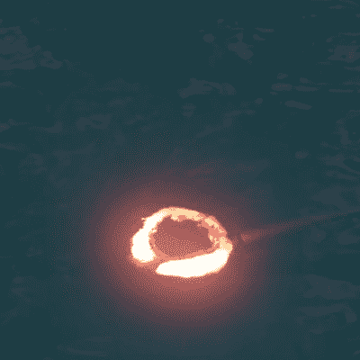

# 爱是燃烧的火焰，水下燃烧的火环也是如此

> 原文：<https://hackaday.com/2022/07/29/love-is-a-burning-flame-and-so-is-this-underwater-burning-ring-of-fire/>

当约翰尼·卡什写《火环》时，他在谈论爱情。但是当一位不知名的[考古学家]追随者照字面理解并建议在水下制造真正的火环时，他们接受了挑战，正如你在休息时间下方的视频[中看到的。](https://www.youtube.com/watch?v=rOCKjaYaYhg)

 当然水下火环有几种成分。首先，你需要水，在这个视频中，一个水池显然可以完成这项工作。第二，你需要可燃气体环。[TheBackyardScientist]决定建造一台机器来制造气环，看到他们在确定基于音圈的提升阀设计之前经历几次迭代是非常有趣的。我们必须说，它的工作绝对顺利。

最后，需要有火。至于火，你需要易燃的东西，和令人震惊的东西。即使在水下，四万伏的电压也能点燃火花塞。燃料似乎是由压缩空气和乙炔提供的，但我们不能 100%确定。我们**确定它会爆炸*！*相当充分，这从它炸毁东西的能力可以看出。**

我们不仅欣赏项目中的工程设计，还欣赏项目中快速的想法迭代、对严重障碍的克服和实际的科学。即使它*是*只是随机制造字面燃烧的火环。

 [https://www.youtube.com/embed/rOCKjaYaYhg?version=3&rel=1&showsearch=0&showinfo=1&iv_load_policy=1&fs=1&hl=en-US&autohide=2&wmode=transparent](https://www.youtube.com/embed/rOCKjaYaYhg?version=3&rel=1&showsearch=0&showinfo=1&iv_load_policy=1&fs=1&hl=en-US&autohide=2&wmode=transparent)

