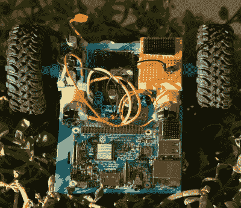

# 低成本自主漫游车将推动您的项目

> 原文：<https://hackaday.com/2018/10/29/low-cost-autonomous-rover-will-drive-your-projects/>

[Miguel]想要获得更多的 Python 实践经验，所以[他创建了一个小型机器人平台作为试验台](https://makesomeshit.com/2018/10/19/build-a-3d-printed-autonomous-robot/)。但就像有时发生的事情一样，事实证明他创造的机器人本身就是一个有价值的项目。凭借较低的总成本和高度灵活的设计，它可能正是您所寻求的。谁知道呢，它甚至可能启动那个一直在你脑海深处徘徊的漫游者项目。

 这个机器人使用了一个异常简单的 3D 打印框架。无需担心复杂的悬挂装置，无需紧固件将多个印刷零件固定在一起。这只是一个单一的印刷“L”形件，有安装电机和前传感器板。按照设计，它只是简单地拖动尾巴，这在光滑的表面上应该很好，但如果你打算带你的新机器人朋友去户外探险，可能需要一点调整。

在“尾部”有一个很大的开放区域来安装一个 Raspberry Pi，但你真的可以在这里放置任何你想要的电路板或微控制器。鼻子里是一个 HC-SR04 超声波传感器，[Miguel]在他的 Python 代码中用它来执行避障。双 H 桥电机驱动器控制前面的一对齿轮电机，以提供推进和转向，降压转换器从 2S LiPo 电池降压 7.4V，为电子设备供电。他甚至包括一个迷你试验板，这样你就可以添加电路或传感器作为实验载荷。

如果你正在寻找一个稍微更先进的 3D 打印机器人平台，我们已经看到了我们的公平份额。从几乎完全打印出来的坦克到看起来已经准备好投入前线战斗的 T2 坦克。