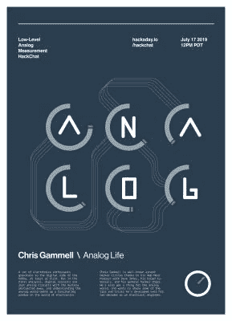

# 低级模拟测量黑客聊天

> 原文：<https://hackaday.com/2019/07/15/low-level-analog-measurement-hack-chat/>

加入我们 2019 年 7 月 17 日星期三中午太平洋时间[与](https://hackaday.io/event/165370-low-level-analog-measurement-hack-chat) [Chris Gammell](https://hackaday.io/hacker/230-chris-gammell) 的低水平模拟测量黑客聊天！

 很多电子爱好者都被这种爱好吸引到了数码方面，至少在一开始是这样。这是可以理解的——一个 Arduino，几个跳线，一点代码就能完成很多事情。但归根结底，数字电路只是抽象出神秘感的模拟电路，了解模拟电路为我们打开了一扇了解电子世界的迷人窗户。

克里斯·甘梅尔在黑客圈里很出名，这要归功于他与达夫·琼斯的 [Amp Hour 播客](https://theamphour.com/)、他的【KiCad 教程以及他的通用黑客印章。他还对模拟世界情有独钟，并希望分享他作为电气工程师 20 年来积累的一些技巧和诀窍。在下一次黑客聊天中，我们将和 Chris 一起深入了解低电平模拟测量的来龙去脉。请提出您的问题和见解，或者来揭开模拟世界的神秘面纱。

 我们的黑客聊天是 [Hackaday.io 黑客聊天群发消息](https://hackaday.io/messages/room/2369)中的社区直播活动。本周，我们将于太平洋时间 7 月 17 日星期三中午 12:00 坐下来讨论。如果时区让你烦恼，我们有[一个方便的时区转换器](https://www.timeanddate.com/countdown/generic?iso=20190717T12&p0=224&msg=Low-Level+Analog+Measurement+Hack+Chat&font=cursive)。

点击右边的那个发言气泡，你会被直接带到 Hackaday.io 上的黑客聊天群，不用等到周三；随时加入，你可以看到社区在谈论什么。