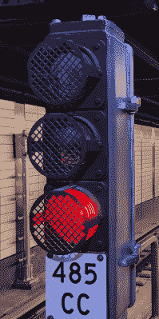
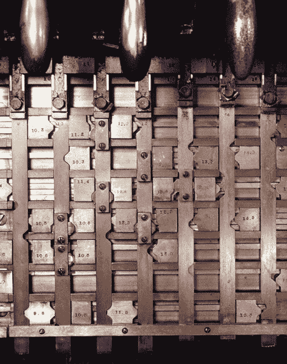
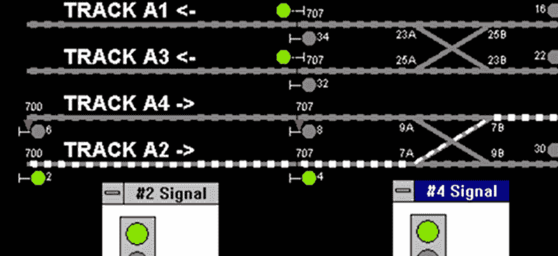

# 低技术高安全性与纽约地铁系统

> 原文：<https://hackaday.com/2019/01/11/low-tech-high-safety-and-the-nyc-subway-system/>

 这一年是 1894 年。你正在为一个大城市设计一个火车系统。你的老板告诉你，市长办公室希望确保火车不会发生事故。该系统开始时很小，但随着时间的推移，随着轨道的交叉和转换，它将变得很大和复杂。请记住，这是 1894 年，所以计算和无线技术在这一点上几乎不是科幻小说。答案是——至少对纽约地铁系统来说——一个巧妙的系统，由[信号和](https://www.nycsubway.org/wiki/Subway_Signals:_A_Complete_Guide)联锁组成，充分利用了当今的技术。伯纳德·s·格林伯格非常详细地描述了这个系统。

地铁于 1904 年开始运营，距离地面列车开始运行已经有 30 多年了。一个聪明的信号系统和轨道本身与一些机械设备一起工作，使地铁非常安全。即使你试图同时运行两列火车，安全系统也会阻止它。

从表面上看，这个系统非常简单。有显示红色、黄色和绿色的灯。如果你开车，你知道这些意味着什么。但真正有趣的是当时用来让它们变轻的方案。

## startrails

如今，我们让一切都变得“智能”如果今天完成，这些轨道将被称为智能轨道，因为它们可以判断是否有火车在上面。该系统由 1000 英尺长的轨道块组成，这些轨道块相互之间是电气隔离的。纽约的整个系统有将近 15000 个街区。如果一列火车在一个区间上有轮子，它会把那个区间的两条铁轨短接在一起。没有火车，两条铁轨显示为开路。因此，每个区间(有时称为线路或区间)基本上是一个道岔，列车在此完成线路。

在一条轨道上，当一个街区被占用时，特定的信号将变成红色。根据满载列车需要多长时间停下来，相邻的街区也可能变红。对于纽约地铁来说，红灯还会升起一个列车停靠站，它是一个 T 形杆，通常位于轨道高度。当灯为红色时，杆将与每节车厢下的跳闸旋塞接合。跳闸旋塞切断车轮电源，并实施紧急制动。所以——除非某种机械故障——即使工程师不想停下来，试图闯红灯的列车也会停下来。

直到 1970 年，火车有时会超越列车停止机制。这是违反规则的，因为——你猜对了——由于超越安全系统而造成了几次碰撞。

## 历史和演变

一旦你知道哪里有火车，你就进入了联锁的主题。这个想法是，你不应该能够以不安全的方式操作轨道。因此，如果你为穿过另一段轨道的一段轨道点亮绿灯，那么第二个街区必须是空的和红色的。强制执行这种行为是联锁的工作。

连锁始于英国。1856 年 6 月，约翰·萨克斯比获得了联锁开关和信号的第一项专利。1868 年，有一项今天在北美被称为“初步闩锁”的专利。到 1873 年，伦敦和西北铁路上已经安装了超过 10，000 个机械锁杆。

直到 20 世纪 50 年代，联锁机器使用的杠杆就像这里显示的一样，相互锁定，显然，其中一些仍在使用，但现在它们大多至少使用继电器逻辑。当然，这一切并不是纽约地铁独有的。

## 模拟

除了链接在顶部的精彩指南，伯纳德·格林伯格还写了 [NXSYS](https://www.nycsubway.org/wiki/NXSYS,_Signalling_and_Interlocking_Simulator) 这是纽约市地铁系统运行的忠实模拟。你可以在这里看到 NXSYS 屏幕的一部分。根据伯纳德的说法:

> NXSYS 可以在以下四个级别中的任何一个级别进行查看、使用或欣赏:
> 
> *   这是一款娱乐性的快速交通视频游戏，适合那些喜欢地铁并希望重现轨道导航体验的人，并了解更多关于地铁及其信号的信息。
> *   快速交通信号和 NX/UR 控制塔操作的综合交互式学习工具，足够详细和准确，对实际负责操作此类设备的人员有价值。
> *   继电器逻辑中此类系统的示例实现的详细指南，可观察到继电器级别的动作。
> *   交互式计算机辅助设计(CAD)工具，用于设计和调试您自己的联锁和信号电路。

## 低高科技

相当令人印象深刻。更令人印象深刻的是，在过去，这一切都可以用杠杆和继电器来完成。你可以在下面的视频中看到一个联锁面板。当然，系统得到了各种各样的升级，你可以在维基百科上阅读关于[地铁所有技术的很多细节。](https://en.wikipedia.org/wiki/Technology_of_the_New_York_City_Subway)

如果你喜欢这个话题，你可以看看[英国人做了什么](https://hackaday.com/2013/11/12/retrotechtacular-upgrading-train-signaling-before-the-information-age/)——毕竟，一开始就是他们的主意。我们之前在[以一种颠覆性的方式](https://hackaday.com/2016/12/14/protesters-use-jumper-cables-to-block-trains/)实际上已经谈过一点关于闭塞感应列车。

 [https://www.youtube.com/embed/RStJ621auaU?version=3&rel=1&showsearch=0&showinfo=1&iv_load_policy=1&fs=1&hl=en-US&autohide=2&wmode=transparent](https://www.youtube.com/embed/RStJ621auaU?version=3&rel=1&showsearch=0&showinfo=1&iv_load_policy=1&fs=1&hl=en-US&autohide=2&wmode=transparent)

#### 照片致谢:

*   纽约州地铁运输管理局的信号 [CC-BY-SA-2.0](https://creativecommons.org/licenses/by/2.0)
*   由【Joe Roma】[CC-BY-SA-2.5](https://creativecommons.org/licenses/by-sa/2.5/)制造的联锁杆