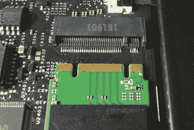
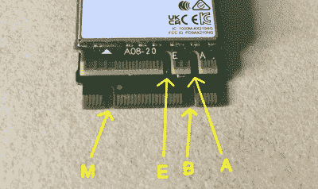
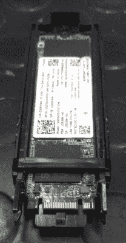
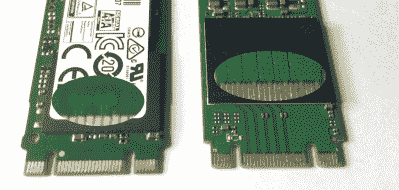
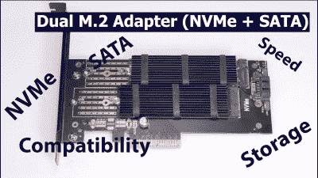
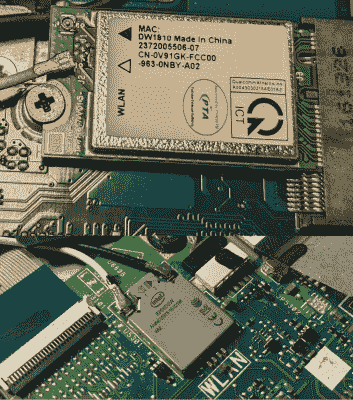
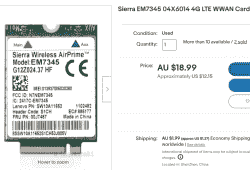
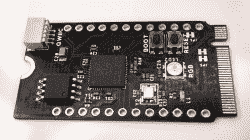

# 面向黑客的 m . 2–扩展您的笔记本电脑

> 原文：<https://hackaday.com/2022/10/27/m-2-for-hackers-expand-your-laptop/>

你已经在现代笔记本电脑中见过 M.2 卡了。如果你今天要买 SSD，最有可能是 M.2 的。我们的许多笔记本电脑都包含 M.2 WiFi 卡，面向消费者的 WWAN 卡现在也包含在 M.2 中，我们不时会看到出乎我们意料的 M.2 卡。如今，使用 M.2 是为笔记本电脑添加新功能的最可行方式之一。我发现 M.2 标准非常容易使用，也非常容易破解，我想向您演示一下。

如果你曾经在网上搜索过，试图了解是什么让 M.2 运行，你可能会发现许多令人困惑的文章中的一篇，这些文章只是转录了 M.2 规范 PDF 的内容，并使事情看起来比实际更复杂。让我们转而看看 M.2 的实际使用情况。今天，我将向你展示你在野外会遇到的 M.2 设备，并教你使用它们需要知道的知识。在第 2 部分中，我将向您展示如何构建自己的 M.2 卡和卡接受设备！

## 大部分是经过深思熟虑的

一旦你开始研究 M.2 标准，你就会真正地欣赏它，尤其是如果你已经使用 mPCIe 设备一段时间的话。mPCIe 是我们多年来一直使用的，它逐渐变成了几乎不兼容的引脚排列的大杂烩。随着制造商想出他们可以嵌入的各种设备，你会发现像 mSATA 和 WWAN 共存扩展这样的黑客，一旦你需要像 UART 或 PCM 这样的东西，在像 mPCIe WWAN 调制解调器这样的东西中缺乏标准化是显而易见的。谢天谢地，M.2 规范考虑了所有这些经验。

M.2 标准的设计考虑到了现实世界的使用情况，并定义了尽可能多的引脚，以确保来自不同制造商的相同用途的卡可以相互替换。它分为不同的密钥，每个密钥都有其用途，如面向存储、WWAN、WiFi 和其他用途的密钥。每个键控都定义了一组接口的引脚，如 PCIe、USB 2.0 或 3.0、SATA、I2C、DisplayPort 等。自然，这些接口中的大多数对黑客来说都很有吸引力。

A M.2 B+M-key SSD ready to be inserted into a M-key socket

Two cards showing four most popular M.2 keys. Top is A+E WiFi card and bottom is B+M SATA SSD

不需要卡或插座来支持键控引脚排列中定义的所有接口或任何特定接口。如果你设计系统，这是有意义的——许多定义的接口是视情况而定的或者是昂贵的。然而，当然，它会导致“它适合，但不工作”的混乱。例如，B+M key SATA SSD 无法在一些仅适用于 NVMe 的 M-key 插座上工作，而 CNVi 等一些专有标准则打破了“任何 M.2 WiFi 卡都可以与笔记本电脑兼容”的概念。

Some M.2 cards might look flippable, but they’re not

然而，在现实世界中，你可以依靠锚——如果你看到一个 M-key、A-key 或 E-key 插槽，它有 PCIe，如果你看到一个 B-key 插槽、A-key 或 E-key 插槽，它有 USB 2.0 如果您手头有原理图或一些 M.2 设备，您可以快速测试任何特定插槽的兼容性。所有按键中都定义了 I2C SDA 和 SCL 引脚，但它们是否连接到任何东西都有 50%的可能性，显然取决于笔记本电脑主板设计的确切日期的月亮相位。

B+M？M.2 标准允许组合卡上的按键，让卡适合两种不同类型的插座，并增加卡的兼容性。您将看到两种组合——B+M 和 A+E，分别用于固态硬盘和 WiFi 卡，B、M、A 和 E 键引脚排列围绕这两种可能的组合而设计。你失去了一些可选的功能，但关键的东西，如 PCIe 仍然可以访问。顺便说一句，虽然如果你施加足够的力，你可能会觉得你可以插入一个颠倒的 B+M 固态硬盘，或者将 M-key 卡推入 B-key 插座，但这不仅不会工作，你会反转输入电压极性，可能会有激烈的后果。即使考虑到这些小问题，M.2 也比 mPCIe 更加合理和强大。

## 一根固态棒

Two B+M SSDs – one SATA and one NVMe through 2x PCIe link

毫无疑问，最受欢迎的是 M.2 固态硬盘。它们要么是 SATA，要么是 NVMe，后者是一种使用 PCIe 作为物理层的存储接口。我们已经深入讨论了 [NVMe 的内部结构](https://hackaday.com/2021/01/13/nvme-blurs-the-lines-between-memory-and-storage/)，请随意查看。SATA 固态硬盘通常使用 B+M 键控，有些仅使用 B-key，但这种情况很少见。NVMe 固态硬盘通常使用 M-key，一些使用 B+M 的组合，因此被限制在 2 个 PCIe 通道，你会看到它与更便宜的固态硬盘。

固态硬盘只能支持这些标准中的一种，而不能同时支持两种。可能很难确定是哪一个，所以如果标签上没有 NVMe 或 SATA 标志，请查找型号。如果你手头有 SSD 或者有一些更高分辨率的图片，看看差分对的数量。如果只有两个，那就是 SATA 如果有三个、五个或九个，那就是 NVMe。据统计，你更有可能看到 NVMe 固态硬盘，因为它们越来越丰富。

M-key 或 B-key 端口可能支持两者之一，也可能只支持其中之一。在 B 和 M 引脚排列上，定义了一个引脚来区分 PCIe 和 SATA 固态硬盘，如果主机支持这两种标准，它将自动在它们之间切换。对于一些笔记本电脑来说，可能很难判断 M.2 SATA SSD 是否受支持——相比之下，NVMe 是一个安全的赌注，因为它几乎从未不受支持。而且，如果您有一个只有 PCIe 连接器或 SATA 连接器的简单外部适配器，它将只支持该类型的 SSD。

## 做 WiFi 的所有方法

M.2 WiFi 使用 A 或 E 密钥——你将看到的大多数 WiFi 卡将使用 A+E 组合密钥，插座过去是 A 密钥，但现在是 E 密钥。你有一个 1x PCIe 链接和 USB 2.0，前者用于实际的 WiFi，后者用于蓝牙。在 A 键和 E 键上，您可以获得第二个 PCIe 1x 链接–而不是 lane，link！–但很少看到连接它的插座，因此很难找到像这样的卡的主机[谷歌珊瑚双 TPU 加速器。](https://coral.ai/products/m2-accelerator-dual-edgetpu)与 mPCIe 相比，天线连接器不再是 uFL 它们是 [MHF3，也称为 wFL，](https://www.adafruit.com/product/5445)所以你可能需要一些新的天线硬件。

当然，并不是所有的嵌入式无线网卡都支持 PCIe——E-key 引脚排列也支持 SDIO 无线网卡。SDIO 是一种嵌入式接口，主要用于 SD 卡和 WiFi 芯片连接——例如，在 Raspberry Pi 这样的主板上。一些卡和适配器[已经出现在那里](https://twitter.com/the6p4c/status/1488480025980858371)使用 E-key，让尚未入门的黑客[惊讶不已。](https://twitter.com/Foone/status/1224206741602062336)鉴于设计自己的 M.2 卡是如此容易，我们希望有一天能看到 M.2 SDIO WiFi 卡变得更加流行——也许到那时，Pine64 将不再设计[怪异的 WiFi 模块。](https://forum.hobbycomponents.com/viewtopic.php?t=2139)

half-sized WiFi card on top, 1216 M.2 WiFi module on the bottom

很少看到纯 E-key 或者 A-key 的卡——例外之一， [CNVi，](https://en.wikipedia.org/wiki/CNVi)用 E-key，而且不是好的那种例外。这是一个[英特尔专有的](https://www.intel.com/content/www/us/en/support/articles/000054819/wireless.html) M.2 衍生接口，让芯片组完成过去由 PCIe WiFi 卡完成的大部分 WiFi 工作。这些被诅咒的 M.2 WiFi 卡不仅不能与 AMD 处理器或旧笔记本电脑一起工作，还有两个版本的 CNVi，它们没有[向后或向前](https://www.reddit.com/r/buildapc/comments/e6ffw2/cant_replaced_an_intel_wirelessac_9560_with_an/)兼容性、[导致用户困惑、](https://www.reddit.com/r/buildapc/comments/e6ffw2/cant_replaced_an_intel_wirelessac_9560_with_an/)额外费用和电子垃圾。有一个暂定的好处——插槽通常连接 CNVi 和 PCIe+USB2，所以理论上你可以使用 CNVi 卡，然后为你的黑客目的获得额外的内部 PCIe 和 USB 链接。

您可能会遇到两种有点古怪的 WiFi 卡外形。首先，这是一个有趣的 E-key WiFi 卡，它之所以成为可能，是因为默认情况下很大一部分引脚没有使用。更有趣的是，你可能已经在超极本中见过这些小型屏蔽焊接模块。这也是 M.2 外形，称为 1216。它是可焊接的，因此不容易升级，但仍然具有预定义的引脚排列。可悲的是，这些模块也有 CNVi 种类——从好的方面来说，你不会经常交换这些卡。

## 用 B-Key 环游世界

Project-ready USB 4G modems for cheap

如果您的项目需要一个便宜的 USB 连接的 4G 调制解调器，并且支持 Linux，那么使用二手的 M.2 B-key 调制解调器是不会错的，通常是 3042 外形，30 毫米宽。许多这种卡是为具有 WWAN 连接的笔记本电脑制造的，二手市场以超低价格出售。大多数都是 USB 2.0，也有一些 USB 3.0 卡可用——无论哪种，你都可以在网上找到配备 USB 插头的突破，也有一些[自制开源突破](https://github.com/themainframe/5g-m2-usb3-interface-pcb)。

这些是笔记本电脑上的 B-key 插槽——在所有可用的 M.2 插槽中，这些是最“狂野西部”的插槽，因为你只能真正依赖 USB 2.0 的存在——其他一切都有很大差异。该标准定义了相当多的其他功能-一些 B-key 插槽具有额外的 SATA，一些具有额外的 PCIe，一些具有 SATA 和 PCIe，可通过相同的 PCIe/SATA 配置引脚 M-key 固态硬盘使用进行切换。有时候也有 USB 3.0，但不保证。你肯定会为你的调制解调器配备 USB 2.0，但对于固态硬盘等任何其他设备，你必须在谷歌上搜索你的笔记本电脑的型号，并询问“我可以将固态硬盘放在 B-key 插槽中吗”。

可悲的是，如果你的笔记本电脑实际上没有 WWAN 选项，不仅 WWAN 天线可能会缺失，而且主板上的 B-key 插座也可能不会焊接——这是一个奇怪而令人沮丧的组装选择，它阻碍了升级，但我想我们还没有看到 mPCIe 这样做。从好的方面来说，如果你有一个 B-key 插槽，你就不必受固态硬盘和 WWAN 卡的限制——例如，这里有一个由[Timonsku]开发的基于[开源](https://github.com/timonsku/RP2040-M.2)USB 2.0 连接[RP 2040 的 M.2 扩展卡，](https://twitter.com/timonsku/status/1376209933381816324)可能是你笔记本电脑的有趣升级！

## M.2:不断发展，无处不在，永远存在

M.2 标准的某些部分正在变得模糊不清，并且不再能在笔记本电脑上使用——如果它们曾经存在过的话。如果你想上一本 rabbithole，可以在网上找到 M.2 机电规范 Rev1.0 文档，从它的 201 页可以学到很多东西。例如，你会发现 F 键是为某个被称为未来内存接口的模糊事物保留的，毫无疑问，这是一个被搁置的英特尔项目，只在某个甚至不再被谷歌索引的博客页面上描述过。

对于更多真实世界但同样有趣的部分，有一个名为 WiGig 的标准，一些 ThinkPads 为此在 A-key WiFi 插槽上暴露了一个 DisplayPort 链接——实际上使用了我上面提到的 A-key 上的第二个 PCIe 链接。显然，你可以拥有无线笔记本电脑坞站，通过 DisplayPort 和 USB3.0 连接，在没有电缆的情况下为你带来大量设备。这里有一些 WiGig dock 内部的有趣图片–[坞站接收器硬件实际上是一个 M.2 G-key 卡本身。](https://twitter.com/WifiCable_/status/1585742863069253632)你甚至可以在易贝上找到 in-dock 卡，作为一段比较近的计算外设历史。

你会发现 M.2 基本上无处不在。它有很多隐藏的潜力，如果我们需要挖掘它，它会帮助你了解它在野外是如何使用的。即使你永远不会设计 M.2 卡，现在你知道如何区分 SATA 和 NVMe M.2 固态硬盘，以及为什么将 B-key 4G 卡插入 M-key 固态硬盘插槽不会带来任何好处。在下一篇文章中，我将向您展示如何设计一个 M.2 卡或在您自己的主板上安装一个 M.2 插座！