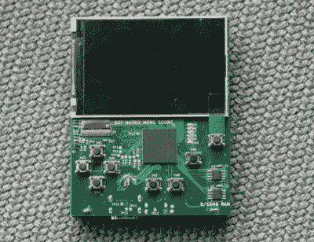
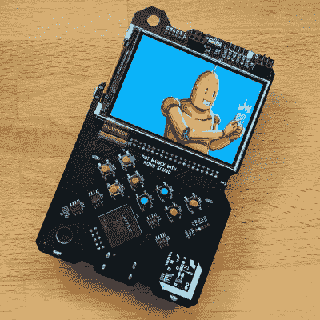
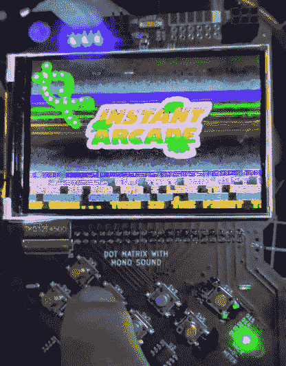

# 芯片内部的机器:Sprite_TM 如何构建 FPGA 游戏男孩徽章

> 原文：<https://hackaday.com/2020/02/19/machine-inside-of-a-chip-how-sprite_tm-built-the-fpga-game-boy-badge/>

如果你告诉 20 世纪 90 年代的孩子，30 年内你会去参加一个会议，并得到一个超级任天堂娱乐系统戴在你的脖子上，他们会说你是个骗子。但这就是为 2019 年 Hackaday 超级大会设计的徽章耶鲁安·多姆堡(又名[Sprite_TM])所发生的事情。它内置于 Game Boy 外形中，配有墨盒插槽、漂亮的屏幕和熟悉的按钮布局。但这里还有更多，比如底部的 HDMI 端口，以及通过 USB 将二进制文件放到设备上来完全重新配置设备的能力。

当然，使这成为可能的是设计的核心 FPGA。在 Sprite 的 Supercon talk 中，我们详细分享了徽章的发展历程。时间线，硬件选择，以及一路上的步骤造就了一个伟大的故事。但你真的不想错过的是他如何在 FPGA 内部构建机器——这是一组被称为“gateware”的 Verilog 代码，汇集了片上系统(SoC)。从他对通过改变一个变量就能产生更多处理器内核的喜悦，到迷人的 SNES 启发的图形子系统，下面分享的内幕甚至比物理设备本身更有趣。

 [https://www.youtube.com/embed/X39nnPWmkvA?version=3&rel=1&showsearch=0&showinfo=1&iv_load_policy=1&fs=1&hl=en-US&autohide=2&wmode=transparent](https://www.youtube.com/embed/X39nnPWmkvA?version=3&rel=1&showsearch=0&showinfo=1&iv_load_policy=1&fs=1&hl=en-US&autohide=2&wmode=transparent)

## 硬件很硬

这个徽章发生了很多事。在 PCB 上，您会发现一个 Lattice LFE5U-45F FPGA，它采用 381 caBGA 封装，提供多达 203 个可用 I/O 信号。想象一下在 PCB 上布线，连接多个 RAM 和闪存芯片、彩色 LCD、40 引脚墨盒插槽、IrDA、USB、HDMI 和多个 RGB LEDs。现在想象做两次！

 雪碧在硬件方面的最大教训之一是，你不应该把董事会的容忍度逼得太紧。他的原型遵循了该公司网站上的设计规则，但只有一些他拿回来的电路板实际上可以工作。失败率太高，实际产量远远达不到规定的能力。完全的重新布线是为了增加最小走线宽度，这使得后续批次的产量更高。

他分享了一个关于原型制作的快速技巧；为每一次原型测试选择不同的阻焊膜颜色，你将永远知道你手中拿的是哪个版本。在这个项目中，他经历了绿色，红色和蓝色，然后到达生产徽章的黑色阻焊膜。

## 内核和外设

FPGA 项目的问题在于，一旦你组装好了硬件，它实际上什么也做不了。你需要一个位流 gateware 之前提到过——告诉 FPGA 它的用途。这个徽章是尽可能开源的，包括处理器内核。RISC-V 内核的一个变体 PICORV32 被选为功能、尺寸之间的最佳平衡，尤其是因为它是用 Verilog 编写的，以匹配 SoC 上的其余工作。

当然，徽章的整个想法是让人们钻到引擎盖下，黑掉它。整个系统可以使用近一两年开发的开源工具进行编译。为了帮助解决这个问题，Sean Cross(又名 Xobs)打包了适合跨平台使用的工具的无依赖性版本[。在 RISC-V 上运行的用户应用程序可以作为 USB 大容量存储设备闪存到徽章上，在 Sylvain Munaut 的帮助下，整个 SoC 可以通过 USB 使用设备固件升级(DFU)进行刷新。扩展卡带本身有一点闪存，FPGA 将运行它在任何插入的卡带上找到的比特流。](https://github.com/xobs/ecp5-toolchain)

问题是，尽管 FPGA 本身的时钟速度相对较快，但 PICORV32 内核的运行频率仅为 6 MHz 左右。在这样的时钟速度下，你如何将漂亮的像素推到 480×320 的显示器上呢？SNES 用一个聪明的图形子系统回答了这个问题，这些技巧被嵌入到这个徽章中。

## 分层图形使缓慢的处理器看起来很快

微控制器通过提高时钟速度来处理密集显示，但更好的技巧是使用硬件。你可以依靠硬件来移动内存，而不是处理所有这些像素，这正是显示器变得非常快的原因。对于任何对图形感兴趣的人来说，[这个特定子系统](https://github.com/Spritetm/hadbadge2019_fpgasoc/blob/master/doc/gfx.md)的文档是必读的(并且必须作为书签以备将来参考)。使用了五个层，背景，帧缓冲区，两个平铺层和一个精灵层。

This still mage does the demo no justice. You really need to [see the video](https://www.youtube.com/watch?v=Gll31o0D6ic).

瓷砖层和精灵层是最有趣的。他们使用平铺地图、PNG 或 TGA 图像来存储多达 16 种颜色的 256 个 16×16 正方形图像。处理器不是复制每个像素，而是给适当的图块一个索引号，并告诉系统将它放在图块层的哪个图块大小的槽中，硬件处理实际的复制。但它变得更好，两个瓷砖层可以移动 1/64 像素的增量来制作动画。虽然图块层是十六像素图块位置的网格，但 sprite 层允许您在任何像素位置绘制图块，并缩放这些图块。

Sprite_TM 讨论了构建在子系统中的许多其他技巧。您可以旋转 sprite 和 tile 层，他演示了一个有趣的调色板操作技巧，给人一种动画实际上是静态图像的错觉。甚至还有[一个名为铜](https://github.com/Spritetm/hadbadge2019_fpgasoc/blob/master/doc/gfx.md)的寄存器操作机制，它增加了波浪效果的乐趣，当你看到它们时你会认出它们。Supercon 之后的几个星期，鲍勃·希克曼在徽章上发布了一个演示，让所有这些都得到惊人的利用。

## 对一个人来说太多

说清楚一点，这个徽章上的绝大部分心血都是我 Sprite_TM 本人放进去的。他如何在仅仅 10 个月的时间里做到这一点是一个谜。但是许多人跳了进去，帮助它越过终点线。几十个原型被制作出来，并交到自愿围绕徽章建立工作室的人手中，帮助人们开始使用 FPGA，或者提高已经尝试过这一领域的人的技能。许多人投入进来寻找 bug，构建声音等子系统，通过启动屏幕和游戏来改善用户体验，并执行最终组装。

我想我可以代表每一个获得这种徽章的人说一声，感谢所有帮助实现这一切的人，特别是耶鲁安·多姆伯格。不可否认的是，这个项目在 Supercon 的时间里走到了一起，令人印象深刻，它代表了一种可能永远不会被超越的努力。但与此同时，这也证明了当你把一个超级黑客与一个支持你的社区和优秀的开源工具结合在一起时会发生什么。这是我们生活的伟大世界。

在 [Hackaday.io 项目页面](https://hackaday.io/project/167255-2019-hackaday-superconference-badge)和[完整的硬件和软件库](https://github.com/Spritetm/hadbadge2019_fpgasoc/)上深入了解 FPGA 徽章的详细信息。