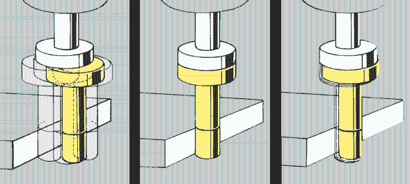
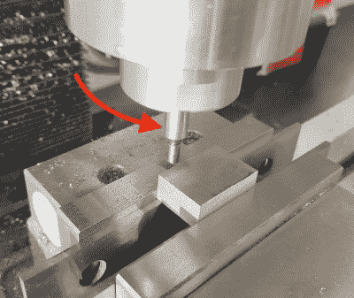
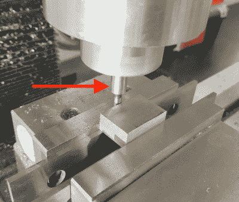
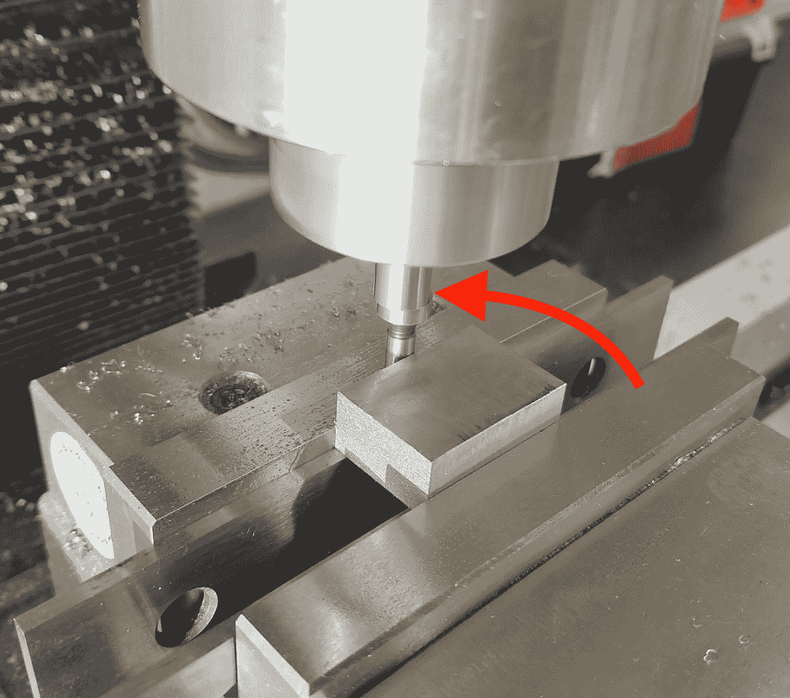

# 机械师工具:边缘查找

> 原文：<https://hackaday.com/2019/07/31/machinist-tools-edge-finding/>

机械师喜欢生活在边缘，但他们总是想知道确切的位置。如果你看过任何加工视频(*[*咳*](http://www.youtube.com/blondihacks)* )，那么你一定见过机器大量使用数字读数。“DRO”(酷孩子这样称呼他们)是一台小电脑，它知道幻灯片在哪里，从而知道你的刀具在哪里。然而，有一个问题。DROs 不知道主轴的*绝对*位置，他们知道主轴的*相对*位置。底线是，DRO 只是手轮上刻度尺的一个花哨版本。关键区别在于，DRO 没有反冲，因为它直接测量载玻片(通过类似于数字卡尺的玻璃标尺)，而不是通过丝杠的旋转来推断位置。使用传统的手轮，每次改变方向时，你都必须补偿反冲，而 DRO 可以让你避免这种情况(以及其他方便的功能)。

关键是，无论是老学校还是新学校，你仍然只能得到一个相对坐标系。你需要以某种方式建立一个原点。一个有用的方法是根据零件的物理边，在零件的一个角上设置一个原点。你如何告诉 DRO(或手轮)边缘在哪里？进入寻边器。

## 无法衡量的精确度

不起眼的寻边器是手工加工中常见的工具之一，以至于每个人都忘记了它们有多聪明。它只是一个底部带有精密接地端的轴，可以自由横向浮动(上面有一些弹簧张力)。这个轴有一个精确的(已知的)直径——通常是 20 万或 6 毫米。你马上就会明白为什么这很重要。

Diagram showing basic principle of an edge finder. Note that what is shown here does not use the 2:1 tip-to-spindle ratio but functionality is similar. [Image source: [Hoffmann Group](https://www.hoffmann-group.com/MY/en/hmy/Clamping-technology/Devices/Edge-finder/p/359000)]

当被扔进磨坊时，寻边器的残端会疯狂地左右摇晃，因为它可以自由地这样做。要使用它，你以中高转速(比如 1000 转/分)转动主轴，把摆动的一端带到工件上。随着寻边器接触零件，摆动端将变得越来越与工具的心轴同心。

Step 1: Loose end of the tool wobbles freely

Step 2 : Tip becomes concentric as you approach the edge

这就是诀窍，是什么让这个设备如此聪明。原则上，当摆动端精确接触表面时，寻边工具将完美地同心运行。然而，这几乎不可能用眼睛看到。如果它很近，但不完全同心，你就看不出来了。为了解决这个问题，固定摆动端的弹簧张力被校准，这样旋转的表面将“抓住”该部分，并在它变得同心时获得牵引力，导致它在试图沿着表面滚动时被踢到一边。这是可见的，因为摆动端“踢”向一边。这里有一些技巧来获得一个完美的读数，因为如果你继续转动桌子超过那个启动时刻，你的读数就不会精确。然而，通过适当的技术，这个非常简单的装置是非常精确和可重复的。

## 从尖端到纺锤体对半分开

Step 3: When the tip “kicks over”, you’ve located your edge. Compensate for the diameter of the edge finder’s tip, and you’re ready to go!

一旦你找到了边缘，你就知道工具的边缘和材料的边缘在同一个地方。然而，你想要的是刀具的*中心*(也就是你的主轴)在那个边缘。这一步很容易，因为我们前面说过，寻边器尖端的直径是已知的。只需将工具从工件上提起，并以工具的半径继续向该方向移动(如手轮或 DRO 所示)。现在，您可以将该维度中的 DRO(或手轮)设置为 0，并在另一个维度中重复。现在你已经得到了一个已知位置的原点，并通过扩展得到了一个横跨整个零件的坐标系。有许多类型的寻边器(包括 CNC 中常用的电子寻边器)，但基本的圆柱摆动式寻边器是常见的、便宜的和精确的。机械师最爱的三样东西！

## 避免公差叠加

最后一点——在绘制自己的机械图纸时，选择每个表面的一个角来标记所有的尺寸和位置总是很有帮助的。边缘发现是一个主要原因。如果你所有的数字都是相对于同一个角的，机械师只需寻边一次，重置原点的累积误差就会少一些。要么这样，要么机械师必须做数学来重新校准你给的所有数字，使之相对于同一个地方。这两种情况都会让机械师生气。记住你的出身，有助于弥合工程师和机械师之间世代相传的裂痕。如果你没有，期待有一天在你的破窗户的反面发现一把钥匙。